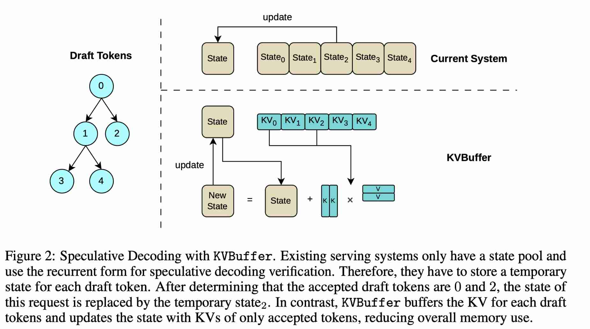

# KVBuffer: IO-aware Serving for Linear Attention

> Longwei Zou, Lin Zhong  
> Yale University

> 注：以下论文笔记由 AI Agent 自动生成，可能存在理解偏差或遗漏，请以原论文为准。

## Abstract

Linear attention has recently gained significant attention for long-context inference due to its constant decoding cost with respect to context length. However, existing serving systems typically serve linear attention by recurrently computing and updating a large linear attention state in every decoding step. Since the state is much larger than the per-token key and value, recurrent decoding incurs substantial memory access and becomes inefficient for serving linear attention. In this paper, we propose KVBuffer, an IO-aware serving mechanism for linear attention. By buffering recent keys and values, KVBuffer enables serving systems to compute linear attention outputs in more flexible and memory-efficient ways. For decoding, KVBuffer enables chunkwise computation, which reduces average memory access and decoding latency by deferring state updates and applying them in batch. For speculative decoding, KVBuffer verifies draft tokens in parallel and avoids storing temporary states. For short contexts, KVBuffer computes attention outputs directly from buffered keys and values, without creating or updating the linear attention state. We implement KVBuffer in SGLang for Qwen3-Next. Our evaluations show that KVBuffer can reduce linear attention decoding latency by up to 45.17% and increase the maximum number of serving requests by 5× for speculative decoding when verifying four draft tokens.

## 一句话总结

KVBuffer 针对线性注意力模型推理中的状态访问瓶颈，引入一个按请求维护的近期 KV buffer，把原本每个 token 都要读写巨大 linear-attention state 的 recurrent decoding，转化为可按 chunk 批量更新、可并行验证投机 draft token、短上下文下甚至不创建 state 的更灵活计算形式，从而显著降低内存访问和 serving 延迟。

## 背景与问题

随着长上下文与 agentic workload 增长，线性注意力与混合架构模型重新受到关注。线性注意力的核心吸引力是：相比 softmax attention 需要随上下文长度增长的 KV cache，线性注意力可以维护一个固定大小的状态 `S`，因此 decoding 成本理论上与上下文长度无关。Qwen3-Next、Kimi Linear 等近期模型也开始使用 linear/softmax hybrid architecture，在质量和效率之间取得折中。

但论文指出，现有 serving 系统对线性注意力的支持方式并不高效。典型实现会在 prefill 后为每个 request 保存一个 linear-attention state；之后每个 decoding step 都执行：

1. 根据当前 token 生成 query/key/value；
2. 用当前 key/value 更新整个 state；
3. 用 query 读取更新后的 state 得到输出。

问题在于，linear-attention state 的尺寸通常远大于单个 token 的 KV。例如 Qwen3-Next 的 Gated DeltaNet 层中，一个 state 约为 2 MB，比 per-token KV 大两个数量级。于是 recurrent decoding 虽然在渐近复杂度上是常数，但实际每步都要读写大 state，成为 memory-bandwidth-bound 操作。

这个问题在两个场景下更严重：

- **投机解码验证**：现有系统为每个 draft token 维护临时 state，验证 4 个 draft tokens 时在 Qwen3-Next 中每个 request 额外占用约 384 MB 状态内存。
- **短上下文请求**：当上下文长度小于 hidden/head dimension 时，直接保存和访问所有 KV 反而比维护一个完整 state 更省内存。

因此，论文的核心问题不是“线性注意力是否理论上高效”，而是：**serving runtime 应该如何在 recurrent / chunkwise / parallel 三种线性注意力计算形式之间做 I/O-aware 选择与内存管理。**

## 核心方法

KVBuffer 的核心思想是：在线性注意力 state 之外，为每个 request 缓存近期生成的 key/value，并利用这些 buffered KV 支持更灵活的计算形式。

论文把线性注意力计算分为三种形式：

1. **Parallel form**：直接从所有历史 KV 计算 attention output，类似 softmax attention 的 KV-centric 方式。存储和读访问随上下文长度增长，但短上下文时可能最划算。
2. **Recurrent form**：维护固定大小 state，每步更新 state 并查询 state。现有 serving 系统主要采用这种方式，长上下文下存储恒定，但每步需要读写巨大 state。
3. **Chunkwise form**：在最近 `m` 个 token 内保留 KV，用旧 state + chunk 内 KV 计算输出；每 `m` 步把这些 KV 批量合并进 state。它在 parallel 和 recurrent 之间折中，能摊销 state update 的写回成本。

KVBuffer 通过一个 paged KV buffer pool 来支持这些形式。每个 request 可按 block 动态分配 KV buffer，类似 vLLM 的 paged attention 思路，但服务对象从 softmax KV cache 转为 linear attention 的近期 KV。这样既避免碎片化，又能让 buffer size 随 decoding 场景变化。

## 技术细节

### 1. Chunkwise decoding

在普通 decoding 中，KVBuffer 不再每步都把新 token 的 KV 立刻写入 state，而是：

- decoding 时读取旧 state 和当前 buffer 内的 KV，用 chunkwise 形式计算输出；
- 把当前 token 的 KV append 到 buffer；
- 当 buffer 满时，在 GPU 上一次性把 buffer 内的所有 KV 合并进 state，并清空/复用 buffer。

论文基于 memory-access model 推导出 chunk size 的近似最优值为 `m = 2√d`，其中 `d` 是 hidden/head dimension。直觉是：

- buffer 太小：state update 太频繁，接近 recurrent decoding；
- buffer 太大：每步读取 buffer KV 的成本上升；
- 中间存在一个 memory-access 最优点。

对于 Qwen3-Next 的 Gated DeltaNet，head dimension `d=128`，理论值约 `2√128≈22.6`，实验中由于 grouped-query attention 降低了 chunkwise 访问成本，最优 buffer size 可以更大，实测 buffer size 32 时效果最好。

### 2. Speculative decoding parallel verification

投机解码中，draft model 一次提出多个 token，target model 需要验证这些 draft tokens。对于线性注意力，如果用 recurrent form，系统往往要为每个 draft token 产生并保存一个临时 state。KVBuffer 改为：

- 缓存每个 draft token 的 KV；
- 用 chunkwise form 并行计算 draft tokens 的 attention output；
- 只在确定 accepted tokens 后，把被接受 token 的 KV 批量合并进真正 state。

这样避免了为每个 draft token 保存巨大的临时 state。论文推导显示，当 draft token 数为 `m` 且 `d >> m` 时，parallel verification 的理论 speedup 近似 `(m+1)/3`。更重要的是，内存占用从 “m 个 state” 降为 “m 个 KV”，可支持更多并发请求。

### 3. KV-only decoding for short contexts

当上下文长度 `L < d` 时，保存所有 KV 并直接计算 attention output 可能比维护 state 更高效，因为 state 大小是 `d²` 级，而所有 KV 的大小是 `Ld` 级。KVBuffer 因此支持短上下文下完全不创建/更新 linear attention state：

- prefill 后保留所有 KV；
- decoding 时直接用 buffered KV 计算输出；
- 当上下文长度增长到 `L ≥ d` 后，再把 KV 压缩为 state，并切换到 chunkwise decoding。

这个设计的重要意义是：linear attention 模型不必在所有场景都强制使用 recurrent state；短上下文可以像 KV-centric 系统一样处理，避免大 state 的固定成本。

### 4. 对 Gated Delta Networks 的适配

论文实验使用 Qwen3-Next-80B-A3B-Instruct，其中 linear attention 模块是 Gated Delta Networks (GDN)。GDN 不只是缓存 key/value，还涉及 decay factor 和 delta-rule update。KVBuffer 对 GDN 的适配是：每个 token buffer 中保存 decay factor `α`、key `k` 和 delta value `u`。由于 `α` 是标量，额外开销很小，主要 memory cost 仍由 key/value/state 决定。

## 实验设置

实现方面，作者将 KVBuffer 集成到 **SGLang v0.5.10**，并为不同场景配置不同 block size：

- chunkwise decoding：block size 等于 buffer size；
- speculative decoding：block size 等于 draft token 数；
- KV-only decoding：block size 设为 16，类似常见 KV cache page size。

评估模型是 **Qwen3-Next-80B-A3B-Instruct**，使用其 Gated Delta Networks 作为 linear attention 模块。实验硬件为 **4 张 NVIDIA L40S GPU**，使用 tensor parallelism。KVBuffer 相关 kernel 由 Triton 实现，包括：

- chunkwise decoding kernel；
- speculative decoding parallel verification kernel；
- batched state update kernel；
- parallel-form / KV-only decoding kernel。

对于 speculative decoding，论文使用 Qwen3-Next 的 Multi-Token-Prediction 作为 draft model，并在 ShareGPT 数据集上评估。

## 主要结果

### 1. Chunkwise decoding 最多降低 45.17% latency

在不同 buffer size 和 batch size 下，KVBuffer 的 chunkwise decoding latency 相对于 recurrent decoding 先下降后上升，符合 memory-access model 的预测。buffer size 过小无法有效摊销 state update；buffer size 过大则读取 buffered KV 的成本变高。

实验中，在 buffer size 32 时，KVBuffer 将 linear attention decoding latency 最多降低 **45.17%**。小 batch size 下，由于 chunkwise decoding 需要额外 state-update kernel，kernel launch overhead 可能使其慢于 recurrent decoding；论文认为可通过 CUDA Graphs 缓解。

### 2. Speculative decoding verification 最高 2.78× kernel speedup

当验证 draft tokens 数增加时，baseline recurrent verification latency 近似线性增长，因为每个 draft token 都要递推 state；KVBuffer 的 verification latency 增长很缓慢，因为它把 draft KVs 缓存起来并行验证。

在验证 8 个 draft tokens 时，KVBuffer 达到 **2.78×** kernel speedup，接近理论预测的约 **3×**。

### 3. Speculative decoding 下支持 5× 最大请求数，throughput 提升 1.46×

在端到端 serving 实验中，当 draft tokens 数为 4 时，KVBuffer 因为不再为每个 draft token 保存临时 state，显著降低 per-request memory footprint，使系统可以支持 **5×** 最大 serving requests，并在高 request rate 下达到最高 **1.46×** throughput improvement。

### 4. 短上下文下 KV-only decoding 更优

对于 batch size 128 的短上下文实验，KV-only decoding 随上下文长度增长 latency 增加；当 context length 接近 `d=128` 时，其 latency 接近 chunkwise decoding。结果验证了论文分析：当 `L < d` 时，parallel/KV-only form 比 recurrent 和 chunkwise form 更高效。

## 优点与局限

### 优点

1. **问题定位准确**：论文抓住了线性注意力 serving 中容易被理论复杂度掩盖的实际瓶颈：大 state 的 per-token 读写。
2. **机制简单但有效**：KVBuffer 本质是给 linear attention state 增加一个近期 KV staging area，但它统一支持 chunkwise decoding、speculative verification 和 short-context KV-only decoding。
3. **I/O-aware 分析清晰**：论文不是泛泛做 kernel 优化，而是用 memory access model 推导 buffer size 和 speedup，实验趋势与模型较一致。
4. **与现有 serving 系统兼容**：实现基于 SGLang，使用 paged memory management 思路，容易被已有 runtime 吸收。
5. **对 hybrid model 有现实意义**：Qwen3-Next、Kimi Linear 等混合架构模型让 linear attention serving 不再只是理论问题。

### 局限

1. **动态策略尚未完全解决**：论文没有实现根据 request 长度、batch 状态和负载动态切换 recurrent/chunkwise/KV-only 的完整 scheduler。不同 computation form 有不同 kernel 和 batching 要求，在线混合调度会更复杂。
2. **评估模型和硬件范围有限**：主要基于 Qwen3-Next 与 4×L40S，结论对其他 linear attention 变体、不同 head dimension、不同 GPU memory hierarchy 的泛化仍需更多实验。
3. **小 batch 下收益不稳定**：chunkwise decoding 的额外 kernel launch 在 batch size 1 时可能抵消收益。实际服务中需要 CUDA Graphs、kernel fusion 或调度策略配合。
4. **与 prefix caching / tiered storage 的结合只是讨论**：论文提出 KV-based prefix caching 可能更细粒度，但没有实现完整系统。
5. **质量影响没有深入测量**：论文提到 chunkwise inference 可减少与训练时 computation form 的 mismatch，但主要实验关注 latency/throughput，没有系统评估长上下文质量或 RL post-training 稳定性。

## 与 EfficientPaper 主题的关系

这篇论文属于 EfficientPaper 中的 **KV cache management / deployment / speculative decoding** 交叉方向，但与传统 softmax KV cache 管理不同，它关注的是 **linear attention / hybrid architecture 的 state-KV 双轨内存管理**。

它对现有研究版图的贡献在于：

- 对 KV 管理方向：把 KV cache lifecycle 的对象从 softmax attention 的完整历史 KV，扩展到 linear attention serving 中的“近期 KV + 大 state”的混合表示。
- 对 speculative decoding：指出 hybrid/linear attention 下投机验证的主要瓶颈不是 draft model 本身，而是每个 draft token 对应的临时 state 内存与递推访问。
- 对 serving runtime：说明未来 runtime 需要根据 attention 机制选择不同 memory representation，而不是把所有模型都抽象成同一种 KV cache 或 state cache。

从研究趋势看，KVBuffer 与 Marconi、PrfaaS、SGLang HiCache/HiSparse、RTP-LLM 等工作共同说明：**下一代 serving 系统需要把模型结构、attention 形式、cache/state 表示、调度与 I/O path 放到同一个优化框架中。**

## 可复现/实现要点

如果要复现或集成 KVBuffer，需要关注以下工程点：

1. **State pool 与 KVBuffer pool 同时管理**：不能只复用 softmax KV cache 的 page allocator，需要为每个 request 维护 linear state slot 与 KV buffer block 映射。
2. **buffer size 选择**：理论上 `m≈2√d`，但真实最优值受 GQA、kernel 实现、batch size、GPU memory hierarchy 和 kernel launch overhead 影响，需要 profiling。
3. **state update kernel**：buffer flush 时要在 GPU 上批量更新 state，否则 CPU 或逐 token 更新会破坏收益。
4. **speculative verification 的 accepted-token update**：只把 accepted tokens 合并进 state，rejected draft KV 不能污染真实 state。
5. **短上下文路径切换**：KV-only decoding 到 chunkwise decoding 的切换点可从 `L≈d` 起步，但生产系统中还应考虑 batch composition 和 scheduler overhead。
6. **GDN 等变体的 buffer 内容不同**：对于 Qwen3-Next GDN，需要缓存 `α, k, u`，不是简单的 `k, v`。
7. **小 batch 优化**：需要 CUDA Graphs 或 kernel fusion 降低额外 state-update kernel 的 launch overhead。

## 个人备注

这篇论文的价值不在于提出一个复杂算法，而在于指出：线性注意力 serving 的“常数复杂度”并不等于“实际高效”。当 state 是 `d²` 级大对象时，每步读写 state 的 I/O 成本会成为主导。KVBuffer 的做法有点像把 linear attention 的 state update 从 write-through 改成 write-back：先把近期 KV 暂存在 buffer 中，等合适时机再批量 flush。

后续值得追踪的方向：

1. **动态 form selection**：根据上下文长度、batch size、request SLO、GPU occupancy 在线选择 recurrent/chunkwise/KV-only。
2. **linear-attention prefix caching**：缓存 KV 而不是只缓存 state，是否能实现更细粒度 prefix reuse？
3. **hybrid model scheduler**：softmax attention 层仍有传统 KV cache，linear attention 层有 state + buffer，runtime 如何统一调度二者？
4. **与 tiered KV/state storage 结合**：state 是否可以分层/压缩/远端恢复？buffer 是否可以作为 state reconstruction 的中间表示？
5. **训练-推理一致性**：如果训练使用 chunkwise form，而推理也用 KVBuffer chunkwise form，是否能带来可测的质量或稳定性收益？
