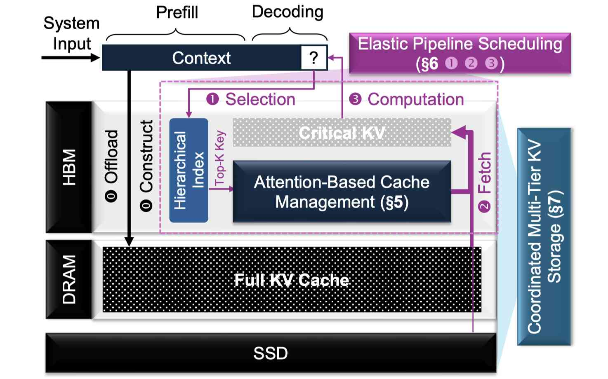

# KVDrive: A Holistic Multi-Tier KV Cache Management System for Long-Context LLM Inference

> Jian Lin, Jiazhi Mi, Zicong Hong, Haodong Wang, Qianli Liu, Haoyue Zhang, Peng Li, Song Guo



> 注：以下论文笔记由 AI Agent 自动生成，可能存在理解偏差或遗漏，请以原论文为准。

## Abstract

Supporting long-context LLMs is challenging due to the substantial memory demands of the key-value (KV) cache. Existing offloading systems store the full cache in host memory and selectively fetch critical entries during decoding, but this strategy quickly hits a ceiling: sparsity cannot be pushed further without degrading accuracy. As a result, when context length and batch size grow, the volume of KV transfers rises sharply and becomes the dominant source of decoding latency. We present KVDrive, a holistic multi-tier KV cache management system spanning GPU memory, host DRAM, and SSD. Unlike prior work that pursues greater sparsity through algorithmic refinements, KVDrive tackles the problem from a systems perspective - jointly orchestrating cache placement, pipeline scheduling, and cross-tier coordination to sustain high-throughput inference under tight GPU budgets. KVDrive advances three fundamental capabilities: it adapts cache management to attention behavior to maximize reuse and minimize redundant data movement; it restructures the decoding pipeline to overlap I/O- and CPU/GPU compute-bound stages, eliminating stalls across heterogeneous resources; and it harmonizes data movement across memory tiers to unlock scalable long-context inference far beyond GPU and DRAM limits. We have implemented a fully functional prototype of KVDrive and evaluated it on long-context benchmarks with popular LLMs. The system achieves up to 1.74x higher throughput compared to state-of-the-art works while preserving accuracy.

## 一句话总结

KVDrive 的核心不是再提出一个更激进的 sparse attention 算法，而是把长上下文 decoding 中的 KV cache offloading 重新定义成一个三层系统问题：在 GPU HBM、host DRAM 和 SSD 之间联合决定哪些 KV 常驻、哪些 KV 被拉取、如何流水化 selection/fetch/compute，以及如何避免粗粒度 offload 带来的 I/O 放大。它对 KV lifecycle management 的价值在于证明：tier placement、attention-aware reuse、pipeline scheduling 和 cross-tier synchronization 必须一起设计，单独优化稀疏率或单独增加 SSD 容量都不够。

## 背景与问题

长上下文 LLM 推理的核心瓶颈是 KV cache。模型参数是固定的，但 KV cache 随上下文长度和 batch size 线性增长；在 60K、120K 乃至更长上下文下，单个 active session 的 KV cache 就可能超过 GPU HBM。传统 offloading 思路有两类：

1. **多 session offload**：假设 active session 的 KV 可以放进 GPU，只把 inactive session 放到 host memory。这个假设在 long-context active session 下失效。
2. **query-aware sparse offloading**：把所有 key/index 或压缩索引留在 GPU/host，decode 时只取 Top-K critical KV entries。Quest、ShadowKV、InfiniGen、MagicPIG、PQCache、RetroInfer 等都属于这个方向的不同实现。

论文指出，第二类系统遇到一个硬上限：如果继续提高 sparsity，就会损害准确率；如果不提高 sparsity，在 context length 和 batch size 变大时，需要从 host/SSD 拉取的 KV 数据量会迅速上升，decode latency 被 transfer 主导。也就是说，问题不能只靠“更稀疏”解决，必须从系统角度同时处理 cache placement、pipeline overlap 和 multi-tier coordination。

## 核心方法

KVDrive 提出一个跨 **GPU memory / host DRAM / SSD** 的 holistic multi-tier KV cache management system，主要由三组机制组成。

### 1. Attention-Based Cache Management

KVDrive 不采用通用的 LRU/LFU，而是利用 transformer attention 的行为特征。论文观察到 critical KV entries 在相邻 token 以及更宽的局部 decode window 内存在 temporal locality：连续生成的 token 往往关注重叠的历史 KV 区域。

基于这个观察，KVDrive 在 GPU 内维护一个 critical KV sliding window：

- 不每步重新把所有 critical KV 拉入 GPU；
- 保留最近 window 中仍可能被访问的 hot KV；
- 只增量加载 window 差异部分；
- 用 attention score 而不是纯 recency/frequency 进行 cache eviction。

论文还提出 2D layer-head cache allocation，因为不同 layer/head 的复用模式并不均匀。统一给每层每头分配相同 cache window 会浪费 GPU cache；按 layer/head 的 attention/reuse 模式分配可以减少数据传输量。

### 2. Elastic Pipeline Scheduling / SFC Disaggregation

KVDrive 把每个 decode step 拆成三类阶段：

1. **Selection**：根据 query 和 index 选择 critical KV entries；
2. **Fetching**：从 host DRAM 或 SSD 拉取缺失 KV 到 GPU；
3. **Computation**：执行 sparse attention、FFN 等计算。

很多 prior systems 把这三步串行执行，导致 GPU 等 CPU、CPU 等 I/O、I/O 等调度的 stall。KVDrive 使用 SFC disaggregation，把 selection、fetching、computation 解耦成可独立调度的 pipeline stage，并将 batch 切成 micro-batches：

- GPU 可以对当前 micro-batch 做 selection；
- CPU 同时检查前一个 micro-batch 的 cache hit/miss；
- I/O 子系统同时取更早 micro-batch 的 KV；
- computation 在 fetch 完成后对 batch 执行；
- metadata update 与 computation overlap。

这个设计的重点不是简单“异步 I/O”，而是根据 selection/fetch/compute 三类资源瓶颈不同，把它们变成可流水化的异构资源调度问题。

### 3. Coordinated Multi-Tier KV Storage

KVDrive 将 SSD 纳入 KV hierarchy，而不是只做 DRAM offload。它的 multi-tier storage 包括：

- **SSD 作为完整 backing store**：prefill 结束后，完整 KV 被持久化到 SSD；
- **importance-guided warm-up**：利用 prompt 末尾 observation window 的 attention distribution 估计 prefix token 重要性，将最高重要性的 KV 放到 HBM，次高重要性的放到 DRAM，其余放到 SSD；
- **SSD-aware layout**：减少随机 I/O，提升顺序访问局部性；
- **parallel sparse synchronization**：decode 中只同步需要的 sparse KV blocks，而不是像 FlexGen-style layer-wise offload 那样整层搬运。

这直接针对粗粒度 offload 的 I/O amplification：如果每层都把完整 KV 从 SSD/DRAM 搬上来，即使 SSD 容量足够，decode throughput 也会被 I/O 拖垮。

## 技术细节

### Critical KV window

论文把每个 decode step 需要访问的 critical KV entries 扩展为一个 window，而不是只看当前 token 的 Top-K。窗口越大，GPU 中保留的 critical KV 越多，reload 数据越少；但窗口越大也会增加 GPU memory overhead 和 lookup overhead。因此 KVDrive 需要在 window size、sparsity budget、GPU cache size 之间做折中。

论文 Figure 3 的实验显示，扩大 critical KV window 可以显著减少 data transfer，且 memory overhead 相对可控。这是 KVDrive attention-based cache 的基础。

### Lookahead eviction

KVDrive 的 eviction 不是简单 LRU。它利用近期/未来局部窗口中的 attention 重要性，对候选 KV 做 lookahead eviction：优先保留更可能在后续 decode window 中被关注的 KV。论文 Table 3 显示，在 Quest、ShadowKV、RetroInfer、KVDrive 等系统上，lookahead 策略相对 LRU 多数情况下能提高 hit rate，提升范围大约为 0.9% 到 3.9%，但并非所有模型/系统上都稳定为正，例如 Phi-4-mini 上 Quest/ShadowKV 的某些配置出现负提升。

这点很关键：attention-aware eviction 是有价值的，但不是万能启发式；它需要模型、layer/head 和 workload-aware calibration。

### 2D layer-head scaling

不同层和不同 attention head 的 critical KV reuse 模式不一致。KVDrive 不用一维统一窗口，而是做 2D scaling，把 GPU cache budget 分配到 layer/head 维度。论文 Figure 15 显示，相比 uniform allocation，2D scaling 在相同 GPU memory budget 下减少了 data transfer。

### SFC pipeline 参数

KVDrive pipeline 的性能取决于几个参数：

- index centroids 数量；
- GPU cache size；
- micro-batch size；
- chunk size；
- window size；
- sparsity budget。

这些参数互相牵制。例如 window size 增大减少 I/O，但 lookup latency 会增加；batch size 变大时，更大的 window 可能更有价值，因为 I/O 带宽更容易成为瓶颈。论文的微基准显示，这不是一个可由单一常数配置解决的问题。

## 实验设置

### 模型

论文评估了四个长上下文模型：

- Llama-3-8B-1048K，8B 参数，1M token context window；
- Qwen3-8B，128K context window；
- Qwen3-14B，128K context window；
- Microsoft Phi-4-mini-instruct，3.8B 参数，128K context window。

### Benchmark

使用两个 long-context benchmark：

- **LongBench**：长上下文理解；
- **RULER**：覆盖 retrieval、multi-hop reasoning、aggregation、QA 等任务。

### Baselines

论文比较了八类配置/系统：

- Original：全部 KV 保留在 GPU，不 offload；
- FlexGen：full-cache layer-wise offloading；
- Quest；
- ShadowKV；
- PQCache；
- MagicPIG；
- RetroInfer；
- RetroInfer(E)：保留原生 attention estimation 的 RetroInfer 变体。

在 EfficientPaper metadata 中，我只加入了当前库里已存在且格式合法的 baseline：`2024/Quest`、`2025/ShadowKV`、`2025/PQCache`。MagicPIG、RetroInfer、FlexGen 等如果未来加入 EfficientPaper，可再补到 baseline graph。

### 硬件

论文覆盖三类硬件环境：

1. **Cost-efficient server**：NVIDIA L20 48GB，Intel Xeon Platinum 8457C，100GB DDR5 host memory；
2. **High-end server**：NVIDIA H20 96GB，AMD EPYC 9K84 96-core，200GB DDR5 host memory；
3. **Workstation**：NVIDIA RTX 4090 24GB，Intel Xeon Gold 6430，120GB DDR5 host memory；

磁盘为 NVMe U.2 SSD。

## 主要结果

### Throughput

KVDrive 在多个模型、context length 和 batch size 下稳定超过 baseline。论文摘要报告最高达到 **1.74× throughput improvement**。在 L20 server 上，Figure 13 显示：

- Llama-3-8B-1048K：不同 context 下相对最佳 baseline 有约 1.30× 到 1.42×；
- Qwen3-8B：约 1.25× 到 1.62×；
- Phi-4-mini-128K：最高约 1.74×。

论文正文还指出，相对 ShadowKV 这一强 baseline，KVDrive 最高有约 70% throughput improvement。

### Accuracy

Table 2 显示 KVDrive 在 RULER 和 LongBench 上的准确率与 Quest、ShadowKV、RetroInfer、PQCache、MagicPIG 等系统大体同级，通常接近 Full/Original 配置。论文据此认为系统优化主要来自 cache management 和 scheduling，而不是以牺牲准确率换速度。

### OOM / Host memory pressure

Original 在长上下文大 batch 下会 OOM。部分 offloading baseline 因 index 或 host-memory footprint 过大也可能初始化失败。FlexGen-style full-cache offload 虽然可绕过部分 OOM，但因为每步从 off-chip storage 加载大量 KV，吞吐可降到 `<1 token/s`，在实际 serving 中基本不可用。

### Microbenchmark

论文微基准验证了几个设计选择：

- lookahead eviction 多数情况下优于 LRU；
- 2D window scaling 比 uniform allocation 更省 data transfer；
- window size 存在 I/O 减少与 lookup latency 增加的 tradeoff；
- chunk size、centroids 数量、micro-batch size 都会改变 selection/lookup/I/O/attention/eviction/FFN 的相对瓶颈。

## 优点与局限

### 优点

1. **问题定义准确**：KVDrive 没有陷入“继续提高稀疏率”的单点优化，而是指出 sparsity 有准确率上限，真正问题是 active long-context decoding 中 KV transfer 成为主瓶颈。
2. **系统 co-design 完整**：attention-aware cache、elastic pipeline、multi-tier storage 三者形成闭环。
3. **SSD tier 处理更现实**：不是简单把 SSD 当大内存，而是强调 layout、sparse synchronization 和 warm-up。
4. **与 cost-aware lifecycle 很契合**：KVDrive 的每个动作都可以抽象成 lifecycle action：place、promote、demote、fetch、evict、sync、pipeline。

### 局限

1. **参数复杂度高**：window size、chunk size、centroids、GPU cache budget、micro-batch size 都要调；这些参数对模型、硬件和 workload 敏感。
2. **主要面向 sparse attention/offloading decoding**：如果 serving workload 的主要收益来自 prefix reuse、cross-request sharing 或 prefill KV restore，KVDrive 不是完整答案。
3. **SSD control path 不是重点**：与 Tutti 相比，KVDrive 更关注 multi-tier sparse synchronization 和 pipeline overlap，没有把 GPU-initiated NVMe I/O / CPU control-plane bottleneck 作为核心贡献。
4. **跨节点场景不足**：论文主要处理单机 GPU/DRAM/SSD hierarchy，对 RDMA、remote KV pool、prefill/decode disaggregation 下的跨节点 KV lifecycle 还没有充分展开。
5. **准确率结论依赖 sparse attention 配置**：论文报告总体 accuracy preserved，但 sparse attention 的质量风险仍取决于任务、模型和检索/推理模式；对 agentic tool traces 的适配还需要单独验证。

## 与 EfficientPaper 主题的关系

KVDrive 属于 `kv_cache_management`。它在 EfficientPaper 里的位置应放在 KV cache lifecycle / tiered storage / long-context serving 这一主线上，和以下工作形成互补：

- **Quest / ShadowKV / PQCache / RetroInfer / MagicPIG**：更偏 query-aware sparse retrieval / approximate selection；KVDrive 把这些思想放入 multi-tier runtime。
- **Tutti**：更偏 SSD restore path 的 control-plane bottleneck；KVDrive 更偏 holistic multi-tier placement 和 pipeline。
- **KunServe**：处理 burst memory overloading 时的 parameter-centric memory management；KVDrive 处理长上下文 decoding 中的 KV movement bottleneck。
- **SGLang HiCache / HiSparse**：工程 runtime 中的 hierarchical KV cache 和 sparse-aware offload；KVDrive 提供论文侧的系统设计与实验支撑。
- **Cost-Aware KV Lifecycle Management proposal**：KVDrive 直接支持 proposal 中的 tier placement、attention-aware reuse prediction、restore cost modeling、pipeline overlap cost 和 SSD/DRAM/HBM hierarchy。

## 可复现/实现要点

如果要把 KVDrive 的思想落到 LMCache / vLLM / SGLang 原型中，最值得先实现的不是完整系统，而是以下可验证模块：

1. **attention-aware eviction score**：用 attention mass / layer-head reuse profile 替代纯 LRU/LFU；
2. **critical KV window**：在 GPU tier 中保留最近若干 decode step 的 critical KV，并统计 incremental reload bytes；
3. **tier placement warm-up**：prefill 结束后根据 observation window attention profile，把 hot KV 放 HBM，warm KV 放 DRAM，cold KV 放 SSD；
4. **pipeline instrumentation**：把 selection、lookup、fetch、attention、FFN、eviction、metadata update 的时间分开记录；
5. **simulator 中加入 micro-batch pipeline**：评估 selection/fetch/compute overlap 是否能降低 TTFT/TPOT；
6. **SSD-aware sparse synchronization**：避免 full-layer KV load，记录 sparse block read 的随机 I/O 和 batching 开销。

## 对 Cost-Aware KV Lifecycle Management 的启发

KVDrive 给 proposal 的最强启发是：KV lifecycle optimizer 不应只输出“这个 block 要不要 evict”，而应输出一组联合动作：

```text
for each KVObject / KVGroup:
  choose tier = {HBM, DRAM, SSD}
  choose representation = {full, sparse, quantized future extension}
  choose residency window = per layer/head critical window
  choose recovery plan = {resident, fetch, prefetch, recompute}
  choose pipeline schedule = microbatch S/F/C overlap
  choose sync policy = dense layer-wise vs sparse block-wise
```

这比简单 cache policy 更接近真实 serving 系统。特别是 KVDrive 证明了一个负面结论：如果没有 coordinated multi-tier design，SSD 只会把系统从 HBM OOM 变成 I/O-bound；如果没有 pipeline scheduling，attention-aware sparse retrieval 也会被 selection/fetch stalls 吃掉收益。

## 个人备注

KVDrive 和 Tutti 应该一起读。二者都围绕 SSD-backed KV cache，但切入点不同：

- KVDrive 说：**哪些 KV 应该在 HBM/DRAM/SSD 之间移动，以及如何流水化 sparse retrieval**；
- Tutti 说：**SSD I/O 的控制面不能放在 CPU 上，否则带宽用不出来**。

对我们的 proposal 来说，二者合起来的结论更尖锐：SSD tier 不是一个 backend，而是一组 runtime design choices。真正的 cost model 必须同时包含 KV importance、tier placement、object layout、I/O submission path、pipeline slack 和 restore/recompute tradeoff。
