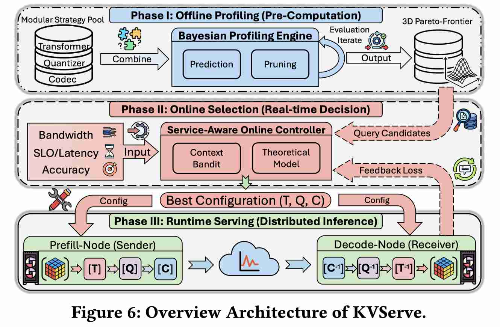

# KVServe: Service-Aware KV Cache Compression for Communication-Efficient Disaggregated LLM Serving

> Zedong Liu, Xinyang Ma, Dejun Luo, Hairui Zhao, Bing Lu, Wenjing Huang, Yida Gu, Xingchen Liu, Zheng Wei, Jinyang Liu, Dingwen Tao, Guangming Tan

## Abstract

LLMs are widely adopted in production, pushing inference systems to their limits. Disaggregated LLM serving (e.g., PD separation and KV state disaggregation) improves scalability and cost efficiency, but it also turns KV into an explicit payload crossing network and storage boundaries, making KV a dominant end-to-end bottleneck. Existing KV compression are typically static runtime configurations, despite production service context varies over time in workload mix, bandwidth, and SLO/quality budgets. As a result, a fixed choice can be suboptimal or even increase latency. We present \emph{KVServe}, the first service-aware and adaptive KV communication compression framework for disaggregated LLM serving: KVServe (1) unifies KV compression into a modular strategy space with new components and cross-method recomposition; (2) introduces Bayesian Profiling Engine that efficiently searches this space and distills a 3D Pareto candidate set, reducing $50\times$ offline search overhead; and (3) deploys a Service-Aware Online Controller that combines an analytical latency model with a lightweight bandit to select profiles under constraints and correct offline-to-online mismatch. Integrated into vLLM and evaluated across datasets, models, GPUs and networks, KVServe achieves up to $9.13\times$ JCT speedup in PD-separated serving and up to $32.8\times$ TTFT reduction in KV-disaggregated serving.

---

*以下总结由 MiMo 生成：*

这篇论文针对离散化LLM服务中KV缓存通信效率低下的问题，提出KVServe框架。它通过统一KV压缩策略空间、引入贝叶斯分析引擎优化搜索效率，并部署服务感知在线控制器动态调整配置。实验表明，KVServe在PD分离服务中最高实现9.13倍作业完成时间加速，在KV离散化服务中降低32.8倍首token延迟。

## GPT Summary

> 由 GPT 自动生成，请人工核验。

### 1. 研究背景与动机

KVServe 关注 disaggregated LLM serving 中 KV cache 跨网络/存储边界传输的通信瓶颈。随着 PD separation、KV state disaggregation、prefix caching、RAG 和 agent workloads 普及，KV cache 不再只是 GPU 内部状态，而成为需要在 prefill/decode 节点、远端 KV pool 或存储层之间移动的显式 payload。论文指出，在端到端实验中 KV communication 可占 JCT 的 60%，而静态 KV compression 配置会随 workload、bandwidth、SLO 和质量预算变化出现次优甚至负优化。

### 2. KVServe 核心思想

KVServe 是一个 service-aware、adaptive 的 KV communication compression 框架。它不固定选择某一种压缩方法，而是把 transform、quantization、codec 等组件统一成模块化策略空间，通过 Bayesian Profiling Engine 离线搜索 Pareto candidate，再由 Service-Aware Online Controller 根据实时服务上下文选择合适 profile。

### 3. 关键技术

| 技术 | 说明 |
|------|------|
| 模块化 KV compression pipeline | 将 KV compression 生命周期抽象为 transform、quantization、codec 等阶段，允许跨方法重组，例如把 QuaRot-style transform 与其他量化/编码组件组合。 |
| Bayesian Profiling Engine | 将 profile 搜索建模为 constrained black-box optimization，用 Gaussian Process Bayesian Optimization 在大组合空间中寻找满足质量/SLO 约束的 Pareto profiles，减少约 50× offline search overhead。 |
| 3D Pareto candidate set | 同时考虑 latency、compression ratio/communication saving、quality constraint，不只追求压缩率。 |
| Service-Aware Online Controller | 在线感知 workload、bandwidth、SLO/quality budget 等服务上下文，结合 analytical latency model 与 lightweight bandit 选择 profile。 |
| Offline-to-online correction | 用 bandit/residual correction 修正 profiling 与线上真实服务之间的 mismatch，避免静态配置在短上下文或高带宽场景中负优化。 |
| vLLM 集成 | 在 vLLM 0.10.1 上实现，支持 disaggregated prefill-decode execution，并把 compression pipeline 注入 KV 迁移路径。 |

### 4. 实验结果

| 场景/指标 | 结果 |
|------|------|
| PD-separated serving | 最高约 9.13× JCT speedup；在 5 Gbps 受限带宽下报告约 9.2× speedup。 |
| KV-disaggregated / prefix caching | 最高约 32.8× TTFT reduction，相比 recomputation 更容易满足严格 SLO。 |
| Offline search overhead | Bayesian Profiling Engine 将离线搜索开销降低约 50×。 |
| Latency breakdown | Default BF16 在部分场景 communication 占 82%–90% JCT；KVServe 将 communication share 降至约 6%–9%。 |
| Online decision overhead | 每次在线 profile decision 小于 1 ms。 |
| Accuracy/compression | 在 97% relative accuracy 约束下，KVServe-Aware 平均相对准确率约 100.35%，平均 compression ratio 约 8.28。 |

### 5. 核心贡献

- 首个面向 disaggregated LLM serving 的 service-aware adaptive KV communication compression 框架。
- 将已有 KV compression 方法从“单点算法”提升为可组合策略空间，并能按服务上下文动态选择。
- 用 Bayesian profiling + Pareto candidate set 降低离线搜索成本，避免穷举全部配置。
- 用 analytical latency model + lightweight bandit 处理线上 bandwidth/workload/SLO 波动。
- 对当前 KV management 主线很重要：它把 KV cache compression 与 serving runtime、network bottleneck、SLO-aware scheduling 明确连接起来。

### 6. 局限与可 follow 点

- KVServe 更偏 communication compression/runtime selection，不直接解决 GPU HBM 内 hot/cold KV placement。
- 其收益依赖 disaggregated serving 场景；在短上下文或高带宽场景，错误压缩策略可能负优化，因此 online controller 是关键。
- 后续可与 HiSparse、Bidaw、PredictKV、Tutti、QuaRot/KIVI/KVQuant 组合，研究 training-free 的 bandwidth-aware + precision-aware hierarchical KV cache runtime。

