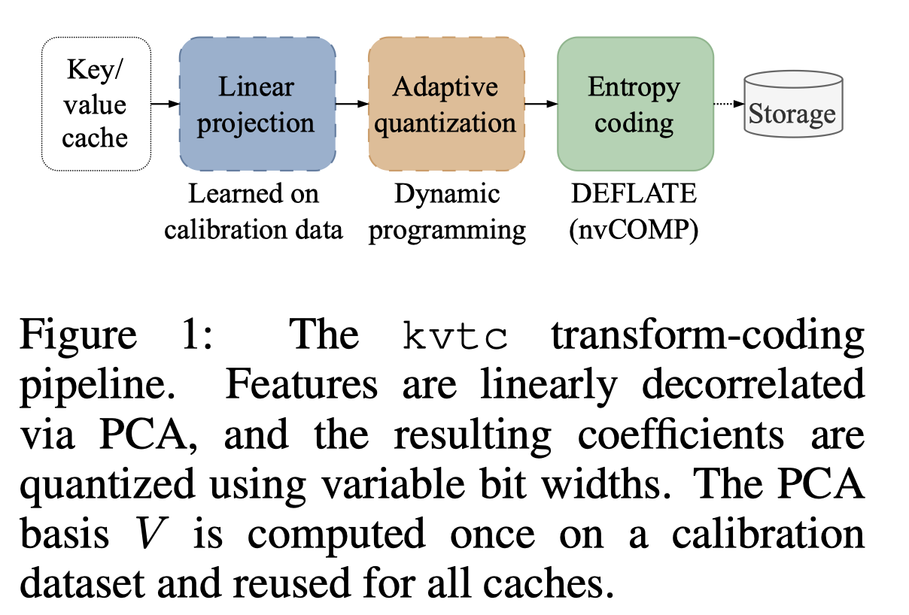

# KV Cache Transform Coding for Compact Storage in LLM Inference

> Konrad Staniszewski, Adrian Łańcucki

## Abstract

Serving large language models (LLMs) at scale necessitates efficient key-value (KV) cache management. KV caches can be reused across conversation turns via shared-prefix prompts that are common in iterative code editing and chat. However, stale caches consume scarce GPU memory, require offloading, or force recomputation. We present KVTC, a lightweight transform coder that compresses KV caches for compact on-GPU and off-GPU storage. Drawing on classical media compression, KVTC combines PCA-based feature decorrelation, adaptive quantization, and entropy coding. It requires only a brief initial calibration and leaves model parameters unchanged. By exploiting redundancies in KV caches, KVTC achieves up to 20$\times$ compression while maintaining reasoning and long-context accuracy, and 40$\times$ or higher for specific use cases. We test KVTC with Llama 3, Mistral NeMo, and R1-Qwen 2.5 models across benchmarks including AIME25, GSM8K, LiveCodeBench, LongBench, MATH-500, MMLU, Qasper and RULER. It consistently outperforms inference-time baselines such as token eviction, quantization, and SVD-based methods, while achieving higher compression ratios. These results support KVTC as a practical building block for memory-efficient LLM serving with reusable KV caches.

---

*以下总结由 MiMo 生成：*

这篇论文针对大语言模型推理中KV缓存占用大量GPU内存的问题，提出了一种轻量级的压缩编码方法KVTC。该方法结合了PCA特征解相关、自适应量化和熵编码，能够在不改变模型参数的情况下对KV缓存进行高效压缩。实验表明，KVTC在保持模型推理和长上下文准确性的同时，实现了高达20倍的压缩比，在特定场景下甚至达到40倍以上，显著优于现有的缓存管理基线方法。
