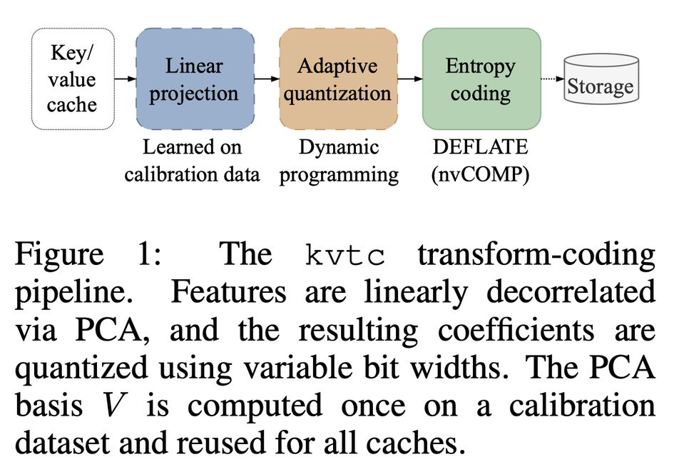

# KV Cache Transform Coding for Compact Storage in LLM Inference

> Konrad Staniszewski, Adrian Łańcucki
> 发表于 ICLR 2026
> 机构：NVIDIA、University of Warsaw

---

## 一句话总结

KVTC 是一种受经典图像压缩启发的轻量级 KV 缓存变换编码方法，通过 PCA 特征解相关 + 动态规划比特分配 + 熵编码三级管线，实现了高达 20× 的 KV 缓存压缩（特定场景 40×+），同时几乎不损失模型推理和长上下文准确性，为 LLM 推理服务中的 KV 缓存管理提供了实用的存储压缩方案。

---

## 摘要翻译

在大规模服务大语言模型（LLM）时，高效的键值（KV）缓存管理至关重要。KV 缓存可以通过共享前缀提示（common in iterative code editing and chat）跨对话轮次复用。然而，过期的缓存会占用宝贵的 GPU 显存，需要卸载或强制重新计算。本文提出了 KVTC，一种轻量级的变换编码器，用于将 KV 缓存压缩以实现紧凑的片上和片外存储。KVTC 借鉴经典媒体压缩技术，结合了基于 PCA 的特征解相关、自适应量化和熵编码。它仅需短暂的初始校准过程，且不改变模型参数。通过利用 KV 缓存中的冗余，KVTC 实现了高达 20× 的压缩比，同时保持推理和长上下文准确性，特定场景下可达 40× 或更高。实验在 Llama 3、Mistral NeMo 和 R1-Qwen 2.5 模型上进行，涵盖 AIME25、GSM8K、LiveCodeBench、LongBench、MATH-500、MMLU、Qasper 和 RULER 等基准测试，KVTC 持续优于推理时基线方法（如 token 驱逐、量化和 SVD 方法），同时实现更高的压缩比。

---

## 研究动机

1. **KV 缓存的内存瓶颈**：现代 Transformer 模型的 KV 缓存可轻松占据数 GB 显存。以 Llama 3.1 8B 为例，1K token 的 KV 缓存就需要 128 MiB（16 位）。随着模型规模增长和推理能力增强（如生成越来越长的推理链），KV 缓存占用量不断增大，成为吞吐量和延迟的显著瓶颈。

2. **缓存管理的两难困境**：在用户对话间隙，过期的 KV 缓存占用 GPU 显存（影响其他用户服务），但保留它们能为未来响应提供最快路径。丢弃缓存则需要重新计算，卸载到 CPU/SSD 则带来传输开销。这在生产系统中形成了延迟-吞吐量的权衡难题。

3. **现有方法的不足**：
   - 量化方法（KIVI、GEAR）在高压缩比下精度下降明显；
   - 驱逐方法（H2O、TOVA）作为通用 KV 缓存压缩器表现不佳；
   - SVD 方法（xKV、SVDq）需要为每个提示计算 SVD，计算成本高；
   - 这些方法通常未充分利用 KV 张量的强低秩结构。

4. **跨头冗余的发现**：论文通过 Procrustes 对齐实验发现，不同注意力头的 key/value 缓存实际上共享一个共同子空间（经正交变换后余弦相似度大幅提升），这为跨头的 PCA 降维提供了理论基础。

---

## 方法（技术细节）

### 整体架构

KVTC 借鉴经典图像编码（如 JPEG）的变换编码范式，构建了一个三阶段管线：

**校准（Calibration）→ 压缩（Compression）→ 解压（Decompression）**

核心思想是：对 KV 缓存进行 PCA 降维（特征解相关）→ 动态规划比特分配 → 熵编码（DEFLATE）。

### 1. 特征解相关（Feature Decorrelation）

- **跨层 KV 拼接**：将多个层的 key/value 缓存沿隐藏维度 `dhead` 拼接，形成数据矩阵 `C ∈ R^{n×p}`，其中 `p = l × h × dhead`。
- **移除位置编码**：在压缩前移除 RoPE（旋转位置编码），因为位置编码会扭曲 KV 的低秩结构。
- **SVD/PCA**：对中心化后的数据矩阵进行 SVD 分解（`C - μ = UΣV^T`），得到投影矩阵 `V^T`。使用随机化 SVD 以降低计算成本。
- **一次性校准**：投影矩阵仅需在每个模型和压缩比下计算一次，然后在所有推理请求中复用。校准过程对 12B 模型可在 H100 GPU 上 10 分钟内完成。
- **跨领域泛化**：实验证明 PCA 基在 FineWeb 和 OpenR1 等不同数据域间具有良好的泛化性。

### 2. 自适应量化（Adaptive Quantization）

- **动态规划比特分配**：利用 PCA 的有序性（主成分按方差排序），通过动态规划算法在固定比特预算下最小化 Frobenius 重构误差。
- **分组量化**：受 Microscaling 数据格式启发，将连续的 PCA 坐标分组量化，每组共享 16 位的 shift 和 scaling 因子。DP 同时优化每组的比特宽度和组大小（限制为 {1, 16, 64, 256, 1024}）。
- **稀疏分配**：DP 会将大量尾部主成分分配为零比特，从而允许提前截断 PCA 维度，加速压缩/解压。
- **校准数据量**：约 200K token 在单个 H100 上即可完成。

### 3. 熵编码（Entropy Coding）

- 使用 **DEFLATE** 算法（通过 NVIDIA nvCOMP 实现 GPU 并行操作）进一步无损压缩量化后的字节流。
- 额外压缩比约为 1.23×，是内容相关的。
- 该步骤在 GPU 上可直接并行执行。

### 4. 滑动窗口与 Sink Token 保护

- **不压缩最近 w=128 个 token**（滑动窗口）和**最老的 s=4 个 token**（attention sink）。
- 原因：这些 token 对注意力模式有不成比例的高贡献，压缩会显著降低精度。
- 在高压缩比（64×）下，ablation 实验显示压缩这些 token 会完全崩溃某些任务的准确率。

### 5. 多轮对话支持

- KV 缓存可跨对话轮次复用，仅需对新 token 进行前缀扩展。
- 压缩/解压发生在推理阶段之间（如解码后或预填充与解码之间）。
- 解压时可逐层进行，使生成可以提前开始。

### 6. 三种工作模式

- **校准**：一次性，计算 PCA 基和比特分配。
- **压缩**：在推理阶段间执行（GPU 或 CPU），用于存储/传输。
- **解压**：反转压缩步骤，最耗时的逆投影可逐层执行。

---

## 实验结果

### 评估模型

| 模型 | 参数量 | KV 缓存大小（1K token） |
|------|--------|------------------------|
| Qwen 2.5 R1 1.5B | 1.5B | 28 MiB |
| Qwen 2.5 R1 7B | 7B | 56 MiB |
| Llama 3.1 8B | 8B | 128 MiB |
| Llama 3.3 70B Instruct | 70B | 320 MiB |
| Mistral NeMo 12B | 12B | 160 MiB |
| MN-Minitron 8B | 8B | 160 MiB |

### 主要实验结果

#### 通用基座模型（8-12B 规模，Table 2）

KVTC 在 Llama 3.1 8B、MN-Minitron 8B、Mistral NeMo 12B 上的表现：

- **16× 压缩（约 20× 含 DEFLATE）**：在所有测试任务上保持与 vanilla 模型 < 1 分的差异。
- **32× 和 64× 压缩**：仍有高精度。
- **对比基线**：
  - GEAR/KIVI（量化方法）在 GSM8K 和 LITM 任务上 5× 压缩即出现性能下降。
  - H2O/TOVA（驱逐方法）作为通用压缩器表现不佳。
  - xKV 在大多数任务表现良好，但 Qasper 例外。
- **部分情况下，KVTC 在极高压缩比下甚至超越 vanilla**。

#### 推理模型（Table 3）

在 DeepSeek-R1 蒸馏的 Qwen 2.5 模型上（1.5B/7B）：

- AIME 2024/2025（数学竞赛）、LiveCodeBench（编码任务）
- KVTC 8× 压缩在编码任务上仅有 0.2-0.3pp 的精度下降
- KVTC 16× 压缩在 AIME 上表现稳定（与 DMS 相当或更优）

#### 多 GPU 推理（Table 4）

在 Llama 3.3 70B（4 GPU pipeline parallel）上：

- MATH-500：10× 压缩精度下降 1.2pp，20× 下降 3.0pp
- NIAH 和 LITM：20× 压缩仍保持 100% 准确率

#### 延迟（Table 5）

- Mistral NeMo 12B 上，KVTC 16× 压缩的解压时间（267ms for BS=8 CTX=8K）远低于重新计算 TTFT（3098ms），即 **8× TTFT 提升**。
- 压缩总时间（压缩）约 379ms（BS=8 CTX=8K），解压约 267ms。

---

## 优势

1. **极高的压缩比**：20× 通用，40×+ 特定场景，远超现有方法（CacheGen 仅 8.6×，GEAR/KIVI 约 5×）。
2. **几乎无损**：16× 压缩在所有测试任务上保持 < 1 分的精度差异。
3. **通用性好**：跨模型（1.5B-70B）、跨任务（数学、编码、长上下文、知识）表现一致。
4. **无需训练/微调**：仅需一次性校准，不改变模型参数。
5. **与现有方法可组合**：KVTC 不改变 KV 缓存结构和注意力计算方式，可与 token 驱逐方法（如 TOVA、DMS）直接组合，实现更低的缓存占用。
6. **GPU 友好**：校准在 GPU 上完成，熵编码使用 nvCOMP GPU 并行实现。
7. **实用性强**：低延迟（解压远快于重计算），适用于生产环境中的 KV 缓存管理。
8. **平滑的压缩-精度权衡**：可通过调整压缩比灵活权衡存储和精度。

---

## 局限

1. **在线压缩不足**：KVTC 设计面向存储压缩和减少 TTFT，而非推理时的实时压缩。未来可探索在主成分空间中直接进行推理。
2. **可扩展性限制**：
   - 仅在 1.5B-70B 的密集解码器模型上验证，更大模型需进一步研究。
   - 校准数据量约 200K token，扩展到更多 token 主要是 PCA 计算量的问题。
3. **Frobenius 范数重构误差的局限性**：该指标不能保证任务级增益，其预测能力可能依赖于任务。
4. **压缩/解压时间**：简单实现的压缩和解压时间可通过 kernel fusion 和分层 PCA 进一步优化。
5. **跨领域泛化**：虽然展示了跨域泛化能力，但模拟多轮设置可能不完全反映真实内容分布和交互模式。
6. **缺少开源代码**：prototxt 中未提供代码仓库 URL。

---

## 与 EfficientPaper 相关的研究方向

### 相关基线方法

| 方法 | 年份 | 类型 |
|------|------|------|
| KIVI | 2024 | 2-bit 不对称量化 |
| TOVA | 2024 | Token 驱逐 |
| H2O | 2023 | Token 驱逐（Heavy-Hitter Oracle） |
| GEAR | 2024 | 低秩校正量化 |
| xKV | 2025 | 跨层 SVD 压缩 |
| DMS | 2025 | 训练 token 驱逐 |

### 相关研究方向

1. **KV 缓存量化**：KIVI、KVQuant、GEAR 等方法，但 KVTC 通过 PCA+动态规划实现了更高的压缩比和更好的精度。
2. **KV 缓存压缩与管理**：CacheGen、LMCache、Mooncake 等系统，KVTC 可作为其中的压缩层。
3. **SVD 低秩压缩**：SVDq、xKV、LoRC 等，KVTC 与这些方法的关键区别在于一次性校准和动态规划比特分配。
4. **稀疏注意力**：H2O、TOVA、Quest、Native Sparse Attention 等，KVTC 可与这些方法组合使用。
5. **变换编码在 LLM 中的应用**：KVTC 将经典图像/视频压缩范式（变换编码）引入 KV 缓存压缩，开辟了新的研究方向。
6. **多 GPU 推理中的缓存管理**：KVTC 在 pipeline parallel 设置下的有效性（Table 4）为分布式 LLM 服务提供了参考。
7. **推理加速**：KVTC 通过减少 KV 缓存大小降低 TTFT（8× 提升），对推理延迟优化有重要意义。
8. **多轮对话缓存复用**：KVTC 的设计考虑了多轮对话场景下的缓存复用和过期管理，与 CacheBlend、CacheGen 等工作方向一致。

---

*本 note 由 AI Agent（Hermes Agent）自动生成，基于论文原文阅读。生成时间：2026年6月4日。*
