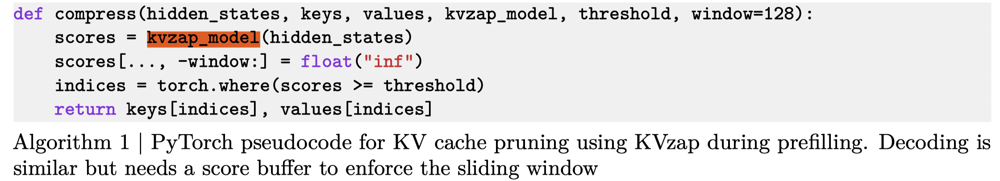

# KVzap: Fast, Adaptive, and Faithful KV Cache Pruning

> Simon Jegou, Maximilian Jeblick

## Abstract

Growing context lengths in transformer-based language models have made the key-value (KV) cache a critical inference bottleneck. While many KV cache pruning methods have been proposed, they have not yet been adopted in major inference engines due to speed--accuracy trade-offs. We introduce KVzap, a fast, input-adaptive approximation of KVzip that works in both prefilling and decoding. On Qwen3-8B, Llama-3.1-8B-Instruct, and Qwen3-32B across long-context and reasoning tasks, KVzap achieves $2$--$4\times$ KV cache compression with negligible accuracy loss and achieves state-of-the-art performance on the KVpress leaderboard. Code and models are available at https://github.com/NVIDIA/kvpress.
