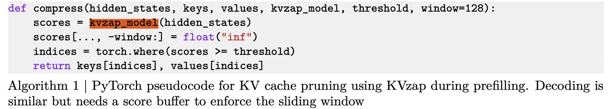

# KVzap: Fast, Adaptive, and Faithful KV Cache Pruning

> Simon Jégou, Maximilian Jeblick

> 注：以下论文笔记由 AI Agent 自动生成，可能存在理解偏差或遗漏，请以原论文为准。

## Abstract

Growing context lengths in transformer-based language models have made the key-value (KV) cache a critical inference bottleneck. While many KV cache pruning methods have been proposed, they have not yet been adopted in major inference engines due to speed–accuracy trade-offs. We introduce KVzap, a fast, input-adaptive approximation of KVzip that works in both prefilling and decoding. On Qwen3-8B, Llama-3.1-8B-Instruct, and Qwen3-32B across long-context and reasoning tasks, KVzap achieves 2–4× KV cache compression with negligible accuracy loss and achieves state-of-the-art performance on the KVpress leaderboard. Code and models are available at https://github.com/NVIDIA/kvpress.

## 一句话总结

KVzap 是 NVIDIA 提出的 KV 缓存剪枝方法，通过轻量级代理模型预测 KV 对的重要性分数，在预填充和解码阶段均能工作，实现 2–4× 压缩且几乎无精度损失，在 KVpress 排行榜上达到 SOTA。

## 背景与问题

- **KV 缓存瓶颈**：随着上下文长度增长，KV 缓存成为 LLM 推理的关键瓶颈。例如，Llama1-65B 在 128k 上下文下需要 335GB KV 缓存。
- **现有方法的局限**：KV 缓存剪枝方法虽多，但未被主流推理引擎（vLLM、SGLang、TRT-LLM）采用，原因在于速度-精度权衡不足。
- **现有方法未满足的四个标准**：
  1. **快速轻量**：剪枝开销可忽略
  2. **阶段无关**：同时适用于预填充（长上下文）和解码（推理任务）
  3. **优化友好**：兼容 FlashAttention2、PagedAttention 等内核
  4. **保真**：最小精度退化

## 核心方法

### 1. KVzip（基础）

KVzip 是当前 KVpress 排行榜的 SOTA 方法，通过复制-粘贴（copy-and-paste）预设任务来评分重要的 KV 对：

- **评分方法**：对每个 head，位置 i 的 KV 对得分为原始上下文中最大注意力权重（重复上下文）
- **剪枝**：跨 head 和 layer 移除得分最低的 KV 对
- **局限**：
  - 需要对扩展提示（两倍长度）进行两次预填充，速度慢
  - 无法在解码阶段使用，不适合推理任务

### 2. KVzip+（改进）

在 KVzip 基础上加入归一化项（受 Expected Attention 启发）：

- **关键改进**：考虑了 token i 对残差流的贡献
- **评分公式**：s⁺ᵢ = max_{j∈<prompt>} aⱼᵢ · ‖Wₒvᵢ‖ / ‖hⱼ‖
- **效果**：一致性匹配或超过 KVzip

### 3. KVzap（核心贡献）

**核心思想**：训练轻量级代理模型（linear 或 2-layer MLP）来预测 KVzip+ 分数，从而实现快速、自适应的 KV 缓存剪枝。

**关键设计**：

1. **代理模型**：
   - 输入：隐藏状态 h（D_h 维）
   - 输出：H 个分数（每个 KV head 一个）
   - 形式：KVzap-Linear（线性层）或 KVzap-MLP（2 层 MLP，hidden layer D_h/8，GELU 激活）
   - 训练：使用 1.2M 对 (h, log(s⁺)) 训练数据

2. **剪枝策略**：
   - **阈值剪枝**：丢弃得分低于阈值 τ 的 KV 对（而非固定 top-k）
   - **自适应压缩**：不同输入的信息密度不同，相同阈值产生不同压缩率
   - **滑动窗口**：保留最近 w=128 个 token 的局部上下文（StreamingLLM）

3. **优势**：
   - **快速**：仅需 1-2 次矩阵乘法，计算开销 < 1.1%
   - **自适应**：根据输入复杂度动态调整压缩率
   - **保真**：在多个基准上几乎无精度损失

### 4. 与现有方法的对比

| 方法 | 预填充 | 解码 | 自适应 | 压缩率 | 精度 |
|------|--------|------|--------|--------|------|
| KVzip | ✓（慢） | ✗ | ✗ | 4× | 好 |
| Expected Attention | ✓ | ✓ | ✓ | 2-3× | 中等 |
| KVzap | ✓ | ✓ | ✓ | 2-4× | SOTA |

## 技术细节

### 训练数据

- **来源**：Nemotron-Pretraining-Dataset-sample
- **规模**：27k prompts（9 个子集：common crawl、multilingual、math、code 等）
- **过滤**：750–1,250 tokens 的 prompts
- **采样**：每个子集最多 500 个 prompts（训练）+ 5 个（验证），共约 2.4k prompts
- **训练对**：每个 prompt 随机采样 500 个 token，得到 1.2M 对（每个 head）

### 模型配置

| 模型 | 线性模型参数 | MLP 参数 | 阈值 τ | 压缩率 |
|------|-------------|----------|--------|--------|
| Qwen3-8B | 1.1M | 76M | -4 | 3.5× |
| Llama-3.1-8B-Instruct | 1.1M | 76M | -7 | 3.0× |
| Qwen3-32B | 1.1M | 210M | -4 | 2.7× |

### 评估基准

- **长上下文**：RULER（4k, 16k, 32k, 128k）、LongBench（21 个子集）
- **推理**：AIME25（30 个奥数级问题）
- **模型**：Qwen3-8B、Llama-3.1-8B-Instruct、Qwen3-32B

## 主要结果

### 代理模型质量

- KVzap-MLP 和 KVzap-Linear 的平均 R² 在 0.60–0.80 范围
- KVzap-MLP 一致性优于 KVzap-Linear
- 说明 KVzip+ 分数可以从隐藏状态中近似

### 计算和内存开销

- **计算开销**：KVzap-MLP < 1.1%，KVzap-Linear < 0.02%
- **内存开销**：类似计算开销
- **长上下文场景**：二次注意力成本主导，KVzap 开销可忽略
- **解码场景**：利用 GPU 空闲周期，有效利用带宽

### 预填充和解码性能

#### RULER 4k（长上下文）

| 模型 | 全量 KV | KVzap | 压缩率 |
|------|---------|-------|--------|
| Qwen3-8B | 95.32 | 95.09 | 0.74 (3.5×) |
| Llama-3.1-8B-Instruct | 95.69 | 95.55 | 0.68 (3.0×) |
| Qwen3-32B | 95.65 | 95.95 | 0.68 (3.0×) |

#### LongBench

| 模型 | 全量 KV | KVzap | 压缩率 |
|------|---------|-------|--------|
| Qwen3-8B | 46.74 | 46.49 | 0.66 (2.7×) |
| Llama-3.1-8B-Instruct | 45.25 | 44.65 | 0.62 (3.0×) |
| Qwen3-32B | 50.56 | 50.40 | 0.57 (2.7×) |

#### AIME25（推理）

| 模型 | 全量 KV | KVzap | 压缩率 |
|------|---------|-------|--------|
| Qwen3-8B (pass@4) | 0.77 | 0.77 | 0.75 (3.5×) |
| Qwen3-32B (pass@4) | 0.83 | 0.87 | 0.60 (2.7×) |

### 自适应压缩

- 最大无损压缩率因任务而异（RULER 高，LongBench 低）
- KVzap 的阈值机制自动捕获这一特性
- 平均压缩率：2.7–3.5×

### 消融实验

1. **阈值 vs 固定 top-k**：
   - 阈值剪枝优于固定比例 top-k 选择（包括 per-head 和 per-layer）
   - 阈值机制允许最多 20% 的压缩率变化

2. **滑动窗口大小**：
   - w=0（无窗口）：准确率降至 28.37%
   - w=128：恢复到 62.51%
   - w=512：无额外增益（62.37%）

## 优点与局限

### 优点

1. **快速轻量**：计算开销 < 1.1%，内存开销类似，几乎可忽略
2. **阶段无关**：同时适用于预填充和解码，支持推理任务
3. **自适应压缩**：根据输入复杂度动态调整压缩率
4. **保真**：在多个基准上几乎无精度损失
5. **易集成**：仅需隐藏状态，可与现有内核兼容
6. **开源**：代码和模型在 GitHub 上公开

### 局限

1. **模型规模验证不足**：在 32B 模型上验证，更大模型（如 GLM 4.7、Qwen3-235B）需要进一步验证
2. **稀疏注意力架构**：未在 DeepSeek V3.2 等稀疏注意力架构上验证
3. **非训练免费**：KVzap 不是训练免费的，需要训练代理模型
4. **后处理方法**：KVzap 是后处理添加的，而非端到端训练
5. **实现挑战**：
   - 引入非统一缓存长度，需要支持可变长度块的 PagedAttention 内核
   - 将压缩转化为实际的时钟加速和 GPU 内存节省需要仔细工程
6. **仅适用于长上下文**：在短上下文场景中效果可能有限

## 与 EfficientPaper 主题的关系

KVzap 属于 **KV Cache 稀疏/压缩**（`kv_cache_sparse`）领域，核心贡献包括：

- **KV 缓存剪枝**：通过轻量级代理模型预测 KV 对重要性，实现快速、自适应的剪枝
- **阶段无关**：同时适用于预填充和解码，支持推理任务
- **自适应压缩**：根据输入复杂度动态调整压缩率

与 EfficientPaper 中已有论文的关系：
- **KVzip**（2025）：KVzap 的基础，KVzip 的改进版
- **Expected Attention**（2025）：KVzap 的对比方法
- **H2O**（2023）：KV 缓存剪枝的先驱
- **StreamingLLM**（2023）：滑动窗口策略的来源
- **Duo Attention**（2024）：检索和流式 head 的对比方法

## 可复现/实现要点

1. **代理模型**：线性层或 2 层 MLP，输入 D_h，输出 H
2. **训练数据**：Nemotron-Pretraining-Dataset-sample，1.2M 对
3. **阈值剪枝**：丢弃得分低于 τ 的 KV 对
4. **滑动窗口**：保留最近 w=128 个 token
5. **评估**：RULER 4k/16k、LongBench、AIME25
6. **开源**：https://github.com/NVIDIA/kvpress

## 个人备注

- KVzap 的核心洞察是：**轻量级代理模型可以高效预测 KV 对的重要性**，这使得 KV 缓存剪枝可以在不牺牲精度的情况下实现快速、自适应的压缩。
- 阈值剪枝（而非固定 top-k）是一个重要的设计选择，它允许根据输入复杂度动态调整压缩率。
- KVzap 的计算开销 < 1.1%，使其成为实际部署的有力候选。
- 论文来自 NVIDIA，且代码开源，说明这是一个工程友好的方法。
- 值得关注的未来方向：(1) 在更大模型上的验证；(2) 在稀疏注意力架构上的应用；(3) 端到端训练的 KV 缓存剪枝。
