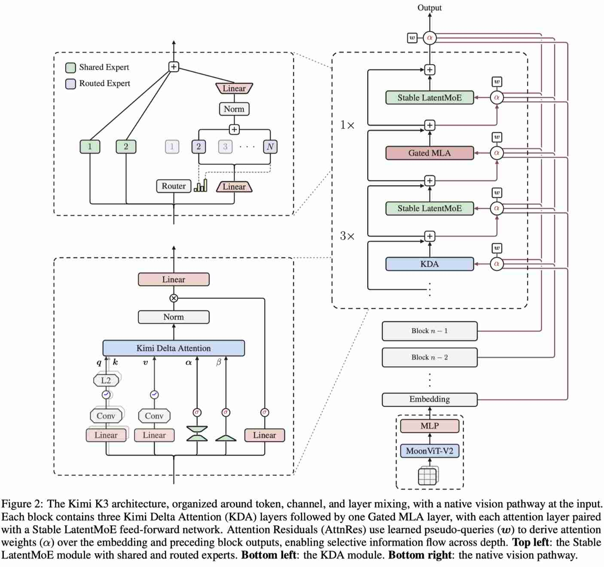

# Kimi K3: Open Frontier Intelligence

> Kimi Team
>
> Moonshot AI
>
> Technical Report, 2026
>
> [技术报告](https://github.com/MoonshotAI/Kimi-K3/blob/main/k3_tech_report.pdf) | [代码与模型仓库](https://github.com/MoonshotAI/Kimi-K3) | [官方技术博客](https://www.kimi.com/blog/kimi-k3)
>
> 

> 注：以下论文笔记由 AI Agent 自动生成，可能存在理解偏差或遗漏，请以原论文为准。

## Abstract

Kimi K3 是一个 2.8T 总参数、104B 激活参数的原生多模态 Mixture-of-Experts 模型，支持最长 1M token 上下文。模型采用 Kimi Delta Attention（KDA）与周期性插入的 Gated MLA 进行长序列信息混合，采用 Attention Residuals（AttnRes）改善深度方向的信息流，并用 Stable LatentMoE 在 896 个 routed experts 中每 token 激活 16 个专家。报告还介绍了面向超大规模训练、百万 token agentic RL 和部署的系统协同设计，包括 MoonEP、KDA Context Parallelism、state-aware prefix caching、持久 rollout 与可恢复 sandbox。官方报告声称相对 Kimi K2 获得约 2.5x overall scaling efficiency 提升，并开源完整模型权重。

## 一句话总结

Kimi K3 将 3T 级稀疏多模态模型、KDA/AttnRes 架构和百万 token agentic RL 结合起来，研究重点从单一模型结构扩展到“长上下文模型 + MoE 训练通信 + agent workflow serving”的端到端协同设计。

## 创新点

1. **KDA + Gated MLA 的混合长序列建模**：69 层 KDA 与 24 层 Gated MLA 交错组合，利用 KDA 的高效序列混合降低长上下文成本，同时保留周期性全局交互能力。
2. **Attention Residuals 深度信息流**：用跨层 attention 替代固定残差累加，使每一层能够选择性聚合前序层表示；这是对 Attention Residuals 独立工作的超大规模模型验证。
3. **Stable LatentMoE 极端稀疏扩展**：在 896 个 routed experts 中每 token 选择 16 个专家，并结合 latent MoE、归一化、SiTU-GLU 和 Quantile Balancing 稳定训练 2.8T 参数模型。
4. **面向百万 token agentic RL 的训练范式**：在 coding、general agent、reasoning、knowledge 和 vision-in-the-loop 环境中，以多种 reasoning effort 进行 RL，再通过 multi-teacher on-policy distillation 合并为统一模型。
5. **模型-系统协同基础设施**：MoonEP 提供静态 shape、均衡 expert execution 和 zero-copy communication；KDA Context Parallelism、state-aware prefix caching、partial rollout 和 resumable microVM sandbox 分别覆盖训练和长时 agent 执行路径。

## 带来什么提升

1. **规模效率**：报告称相对 Kimi K2，KDA、AttnRes、Stable LatentMoE 及训练数据配方共同带来约 **2.5x overall scaling efficiency** 提升；该指标依赖报告定义和对比设置，不能直接等同于端到端吞吐提升。
2. **长上下文能力**：支持最长 **1,048,576 tokens**，使跨大规模代码仓库、长文档和多轮工具轨迹的 agent workload 成为目标场景。
3. **稀疏计算规模**：总参数 2.8T 而每 token 激活 104B，借助 MoE 在保持大容量模型的同时控制单 token 计算量；但实际收益仍取决于 expert parallel 通信和负载均衡效率。
4. **Agentic 推理**：报告在长时 coding、通用 agent、知识和 vision-in-the-loop 任务上展示 frontier-level 结果，并强调数百至数千次工具调用、百万级累计上下文的持续执行能力。
5. **开放研究价值**：完整权重、技术报告和模型仓库公开，便于复现 KDA/AttnRes/MoE 组合以及研究 1M context 下的 KV、状态缓存、专家通信和调度问题。

## 与 EfficientPaper 研究方向的关系

- **结构设计**：Kimi K3 是 Attention Residuals 在 3T 级多模态 MoE 上的系统级落地案例；KDA 则代表区别于标准 softmax attention 的长序列混合路径。
- **MoE 加速**：896 experts、16-way routing 将 expert parallel 的通信、负载均衡和静态 shape 执行推到更极端的规模，可与 MoE 通信优化工作对照分析。
- **KV/state lifecycle**：KDA 的 recurrent-like state、Gated MLA 的 KV cache 和 agent rollout state 需要统一的生命周期、迁移、恢复和批量写回策略，直接连接当前 KV cache 研究主线。
- **Agent serving**：百万 token trajectory、persistent rollout 和 resumable sandbox 表明 serving 优化单位需要从单请求扩展到可恢复的 workflow/state，而不仅是 token throughput。
- **硬件协同**：报告将 fused kernels、context parallelism、expert parallel、缓存和 fleet scheduling 作为整体设计，适合作为算法-系统协同研究的 case study。

## 对研究计划的启发

1. **优先补齐 hybrid attention 的统一 KV/state cost model**：分别统计 KDA state、Gated MLA KV、tool observation、persistent rollout state 的容量、带宽、恢复延迟和重算代价，避免把 KDA 模型简单套用纯 softmax KV cache 策略。
2. **把 MoE routing signal 接入 KV/serving 调度**：专家访问热度、token-to-expert 路由和 agent workflow stage 可能共同预测下一阶段的计算与状态需求，可研究 routing-aware prefetch、expert placement 和 KV/state co-placement。
3. **验证“1M context”真正的系统瓶颈**：实验应拆分 attention/kernel、state/KV movement、expert communication、prefix reuse、tool-call gap 和 sandbox persistence，分别报告 TTFT、inter-token latency、通信占比、HBM/DRAM/NVMe 流量和 workflow SLO。
4. **将 K3 作为研究基准而非只作为模型条目**：后续可围绕 KDA state 管理、Gated MLA cache 压缩、百万 token agent trajectory checkpoint、MoonEP 类均衡 expert execution 建立可复现实验子集。

## 局限与核查点

- 报告中的约 2.5x scaling efficiency、benchmark 分数和“frontier-level”结论依赖官方实验设置，需核对 baseline、推理预算、fallback/tool 配置后再用于横向比较。
- 报告公开了系统设计方向，但 MoonEP、KDA context parallelism 和完整 serving kernel 的可复现程度需要以仓库实际代码为准；当前官方 Kimi-K3 仓库主要提供报告、模型入口和许可证文件。
- 1M context 是模型支持上限，不代表所有工作负载都能以相同吞吐或成本运行；KDA state 与 Gated MLA KV 的混合内存行为应单独 profiling。
