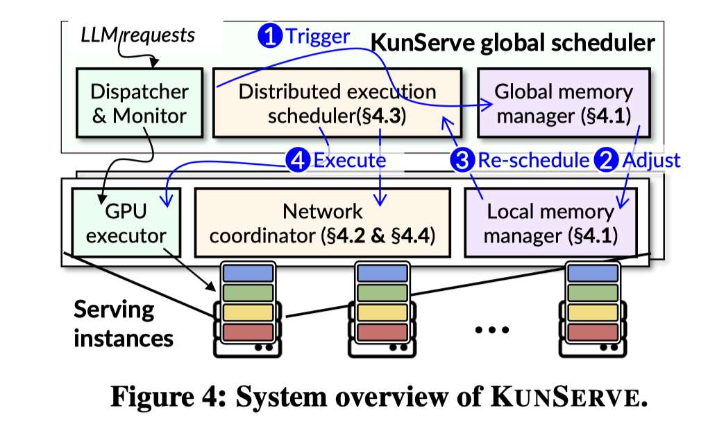

# KunServe: Parameter-centric Memory Management for Efficient Memory Overloading Handling in LLM Serving

> Rongxin Cheng, Yuxin Lai, Xingda Wei, Rong Chen, Haibo Chen

> 注：以下论文笔记由 AI Agent 自动生成，可能存在理解偏差或遗漏，请以原论文为准。

## Abstract

Serving LLMs with a cluster of GPUs is common nowadays, where the serving system must meet strict latency SLOs required by applications. However, the stateful nature of LLM serving requires maintaining huge states (i.e., KVCache) in limited GPU memory. Under spikes in real-world workloads, GPU memory can be easily overloaded, leading to orders of magnitude higher response latency due to queuing introduced by waiting for KVCache to be reclaimed. Prior KVCache-centric approaches handle overloading by dropping, migrating, or swapping KVCache. These methods fail to release sufficient memory quickly with requests still queued. This paper proposes the first parameter-centric approach to handling overloading by selectively dropping replicated parameters to instantly free memory for requests, based on an unnoticed observation that model parameters are commonly replicated across GPUs for serving LLMs. With additional memory, all requests can be served with a larger batch without queuing. To make the parameter-centric approach correct and efficient, we cooperatively execute requests on GPUs with a complete copy of parameters using pipeline parallelism, and derive an appropriate drop plan without unnecessary cooperation. We also design techniques to minimize the performance overhead due to pipeline parallelism with the execution patterns of requests under drop. Evaluations show that KunServe reduces the tail TTFT of requests under overloading by up to 72.2× compared to the state-of-the-art systems including Llumnix, vLLM and InferCept.

## 一句话总结

KunServe 将 LLM serving 的“爆发期显存过载”问题从传统的 KVCache-centric 处理（丢弃、迁移、swap KV）转向 parameter-centric 处理：在多实例中临时丢弃部分重复模型参数，为 KVCache 和排队请求释放显存，并用 pipeline parallelism、协调式 KVCache 交换和 lookahead batch formulation 保持正确性与效率。

## 背景与问题

LLM 在线服务通常需要在 GPU HBM 中同时放置模型参数和请求状态，其中 KVCache 会随并发请求数、输入长度和输出长度增长。在真实 workload 的 burst 场景下，KVCache 可能迅速耗尽 HBM，使新请求必须排队等待已有请求释放 KVCache，从而导致 TTFT（time-to-first-token）出现数量级级别的尾延迟尖峰。

已有系统大多围绕 KVCache 本身做管理：

- **drop / recompute KVCache**：可以释放显存，但之后需要重算，增加计算浪费；
- **swap KVCache 到 CPU/外存**：释放 GPU 显存，但受 PCIe/网络/存储延迟影响，新请求仍可能排队；
- **migrate KVCache 到其他 GPU**：需要足够空闲 GPU 与网络传输时间，且不能总是在 burst 初期快速释放足够空间。

论文的关键观察是：在 LLM serving 集群中，同一个模型的参数经常在多个 serving instance 上重复加载。相较于只盯着 KVCache，可以在短时过载期间临时丢弃部分“重复参数”，把原本被参数占用的 HBM 转换为可容纳更多 KVCache/请求的空间。只要一个协作组内仍然保留完整的一份模型参数，就可以通过 pipeline parallelism 正确执行请求。

## 核心方法

KunServe 的核心思想是 **parameter-centric memory management**：当监控到显存过载时，不优先移动 KVCache，而是生成一个 parameter drop plan，在多个 serving instances 之间选择性丢弃重复层参数。丢弃后，每个实例可能只保留模型的一部分层；多个实例组合起来仍覆盖完整模型，因此请求可以跨实例以 pipeline parallelism 执行。

系统包含几个关键组件：

1. **全局 dispatcher / monitor / memory manager**：dispatcher 负责请求路由，monitor 收集各实例负载与显存使用，global memory manager 在过载时生成参数丢弃计划。
2. **Local manager / local executor**：每个实例本地执行参数丢弃、恢复和请求调度。
3. **Drop plan generation**：在线快速决定哪些实例分组、哪些层参数可以被丢弃，以释放足够显存并尽量减少 pipeline stages。
4. **Coordinated KVCache exchange**：参数布局变化后，已有请求的 KVCache 也需要跨实例交换，以保证每个 layer stage 能拿到对应层的 KVCache。
5. **Lookahead batch formulation**：过载期间队列中通常有足够请求，KunServe 利用这一点重新组织 microbatch，降低 pipeline bubbles。
6. **Dynamic restoration**：burst 结束、显存压力下降后，系统动态恢复被丢弃参数，回到普通非 pipeline 或低协作执行状态，避免长期 pipeline 开销。

## 技术细节

### 1. 参数丢弃计划：尽量少引入 pipeline stages

参数丢弃要满足三个条件：在线生成速度快、执行正确、性能损失尽量小。正确性要求是：一个协作组内的所有实例合起来仍有完整模型参数。但丢弃越多，通常需要越多 pipeline stages，microbatch 也会更细，容易降低 GPU batch execution efficiency 并引入 pipeline bubbles。

KunServe 因此采用贪心分组策略：

- 初始时每个实例是单独 group；
- 根据排队请求的显存需求计算需要释放多少空间；
- 迭代地选择较小 group 合并，并丢弃合并后冗余的参数副本；
- 每次释放显存后更新可用显存，直到满足排队请求需求；
- 目标是在释放足够 HBM 的同时，让每个请求涉及的实例数尽量少。

这个设计本质上把“释放参数空间”和“pipeline 并行开销”放到同一个在线决策中，而不是简单地最大化可释放显存。

### 2. KVCache 交换：避免 recomputation

参数丢弃会改变 layer 到 instance 的映射。假设请求原本在实例 A 上运行，A 与 B 合并后 A 只保留前半层、B 只保留后半层，那么 B 执行后半层时需要该请求后半层对应的 KVCache；如果 KVCache 仍在 A 上，就不能直接继续 decode。

直观方案是重算 KVCache，但这会让排队请求继续等待。KunServe 选择通过网络交换 KVCache：协作组内实例互相发送已有请求在对应层上的 KVCache。论文指出，在 200Gbps RDMA 网络上，KVCache 交换通常带来 1–2 秒 stall；如果请求后续有约 200 个 decode tokens，摊到 TPOT 上约为 10ms 级别，通常可接受。

但 KVCache 交换和 pipeline execution 的 activation transfer 会竞争网络带宽。如果不协调，长时间 KVCache exchange 会阻塞 activation transfer，使 GPU idle。KunServe 因此采用 coordinated exchange：优先保障 pipeline activation 等短关键路径传输，将大块 KVCache exchange 以协调方式穿插执行，减少对新请求 prefill/decode 的影响。

### 3. Lookahead batch formulation：减少 pipeline bubbles

普通 pipeline/chunked prefill 常按 token count 形成 microbatch，假设 token 数近似决定执行时间。但在 LLM 中 attention computation 与上下文长度相关，并非简单线性：同样 token 数的 chunk，如果带有更长 prefix，后续 attention 计算更重。因此 token-count-based chunking 可能产生不同 microbatch 执行时间不平衡，导致 pipeline bubbles。

KunServe 利用 burst 期间请求队列较长这一事实，对排队请求做 lookahead：不是只看当前到达请求，而是从队列中重新组合 microbatch，并用考虑 attention cost 的代价模型估计不同组合的执行时间。论文提出一个启发式 divide-and-conquer 算法来生成更均衡的 batch formulation，使不同 pipeline stage 的 microbatch 时间更接近。

### 4. 动态恢复与容错

Parameter dropping 只适用于过载期。正常负载下继续 pipeline execution 会导致频繁 weight loading、pipeline bubbles 和额外网络传输。KunServe 在总 KVCache usage 低于阈值时触发参数恢复，从其他实例、主机 DRAM 或 SSD 拉取缺失参数，回到普通执行模式。恢复过程与请求处理重叠，并使用类似 coordinated transfer 的策略，避免参数恢复传输阻塞正常 pipeline activation。

容错方面，由于协作组内实例通过 pipeline 共同服务请求，一个节点故障会影响同组其他节点。KunServe 的处理方式是让受影响实例动态恢复参数，重新形成可独立执行的完整实例；只要主机 DRAM/SSD 或其他副本中保留参数，就能完成恢复。

## 实验设置

论文在两个 GPU cluster 上评估 KunServe：一个集群用于较小模型（例如 Qwen-2.5-14B），另一个含多 GPU/NVLink 的集群用于较大模型（例如 Qwen-2.5-72B，结合 tensor parallelism）。评估模型包括 Qwen-2.5-14B 和 Qwen-2.5-72B，二者使用 GQA，KVCache 已比 MHA 模型更省；作者指出如果服务更 KV-heavy 的模型，KunServe 的收益可能更明显。

Workload 方面，论文以真实 burst trace **BurstGPT** 为主要到达模式，并结合不同数据集代表不同输入/输出长度场景，包括 BurstGPT、ShareGPT、LongBench 等。对比系统包括 vLLM、vLLM pipeline parallelism 变体、Llumnix、InferCept 等。主要指标包括 P50/P90/P99/P999 TTFT、TPOT、SLO violation、throughput、bubble time 和显存使用。

## 主要结果

### End-to-end latency

KunServe 在不同 workload 和模型上显著降低 tail TTFT。论文报告相较 Llumnix、vLLM、InferCept 等系统，KunServe 的 P99 TTFT 提升达到 **12.7×–72.2×**。原因是 KunServe 通过参数丢弃快速释放显存，让原本排队的新请求可以以更大 batch 执行；而其他系统在过载时仍受 recomputation、swapping、migration 或等待已有请求释放 KVCache 的影响。

### TPOT trade-off

KunServe 不是免费午餐。它通过更大 batch 和 pipeline execution 消除排队，因此部分场景下 P50/P99 TPOT 会略升。例如论文提到 LongBench-14B workload 中，P50 TPOT 相比其他 baseline 高约 15.8%–22.7%。但作者认为这是合理 trade-off：相比 TTFT 的数量级尾延迟下降，TPOT 增加仍在目标应用 SLO 内。

### Ablation

消融实验显示各组件都有明确贡献：

- **Dynamic parameter drop** 是主要收益来源：在 LongBench workload 上，P90/P99/P999 TTFT 相比 vLLM DP 分别降低约 8.8×、11.7×、10.3×，因为它直接消除了排队。
- **Coordinated exchange** 进一步降低 P99/P999 TTFT 约 1.5×/1.4×，并降低部分 TPOT，因为它避免 KVCache exchange 阻塞 pipeline activation。
- **Lookahead batch formulation** 降低 P90/P99/P999 TPOT 约 4.5%、10.6%、9.7%，减少 pipeline bubble。
- **Cost model** 相比不考虑 attention cost 的模型更准确，偏差低于 5%；而忽略 attention cost 的模型在某些 request/chunk 场景中偏差可达 48%–74%。

### Dynamic restoration

在包含多次过载的长时间 BurstGPT run 中，动态恢复可以减少正常期不必要的 pipeline 开销。论文报告 restoration 使 P50 TTFT/TPOT 分别降低约 28%/23%，P99 TTFT/TPOT 分别改善约 6.4×/1.2×。没有 restoration 时，系统长期类似 vLLM PP，正常期 throughput 降低，反而使下一波 burst 更容易积累显存压力。

### Extreme burst

在极端重复 burst 设置下，KunServe 的可释放显存仍受模型参数大小上限约束，并不能无限处理请求。但它能比 vLLM 更久地维持服务：在 Qwen-2.5-72B 上，KunServe 到达显存极限的时间约为 152 秒，比 vLLM 长 1.5×；在到达极限前，KunServe 没有出现 SLO(5×) violation，而 vLLM 的 TTFT 可上升到 42×。这说明 KunServe 适合作为 autoscaling cold start 前的“短时吸震器”。

## 优点与局限

### 优点

- **新颖的问题切入点**：不是继续在 KVCache 上做 drop/swap/migration，而是利用模型参数副本冗余，把参数显存转化为短时 KVCache 容量。
- **适合 burst handling**：对真实 workload 中短时负载尖峰尤其有效，可以在 autoscaling 生效前降低 TTFT 尾延迟。
- **系统设计完整**：不仅提出 parameter drop，还处理了 KVCache exchange、pipeline bubble、dynamic restoration 和 fault tolerance。
- **与现有 serving 并行方式正交**：论文讨论了与 tensor parallelism、expert parallelism、sequence parallelism 的兼容性；KunServe 主要改变跨实例的 layer/parameter layout。

### 局限

- **收益受模型参数大小上限约束**：可释放显存最多来自可丢弃的重复参数，无法应对无限长或超大 burst。
- **依赖多实例参数副本冗余**：如果部署本身已经极致 sharding、没有足够重复参数，KunServe 的空间来源会减少。
- **需要较好的跨实例网络**：KVCache exchange 和 pipeline activation transfer 都依赖网络，低带宽或高拥塞环境下可能降低收益。
- **TPOT 可能上升**：通过 pipeline 和更大 batch 换取 TTFT 尾延迟下降，适合 TTFT/SLO 敏感场景，但不一定适合极端 TPOT 敏感场景。
- **实现复杂度较高**：需要跨实例全局调度、显存管理、KVCache relocation、pipeline scheduler 和参数恢复机制协同。

## 与 EfficientPaper 主题的关系

KunServe 属于 **KV cache management / deployment / LLM serving** 方向，但它的重要性在于扩展了 KV 管理的 action space：当 KVCache 造成显存过载时，系统不一定只能操作 KVCache，也可以操作参数布局，用“参数副本冗余”换取“短时请求状态容量”。

这对 EfficientPaper 当前的 KV 管理研究脉络有两个启发：

1. **KV lifecycle optimizer 的 action space 应包含 parameter layout**。未来统一决策器不应只在 compression、eviction、prefetch、tier placement 中选择，还应考虑是否通过参数重排、临时 pipeline grouping、甚至 autoscaling 协同释放显存。
2. **Serving 系统的短时弹性不只来自新机器，也来自已有副本的重构**。KunServe 类似一种 software-defined memory elasticity：在不启动新实例的情况下，动态调整参数/KV 的显存占比，应对 burst 的 cold-start gap。

## 可复现/实现要点

- 需要 global monitor 精确追踪每个实例的 HBM 使用、KVCache demand 和请求队列。
- Drop plan 生成需要同时考虑可释放显存和 pipeline stage 数，不能只最大化 drop ratio。
- 参数丢弃后必须处理 ongoing requests 的 KVCache relocation，否则 decode 无法继续正确执行。
- KVCache exchange 与 activation transfer 应该有网络优先级或协调机制，否则交换会阻塞 pipeline。
- Batch formulation 的 cost model 需要考虑 attention cost 和 prefix/chunk 位置，简单 token count 不足以均衡 microbatch。
- 参数恢复应与请求执行重叠，并在网络上让位于 latency-critical activation transfer。

## 个人备注

KunServe 的研究价值不只是“又一个 LLM serving 系统”，而是提供了一个新的系统杠杆：在模型参数和请求状态之间做动态显存再分配。它与 KV compression、hierarchical KV cache、disaggregated serving、autoscaling 都可以组合。后续值得追的问题包括：

- 参数丢弃是否能与 KVCache 压缩/分层 placement 放到同一个 cost model 中联合优化？
- 对 MoE 模型，能否根据 expert hotness 动态丢弃/恢复冷 expert 参数，同时保持 expert parallelism 的通信效率？
- 在跨机 pipeline 下，activation transfer、KV exchange、parameter restore 三类网络流是否需要统一 QoS/scheduling？
- 是否可以设计“burst predictor”，在过载真正发生前提前生成 drop/restoration plan？
