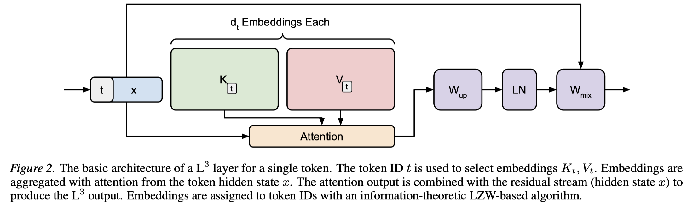

# L$^3$: Large Lookup Layers

> Albert Tseng, Christopher De Sa

## Abstract

Modern sparse language models typically achieve sparsity through Mixture-of-Experts (MoE) layers, which dynamically route tokens to dense MLP "experts." However, dynamic hard routing has a number of drawbacks, such as potentially poor hardware efficiency and needing auxiliary losses for stable training. In contrast, the tokenizer embedding table, which is natively sparse, largely avoids these issues by selecting a single embedding per token at the cost of not having contextual information. In this work, we introduce the Large Lookup Layer (L$^3$), which unlocks a new axis of sparsity by generalizing embedding tables to model decoder layers. L$^3$ layers use static token-based routing to aggregate a set of learned embeddings per token in a context-dependent way, allowing the model to efficiently balance memory and compute by caching information in embeddings. L$^3$ has two main components: (1) a systems-friendly architecture that allows for fast training and CPU-offloaded inference with no overhead, and (2) an information-theoretic embedding allocation algorithm that effectively balances speed and quality. We empirically test L$^3$ by training transformers with up to 2.6B active parameters and find that L$^3$ strongly outperforms both dense models and iso-sparse MoEs in both language modeling and downstream tasks.
