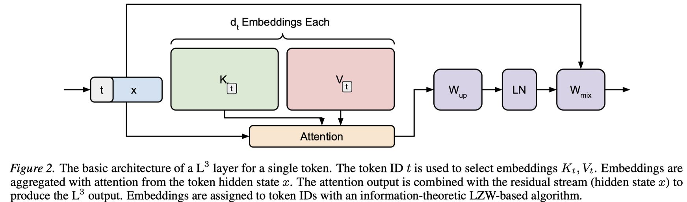

# L³: Large Lookup Layers

> Albert Tseng, Christopher De Sa

> 注：以下论文笔记由 AI Agent 自动生成，可能存在理解偏差或遗漏，请以原论文为准。

## Abstract

Modern sparse language models typically achieve sparsity through Mixture-of-Experts (MoE) layers, which dynamically route tokens to dense MLP "experts." However, dynamic hard routing has a number of drawbacks, such as potentially poor hardware efficiency and needing auxiliary losses for stable training. In contrast, the tokenizer embedding table, which is natively sparse, largely avoids these issues by selecting a single embedding per token at the cost of not having contextual information. In this work, we introduce the Large Lookup Layer (L³), which unlocks a new axis of sparsity by generalizing embedding tables to model decoder layers. L³ layers use static token-based routing to aggregate a set of learned embeddings per token in a context-dependent way, allowing the model to efficiently balance memory and compute by caching information in embeddings. L³ has two main components: (1) a systems-friendly architecture that allows for fast training and CPU-offloaded inference with no overhead, and (2) an information-theoretic embedding allocation algorithm that effectively balances speed and quality. We empirically test L³ by training transformers with up to 2.6B active parameters and find that L³ strongly outperforms both dense models and iso-sparse MoEs in both language modeling and downstream tasks.

## 一句话总结

L³ 是一种大型查找层架构，通过将嵌入表泛化到解码器层，使用静态 token 路由聚合每个 token 的一组学习嵌入，在保持硬件友好的同时，显著超越稠密模型和等稀疏度 MoE，实现了新的稀疏性轴。

## 背景与问题

- **MoE 的局限**：
  - 动态硬路由的硬件效率低
  - 需要辅助损失来稳定训练
  - 专家无法在不知道路由的情况下进行卸载
- **嵌入表的启示**：
  - 嵌入表是原生稀疏的，硬件友好
  - 但缺乏上下文信息
- **核心问题**：能否将嵌入表的稀疏性和硬件友好性推广到解码器层？

## 核心方法

### 1. L³ 层架构

**核心思想**：将嵌入表泛化到解码器层，使用静态 token 路由聚合每个 token 的一组学习嵌入。

**架构**：
- **输入**：隐藏状态 x ∈ R^{din} 和 token ID t
- **嵌入矩阵**：K = {K₁, ..., K_{|τ|}} 和 V = {V₁, ..., V_{|τ|}}
- **混合矩阵**：W_{mix} ∈ R^{dout × (din + dup)}
- **上投影矩阵**：W_{up} ∈ R^{dup × demb}
- **注意力聚合**：token 隐藏状态关注嵌入，上下文依赖地聚合

**关键特性**：
- **静态路由**：基于 token ID，无需上下文依赖路由
- **硬件友好**：知道确切的参数，可以卸载到 CPU
- **上下文依赖**：嵌入通过注意力机制聚合，保持上下文信息

### 2. 信息论嵌入分配算法

**核心思想**：使用无损压缩算法（如 LZW）确定嵌入分配，基于词频。

**方法**：
- **静态路由**：将静态 token 路由视为上下文依赖路由的替代
- **LZW 算法**：基于词频分配嵌入
- **效果**：有效将 L³ 相对于稠密模型的困惑度差距翻倍

### 3. 系统友好架构

**训练**：
- 快速训练：静态路由允许高效的参数加载
- 无额外开销：无需辅助损失

**推理**：
- CPU 卸载：知道确切的参数，可以卸载到 CPU
- 重叠计算：将获取与 L³ 前计算重叠

## 主要结果

### 性能提升

- **语言建模**：L³ 显著优于稠密模型和等稀疏度 MoE
- **下游任务**：L³ 在下游任务上也表现优异
- **规模**：训练了高达 2.6B 活动参数的模型

### 关键发现

1. **新的稀疏性轴**：L³ 代表了一种新的稀疏性轴，与 MoE 正交
2. **硬件友好**：静态路由允许快速训练和 CPU 卸载推理
3. **信息论分配**：LZW 算法有效平衡速度和质量
4. **与 Engram 相似**：L³ 与 Engram 在嵌入表的大规模使用上相似

## 优点与局限

### 优点

1. **新的稀疏性轴**：L³ 与 MoE 正交，可以进一步扩展稀疏性
2. **硬件友好**：静态路由允许快速训练和 CPU 卸载推理
3. **上下文依赖**：嵌入通过注意力机制聚合，保持上下文信息
4. **信息论分配**：LZW 算法有效平衡速度和质量
5. **显著性能**：显著优于稠密模型和等稀疏度 MoE

### 局限

1. **嵌入分配依赖**：性能依赖于嵌入分配算法，需要仔细调优
2. **评估范围**：主要在语言建模和下游任务上评估，更复杂任务需进一步测试
3. **与 Engram 的比较**：与 Engram 的完整比较留待未来工作
4. **无代码开源**：代码 URL 为空，可能尚未开源

## 与 EfficientPaper 主题的关系

L³ 属于 **Structure Design**（`structure_design`）领域，核心贡献包括：

- **大型查找层**：将嵌入表泛化到解码器层
- **静态 token 路由**：硬件友好的稀疏性
- **信息论嵌入分配**：LZW 算法

与 EfficientPaper 中已有论文的关系：
- **Engram**（2026）：类似的嵌入表方法
- **SCONE**（2025）：局部上下文嵌入表
- **MoE**（2017-2025）：传统稀疏架构
- **SPEED**（2026）：稀疏编码器解码器
- **VQKV**（2026）：向量量化 KV 缓存

## 可复现/实现要点

1. **L³ 层架构**：混合矩阵、上投影矩阵、注意力聚合
2. **嵌入分配**：LZW 算法，基于词频
3. **训练**：快速训练，无额外开销
4. **推理**：CPU 卸载，重叠计算
5. **模型规模**：高达 2.6B 活动参数

## 个人备注

- L³ 的核心洞察是：**嵌入表的稀疏性可以泛化到解码器层**，实现新的稀疏性轴。
- 静态 token 路由是关键设计选择，它使 L³ 硬件友好，可以卸载到 CPU。
- 信息论嵌入分配算法是关键优化，它有效平衡速度和质量。
- 论文来自 Cornell University，说明这是一个学术界的探索性工作。
- 值得关注的未来方向：(1) 与 MoE 的结合；(2) 更大规模的模型；(3) 与 Engram 的完整比较。
