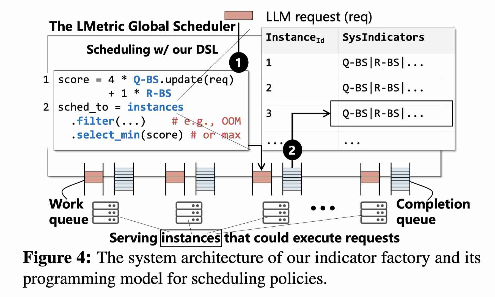

# Simple Is Better: Multiplication May Be All You Need for LLM Request Scheduling

> Dingyan Zhang, Jinbo Han, Kaixi Zhang, Xingda Wei, Sijie Shen, Chenguang Fang, Wenyuan Yu, Jingren Zhou, Rong Chen

> 注：以下论文笔记由 AI Agent 自动生成，可能存在理解偏差或遗漏，请以原论文为准。

## Abstract

全局 LLM 路由既要把请求送到已有相同前缀 KV Cache 的实例，又要避免缓存热点实例过载。现有线性加权、阈值过滤和模拟器方案需要按 workload、模型与硬件调参。LMetric 用“新增 prefill token 数 × 当前 batch size”作为唯一调度分数，以无超参数乘法同时表达 KV affinity 与负载均衡，并给出乘法失效条件及热点检测缓解机制。

## 一句话总结

LMetric 将 prefill 成本压缩为 `PToken`、decode 负载压缩为 `batch size`，选择两者乘积最小的实例，用一次乘法替代 workload-specific 权重搜索。

## 创新点

1. **免权重的乘法路由。** 对实例 $i$ 使用 $Score_i=PToken_i\times BS_i$；若写成 $(\lambda PToken_i)((1-\lambda)BS_i)$，比较实例时公共正因子 $\lambda(1-\lambda)$ 自动消去，因此排序无需调参。
2. **指标与 LLM 执行结构对齐。** `PToken` 是路由后真正需要执行的新 prefill tokens，并纳入队列中尚未处理的 prefill；`BS` 表示加入请求后的 decode batch 负载，比 KV hit ratio 或总 token 数更直接对应 prefill/decode 成本。
3. **给出可检测失败边界。** 当某类共享前缀请求的流行度超过缓存该前缀的实例覆盖能力时，乘积仍可能形成 KV hotspot；系统先用必要条件筛选，再观察连续 $2|M|$ 个请求确认热点并临时排除过载实例。

## 带来什么提升

1. 在 16×H20、vLLM-v1、Qwen3-30B 的 ChatBot trace 上，相比 vLLM-v1，平均 TTFT 降低 **92%**、平均 TPOT 降低 **24%**；相比 Preble，平均 TTFT/TPOT 降低 **56%/8%**，P99 降低 **45%/16%**。
2. `PToken × BS` 相比 `(1-KV hit ratio) × BS`，P50/P95 TTFT 分别降低 **14.4%/42.8%**，说明收益来自同时感知排队 prefill 工作与缓存命中，而非单纯提高 hit ratio。
3. 阿里云百炼 Qwen3.5-27B、数百 GPU 的生产 canary 中，相比原 BAILIAN scheduler，平均 TTFT 降低 **39%**、平均 TPOT 降低 **51%**。

## 备注

- “免超参数”仅指核心乘积排序不需要组合权重；热点检测仍有窗口和确认策略。
- 极端长公共前缀突发可让 `PToken` 优势压过 batch 增长；ToolAgent 上其平均 TTFT 比模拟式 llm-d 高 10%，但 TPOT 低 30%。
- 主要验证同模型、同构 GPU、prefill/decode colocated 集群；异构和 P/D 分离部署尚未充分验证。
