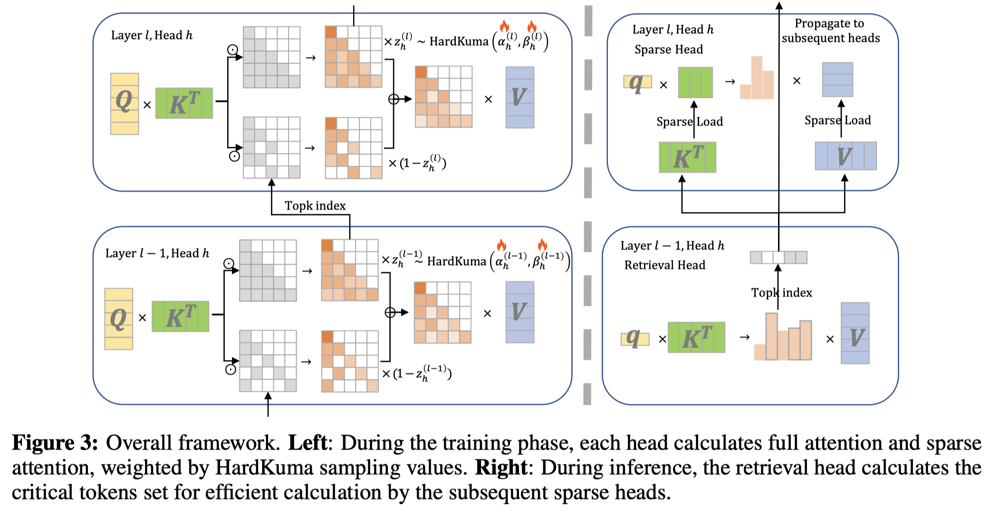

# LycheeDecode: Accelerating Long-Context LLM Inference via Hybrid-Head Sparse Decoding

> Gang Lin, Dongfang Li, Zhuoen Chen, Yukun Shi, Xuhui Chen, Baotian Hu, Min Zhang

## Abstract

The proliferation of long-context large language models (LLMs) exposes a key bottleneck: the rapidly expanding key-value cache during decoding, which imposes heavy memory and latency costs. While recent approaches attempt to alleviate this by sharing a single set of crucial tokens across layers, such coarse-grained sharing undermines model performance by neglecting the functional diversity of attention heads. To address this, we propose LycheeDecode, an efficient decoding method centered on a fine-grained hybrid-head attention mechanism that employs a hardware-efficient top-k selection strategy. Specifically, the novel HardKuma-based mechanism partitions attention heads into a small subset of retrieval heads that dynamically identify crucial tokens and a majority of sparse heads that reuse them for efficient computation. Through extensive experiments on leading models like Llama3 and Qwen3 across diverse benchmarks for long-context understanding (e.g., LongBench, RULER) and complex reasoning (e.g., AIME24, OlympiadBench), we demonstrate that LycheeDecode achieves generative quality comparable to, and at times surpassing even the full-attention baseline. Crucially, this is accomplished with up to a 2.7x speedup at a 128K context length. By preserving the functional diversity of attention heads, our fine-grained strategy overcomes the performance bottlenecks of existing methods, providing a powerful and validated pathway to both efficient and high-quality long-context LLM inference.
