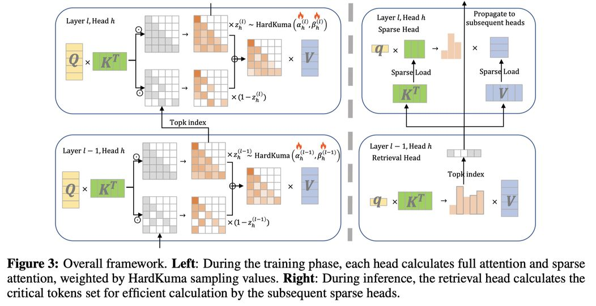

# LycheeDecode: Accelerating Long-Context LLM Inference via Hybrid-Head Sparse Decoding

> Gang Lin, Dongfang Li, Zhuoen Chen, Yukun Shi, Xuhui Chen, Baotian Hu, Min Zhang
>
> Harbin Institute of Technology, Shenzhen

> ⚠️ **本 note 由 AI Agent 自动生成**（基于 arXiv 论文全文阅读），内容可能存在偏差，请以原论文为准。

---

## 一句话总结

LycheeDecode 提出了一种基于混合注意力头（Hybrid-Head）的稀疏解码方法，通过将注意力头区分为"检索头"（Retrieval Head）和"稀疏头"（Sparse Head），并利用 HardKuma 分布实现端到端的头角色学习，在 128K 上下文长度下实现 2.7 倍加速，同时保持甚至超越全注意力基线的生成质量。

---

## 摘要翻译

长上下文大语言模型（LLM）的普及暴露了一个关键瓶颈：解码过程中快速膨胀的键值（KV）缓存，这带来了巨大的内存和延迟开销。近期方法试图通过跨层共享单一的关键 token 集来缓解这一问题，但这种粗粒度的共享忽略了注意力头的功能多样性，从而损害了模型性能。为解决此问题，我们提出 LycheeDecode，一种以细粒度混合注意力头机制为核心的高效解码方法，采用硬件高效的 top-k 选择策略。具体而言，新型的基于 HardKuma 的机制将注意力头分为少量"检索头"（动态识别关键 token）和多数"稀疏头"（复用检索结果以高效计算）。通过对 Llama3 和 Qwen3 等领先模型在长上下文理解（如 LongBench、RULER）和复杂推理（如 AIME24、OlympiadBench）等多种基准上进行大量实验，我们证明 LycheeDecode 可以达到与全注意力基线相当、有时甚至超越的生成质量。关键是，这在 128K 上下文长度下实现了高达 2.7 倍的加速。通过保持注意力头的功能多样性，我们的细粒度策略克服了现有方法的性能瓶颈，为高效且高质量的长上下文 LLM 推理提供了一条经过验证的强大途径。

---

## 研究动机

1. **长上下文推理的 KV 缓存瓶颈**：随着 LLM 支持的上下文长度从数千扩展到百万级 token，自回归解码中 KV 缓存的线性增长导致内存占用和推理延迟急剧增加。
2. **现有层级共享策略的局限**：TidalDecode、OmniKV 等方法发现相邻层间关键 token 高度相似，采用层级共享策略。但论文通过热力图可视化发现，同一层不同注意力头的 top-k 重叠率差异巨大（从 0% 到 100%），说明统一的层级共享过于简化。
3. **头角色识别的离散优化难题**：DuoAttention 等方法通过学习连续变量来区分头类型，但推理时需要四舍五入为二值，导致训练-推理不一致，影响性能。
4. **核心洞察**：注意力头具有功能多样性，应该采用更细粒度的头级策略来区分"检索头"和"稀疏头"，实现更精确的 token 选择与共享。

---

## 方法（技术细节）

### 整体框架

LycheeDecode 将每个注意力头分配为两种角色之一：

- **检索头（Retrieval Head, h ∈ H_R）**：执行全上下文注意力计算，从完整 KV 缓存中识别并选择 top-k 关键 token，将选中的 token 集传播到下一层对应头。
- **稀疏头（Sparse Head, h ∈ H_S）**：仅在前一层传播的 token 集上执行稀疏注意力计算，不再重新选择 token，因此可大幅减少计算量和 KV 缓存加载开销。

### 头级稀疏解码

- **检索头操作**：标准密集注意力 A(l)_h = softmax(q(l)_h (K(l)_h)^T / √d_k)，然后通过 argsTopK 选出 top-k 个最高注意力权重的 token 索引，传递给下一层。
- **稀疏头操作**：O(l)_h = softmax(q(l)_h (K(l)_h[S(l)_h])^T / √d_k) · V(l)_h[S(l)_h]，其中 S(l)_h 是从前一层继承的 token 集，稀疏头不选择新 token，集合不变传播。

### HardKuma 分布用于头角色学习

- **问题**：头类型分配是离散二值优化问题，直接优化连续变量（如 DuoAttention）会导致训练-推理不一致。
- **解决方案**：引入 Hard Kumaraswamy (HardKuma) 分布，这是一种可重参数化的近二值分布：
  1. 从均匀分布采样 u ~ U(0,1)，通过 Kumaraswamy 分布的逆 CDF 变换为 s = (1 - u^(1/β))^(1/α)
  2. 线性拉伸到更宽区间 (p, q)，其中 p < 0, q > 1
  3. 通过 hard-sigmoid 截断：z = min(1, max(0, s'))
  - 该过程使概率质量集中在 0 和 1 处，同时保持几乎处处可微

- **训练阶段**：每个头计算全注意力和稀疏注意力两种注意力图，通过 HardKuma 采样值线性组合：Ã(l)_h = z(l)_h · A(l)_R,h + (1 - z(l)_h) · A(l)_S,h
- **推理阶段**：确定性分配——若 E[z(l)_h] > 0.5 则为检索头，否则为稀疏头。
- **损失函数**：知识蒸馏损失 L_distill，对齐学生模型 logits 与全注意力教师模型 logits。
- **稀疏度控制**：拉格朗日松弛，通过可学习拉格朗日乘子 λ 自适应地约束活跃检索头数量（目标 L0 范数 E[∥z∥₀]）。

### 自定义高效内核

- 使用 TileLang 实现混合头块稀疏解码内核。
- **工作负载均衡策略**：将所有头的块计算聚合为统一工作池，再均匀分割给 GPU 线程块，避免因头类型不同导致的负载不均。
- 采用在线 softmax 算法处理分块注意力计算。
- 在 128K 上下文、batch size=8 的全稀疏配置下，内核最高可实现 7 倍加速（相对于 FlashAttention-2）。

### 训练设置

- 在 Booksum 数据集上插入 passkey，通过蒸馏损失训练。
- 单卡 A100 80G，3000 步，单 batch，仅需数小时。
- HardKuma 参数 α, β 初始化为 1（均匀分布）。
- 关键 token 预算：序列长度的 30%。
- 检索头预算：32 个（与 TidalDecode 的两层全注意力 + 两层选择层的 8 KV 头数量一致）。

---

## 实验结果

### 长上下文理解（LongBench）

| 模型 | 方法 | 预算 | 平均分 |
|------|------|------|--------|
| Llama-3-8B | Full Attention | - | 32.33 |
| Llama-3-8B | TidalDecode | 1024 | 30.75 |
| Llama-3-8B | LycheeDecode | 1024 | 31.02 |
| Llama-3-8B | LycheeDecode | 4096 | **33.07**（超过全注意力） |
| Qwen3-8B | Full Attention | - | 33.02 |
| Qwen3-8B | SeerAttention-R | 4096 | 33.38 |
| Qwen3-8B | LycheeDecode | 4096 | **33.48** |

- LycheeDecode 在所有设置下均优于 TidalDecode 和 DuoAttention。
- 在 Llama-3-8B 上以 4096 预算甚至超越全注意力基线（33.07 vs 32.33）。
- 在 Qwen3-8B 上与 SeerAttention-R 相当或略优。

### 复杂推理任务（数学推理）

| 模型 | 方法 | AIME24 | 平均 |
|------|------|--------|------|
| DeepSeek-R1-Distill-Llama-8B | Full Attention | 23.3 | 35.4 |
| DeepSeek-R1-Distill-Llama-8B | TidalDecode w/ Cache Correction | 33.3 | 35.7 |
| DeepSeek-R1-Distill-Llama-8B | LycheeDecode w/ Cache Correction | **40.0** | **40.3** |
| DeepSeek-R1-Distill-Qwen-7B | Full Attention | 40.0 | 43.0 |
| DeepSeek-R1-Distill-Qwen-7B | LycheeDecode w/ Cache Correction | **46.7** | **44.9** |

- 引入 Cache Correction（每 32 个 token 执行一次密集注意力修正）后，LycheeDecode 在数学推理上显著优于全注意力基线和 TidalDecode。

### 效率评估

- **端到端加速**：在 128K 上下文、单 batch 下，LycheeDecode 相比全注意力加速 2.7 倍，相比 TidalDecode 快 1.73 倍。
- **内核级加速**：在 128K 上下文、batch size=8 的全稀疏配置下，自定义内核相比 FlashAttention-2 最高实现 7 倍加速。
- TidalDecode 在短序列时延迟高于全注意力，仅在 >64K 时才优于全注意力；LycheeDecode 在所有长度上均保持低延迟。
- TidalDecode 仅支持单 batch；LycheeDecode 支持多 batch。

### 消融实验

- **不同稀疏方法**：Top-k、Top-p、Threshold、Ratio 四种策略中，Ratio 方法在同等稀疏度下通常表现最佳。
- **头识别方法**：HardKuma 分布优于直接优化和 HardConcrete 分布。
- **训练-推理一致性**：可视化显示 LycheeDecode 的 HardKuma 分布在训练中迅速收敛到 0/1 二值，而 DuoAttention 的连续变量在 1000 步后仍有大量灰色区域（0.4-0.6）。

### RULER 基准

- 在短上下文（4K-8K）场景下与全注意力高度接近（62.79 vs 63.30）。
- 在长上下文（32K-64K）下有轻微性能下降，但在固定 4096 token 预算下属于合理权衡。

---

## 优势

1. **细粒度头级策略**：相比 TidalDecode 等层级共享方法，LycheeDecode 在头级别区分检索头和稀疏头，更好地捕捉注意力头的功能多样性，从而获得更好的性能。
2. **HardKuma 分布解决训练-推理不一致**：通过近二值分布实现端到端可微的头类型学习，避免了连续松弛到二值转换的精度损失。
3. **显著加速**：在 128K 上下文下实现 2.7 倍端到端加速，内核级最高 7 倍加速。
4. **性能无损甚至提升**：在多个基准上达到或超越全注意力基线，特别是在数学推理任务中表现突出。
5. **训练高效**：仅需单卡 A100，3000 步，数小时即可完成训练。
6. **噪声过滤效应**：稀疏头通过仅关注检索头筛选的关键 token，天然过滤了无关上下文噪声，这是超越全注意力基线的一个可能原因。
7. **多 batch 支持**：相比 TidalDecode 仅支持单 batch，LycheeDecode 支持多 batch 部署。

---

## 局限

1. **固定预算分配**：当前为每个稀疏头分配固定预算，未考虑动态预算分配（如 Ada-KV），可能不是最优策略。
2. **仅限文本模型**：实验局限于纯文本 LLM，未扩展到多模态 LLM。
3. **未集成推理服务框架**：未与 vLLM 等高度优化的推理服务框架集成。
4. **长上下文性能衰减**：在 RULER 基准的超长上下文（64K）场景下，性能有所下降。
5. **稀疏头的局限**：稀疏头仅使用前一层传播的 token 集，可能无法完全捕捉长距离依赖。
6. **训练数据依赖**：头角色学习依赖 Passkey Retrieval 数据集，对特定任务的泛化性有待进一步验证。
7. **训练阶段开销**：训练时每个头需同时计算全注意力和稀疏注意力，增加了训练时的计算量。

---

## 与 EfficientPaper 相关的研究方向

LycheeDecode 属于 **KV Cache 稀疏化**（kv_cache_sparse）研究方向，与以下研究密切相关：

1. **基线方法**：
   - **TidalDecode (2025)**：层级共享策略，LycheeDecode 的主要对比基线，在性能和多 batch 支持上均优于 TidalDecode。
   - **SeerAttention-R (2025)**：基于可训练门控网络的方法，LycheeDecode 以更轻量的头识别策略达到可比性能。

2. **相关工作**：
   - **DuoAttention (2025)**：检索头与流式头的分类，但使用连续松弛变量，训练-推理一致性较差。
   - **RazorAttention (2025)**：免训练压缩技术，仅对检索头保持全 KV 缓存。
   - **Native Sparse Attention (2025)**：通过大量后训练实现稀疏注意力。
   - **MiniCPM (2025)**：端设备高效 LLM，也使用稀疏注意力。

3. **研究方向拓展**：
   - **KV 缓存压缩与选择**：LycheeDecode 的头级策略可与 KV 缓存压缩方法（如 SnapKV、Ada-KV）结合。
   - **多模态 LLM 高效推理**：论文提出将该方法扩展到多模态 LLM（如 Uni-MoE）。
   - **动态预算分配**：结合 Ada-KV 等动态预算分配方法，可能进一步提升性能。
   - **推理服务集成**：与 vLLM 等框架集成是未来重要方向。
   - **注意力头功能分析**：LycheeDecode 的头级视角为理解 Transformer 注意力机制提供了新角度，与 "retrieval head" 相关研究（Wu et al., 2025）紧密相关。
   - **自定义高效内核**：TileLang 在混合头稀疏注意力中的应用，为 GPU kernel 优化提供了新的范式。
