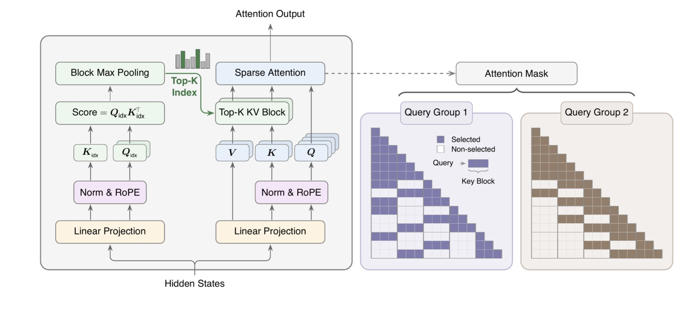

# MiniMax Sparse Attention

> Xunhao Lai, Weiqi Xu, Yufeng Yang, Qiaorui Chen, Yang Xu, Lunbin Zeng, Xiaolong Li, Haohai Sun, Haichao Zhu, Vito Zhang, Pengyu Zhao

- 加速实现和NSA定义类似，kv 按照block选取，同一个group内的query共享mask，因此可以凑成 block-wise sparse gemm进行加速运算。不需要非连续的IO

- Indexer 部分使用了独立的linear projection生成qkv，与full attention的qkv有区别，这点类似 DSA的做法

> 注：以下论文笔记由 AI Agent 自动生成，可能存在理解偏差或遗漏，请以原论文为准。

## Abstract

MiniMax Sparse Attention（MSA）面向百万级长上下文，把标准 GQA 注意力改造成可训练、可部署的 block-sparse attention：轻量 Index Branch 为每个 GQA group 选择 Top-k KV blocks，Main Branch 只在选中的 block 上执行精确 softmax attention。论文同时给出训练 recipe 与 GPU kernel 路径，在 109B MoE 多模态模型上基本保持 full attention 能力，并在 1M context 下显著降低 attention 计算和端到端延迟。

## 一句话总结

MSA 的核心不是简单“每个 query 只看 2048 tokens”，而是把稀疏选择粒度同时对齐到 GQA 语义分组和 GPU block 访问，从而让可学习 sparse attention 真正变成可落地加速。

## 创新点

1. **按 GQA group 做 block-level Top-k 选择**：每个 GQA group 独立选择 KV blocks，同组 query heads 共享 mask；相比全 head 共享 mask 更有语义区分度，相比 token-level/per-head 选择又更适合连续 KV 访问和 block-wise sparse GEMM。
2. **独立 Index Branch + KL alignment 训练**：Indexer 使用独立 linear projection 生成 index q/k，与 full attention 的 q/k/v 分开；通过 KL loss 对齐 Main Branch 的注意力分布，并只更新 index projection，降低对主干模型的扰动。
3. **算法和 kernel 联合设计**：跳过 softmax 的 exp-free Top-k、KV-outer sparse attention、reverse sparse index、hot block chunking、two-phase LSE combine，把 block sparsity 映射成实际 GPU 吞吐，而不只是理论 FLOPs 降低。

## 带来什么提升

1. **计算量显著下降**：在 1M context 下，每 token attention FLOPs 相比 GQA full attention 降低约 **28.4×**；默认 block size 为 128、Top-k 为 16，即 Main Branch 每次最多关注约 2048 个 KV tokens。
2. **端到端速度提升**：在 H800 上，配合专门 kernel，prefill wall-clock 加速约 **14.2×**，decode 加速约 **7.6×**；Top-k kernel 相比 `torch.topk` 快 **5.1×**。
3. **能力基本保留**：在 109B total / 6B activated MoE 模型上，MSA-PT 与 full attention 的训练 loss 接近；MSA-CPT 经过 long-context training 后，在 HELMET-128K 上仅低约 0.60 overall，在 RULER-128K 上略高于 full attention。

## 备注

- MSA 与 NSA、DSA、MoBA 等工作的区别在于更强调工程闭环：selector 训练、GQA group 粒度、block Top-k、GPU kernel 和百万上下文部署一起设计。
- 主要局限是 Index Branch 仍有轻量 $O(N^2)$ scoring，且真实收益依赖高质量 sparse attention kernel；普通框架里 naive gather/scatter 很难复现论文速度。
- 对 EfficientPaper 的启发：长上下文效率路线正在从“推理时临时剪 KV”转向“训练期让模型原生适应稀疏支持集 + kernel co-design”。
