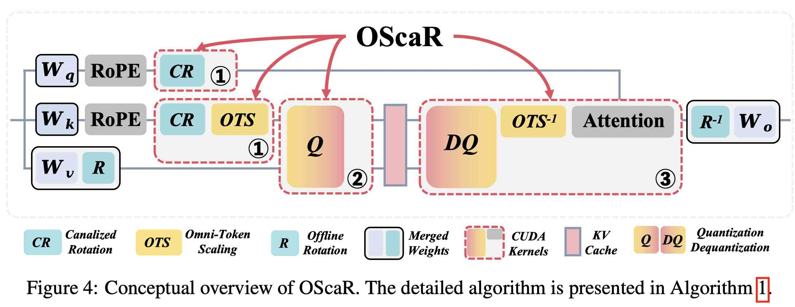

# OScaR: The Occam's Razor for Extreme KV Cache Quantization in LLMs and Beyond

> Zunhai Su, Rui Yang, Chao Zhang, Yaxiu Liu, Yifan Zhang, Wei Wu, Jing Xiong, Dayou Du, Xialie Zhuang, Yulei Qian, Yuchen Xie, Yik-Chung Wu, Hongxia Yang, Ngai Wong



> 注：以下论文笔记由 AI Agent 自动生成，可能存在理解偏差或遗漏，请以原论文为准。

## Abstract

长上下文推理、多模态理解和 omni-modal 智能的发展让 KV cache 的显存占用成为高效部署的主要瓶颈。已有 per-channel quantization 能较好处理 Key tensor 中固有的 channel-wise outliers，但在 INT2 等极端压缩下性能显著下降。本文从经验和理论两方面重新审视 per-channel quantization 的局限，指出 **Token Norm Imbalance (TNI)** 是量化保真度的主要瓶颈：当一组 token 的范数差异很大，却必须共享同一组量化参数时，误差会被系统性放大。

OScaR（Omni-Scaled Canalized Rotation）提出一个面向 X-LLMs（text-only、multi-modal、omni-modal LLMs）的轻量、无需训练的 KV cache compression 框架。它在 per-channel paradigm 上加入两步核心处理：先做 **Canalized Rotation**，再做 **Omni-Token Scaling**，用尽量简单的 pipeline 缓解 TNI 引起的 sequence-dimensional variance。论文还提供优化过的 system design 和 CUDA kernels。实验显示，OScaR 在 INT2 量化下可达到接近无损的效果；相对 BF16 FlashDecoding-v2 baseline，最高实现 3.0× decoding speedup、5.3× memory footprint reduction、4.1× throughput increase。

## 一句话总结

OScaR 的核心观点是：极低比特 KV cache 量化失败的根源不只是 Key 的 channel-wise outlier，而是同一 per-channel quantization group 内 token norm 差异过大；用 Hadamard-based Canalized Rotation 先抹平 outlier channel，再做 Omni-Token Scaling 平衡 token norm，就能以非常简单的训练无关 pipeline 在 INT2 下接近无损压缩 KV cache。

## 背景与问题

自回归推理中，KV cache 避免了重复计算，但其显存占用随上下文长度线性增长。对于长上下文、streaming、视觉/音频多模态输入，prompt sequence 可能包含大量文本 token、视觉特征和音频 embedding，KV cache 很快成为 HBM 的主导占用，限制 batch size 和吞吐。

KV cache quantization 是直接缓解该问题的重要路线。现有经验表明：

- **Key** 中存在明显 channel-wise outliers，因此常用 per-channel quantization；
- **Value** 分布相对均匀，因此常用 per-token quantization；
- KIVI 代表的 block-wise per-channel Key quantization 在低比特下有效，但需要 residual window 支持在线生成；
- QuaRot、RotateKV、ZipCache、TurboQuant 等方法通过 rotation、smoothing、outlier protection 或更复杂的 error correction 改善量化质量。

论文认为：这些方法虽然有效，但在 INT2 等极端压缩下，per-channel Key quantization 仍有一个更基本的弱点——它假设同一 channel/block 内不同 token 的数值范围可以由共享 scale/zero-point 覆盖。但真实模型中存在显著 **Token Norm Imbalance**：一些 token 的范数异常低或异常高，尤其与 attention sink、多模态 token 分布差异有关。共享量化参数为了覆盖这些差异会扩大 dynamic range，使多数普通 token 的有效量化分辨率下降。

## 核心方法

OScaR 包含两个互相依赖的算法组件：

1. **Canalized Rotation (CR)**：先对 Key / Query / Value 相关路径做 Hadamard transform，将 outlier channel 的能量扩散到所有维度，避免某些 channel 主导 token norm。
2. **Omni-Token Scaling (OTS)**：在 rotation 之后，对 token 做 sequence-level normalization，平衡不同 token 的范数，降低 TNI 对 per-channel quantization 的影响。

关键是顺序不能反：直接 token-wise scaling 看似能平衡 token norm，但会引入 **Scaling-Induced Outlier Artifact**。如果低范数 outlier tokens 被直接放大到普通 token 范数，它们在本来很小的 channel 上会变成人造 outlier，反而扩大 per-channel quantization range。Canalized Rotation 先把 channel outlier 能量打散，使后续 token scaling 不会制造新的局部极端值。

因此，OScaR 的设计可以理解为：

```text
原始 KV 分布
  → Canalized Rotation：处理 channel-wise outlier / 防止 scaling artifact
  → Omni-Token Scaling：处理 token norm imbalance
  → 极低比特量化：Key per-channel, Value per-token
```

## 技术细节

### 1. TNI：per-channel quantization 的结构性瓶颈

在 block-wise per-channel Key quantization 中，对于某个 Key cache block `K ∈ R^{S×d}`，每个 channel j 在 block g 内用同一组量化 step size 和 zero-point：

```text
Δ_{j,g} = (max_{i∈g} K_{i,j} - min_{i∈g} K_{i,j}) / (2^b - 1)
z_{j,g} = ceil(-min_{i∈g} K_{i,j} / Δ_{j,g})
```

如果 block 内 token norm 差异很大，少数极端 token 会扩大 `max-min` range，导致普通 token 的 quantization step 过粗。论文通过 token-wise norm profiling 发现：

- text-only LLM 中，Query/Key/Value 都有一小部分低范数 outlier tokens；
- 这些 token 与 attention sink tokens 对应，且跨 attention states 稳定出现；
- multi-modal LLM 中 TNI 更复杂：既有 text-only 类似的 attention-sink outliers，也有跨模态范数差异，以及部分超大范数 outlier tokens。

理论推导进一步指出，per-channel quantization block 的重建误差受 block 内 token norm range 支配，因此 TNI 会系统性放大误差。Value 的 per-token quantization 虽然也存在 TNI，但范数差异被局限在单个 token 内，不会像 per-channel Key quantization 那样跨 token 相互干扰。

### 2. 为什么不能直接做 token-wise scaling？

直接把所有 token 缩放到相同范数，看起来能解决 TNI，但实际可能退化。原因是普通 token 往往被少数 outlier channels 主导，而低范数 attention-sink token 的各 channel 值可能整体较小且更均匀。直接放大这些低范数 token 后，它们会在普通 token 原本很小的 channel 上产生新 outlier，扩大 per-channel range。

论文称这种现象为 **Scaling-Induced Outlier Artifact**。这解释了为什么单独的 token-wise normalization 不可靠：它解决了 token norm imbalance，但破坏了 channel-wise quantization 的分布结构。

### 3. Canalized Rotation

Canalized Rotation 使用 Hadamard transform 先重新分布 channel outlier 的能量。Hadamard transform 的优势是：

- 与普通矩阵乘相比复杂度更低，FHT 可达到 `O(d log d)`；
- 能把局部 channel outlier 的能量扩散到更多维度，使 channel 分布更平滑；
- 为后续 token scaling 创造更安全的数值条件。

对于 attention 计算，Key 经过 rotation 后，Query 也需要在线 FHT，以隐式抵消 Key 上的旋转，保证 attention 语义一致。Value 路径则可以把 Hadamard transform offline merge 到 attention output weight 中，减少 runtime overhead。

### 4. Omni-Token Scaling

在 Canalized Rotation 后，OScaR 计算每个 token 的范数，并做 token-wise scaling，使 sequence dimension 上的 token norm 更均衡。dequantization 时再做 inverse scaling 恢复原始范数。论文强调 OTS 是 omni-directional / sequence-level normalization，目标是同时处理 text-only、多模态、omni-modal 场景中多样的 TNI 模式。

实现上，Omni-Token Scaling 使用硬件加速的 `rsqrt` 指令来降低开销。

### 5. System design 和 CUDA kernels

OScaR 实现了三个 CUDA kernels，并基于 HadaCore 与 BitDecoding 做适配：

1. **Online FHT and Scaling kernel**：对 Key 做 fused FHT + token scaling，同时对 Query 应用 FHT；
2. **Quantization kernel**：对 Key 和 Value 做 GPU-efficient quantization；
3. **Dequantization, De-Scaling, and Attention kernel**：处理 Key/Value dequantization、Key inverse scaling 和 attention computation。

这种设计的重点是把算法处理尽量融合到推理路径里，避免复杂 pipeline 的额外 memory movement 和 kernel launch overhead。

## 实验设置

### 模型

论文覆盖三类 X-LLMs：

- text-only LLMs：Llama-3.1-8B、Qwen3-8B
- multi-modal LLMs：LLaVA-v1.6-vicuna-7B、Qwen3-VL-4B/8B-Instruct
- omni-modal LLMs：Qwen3-Omni-30B-A3B

### 任务

- text-only：LongBench-E、Needle-in-a-Haystack (NIAH)
- multi-modal：OCRBench、DocVQA
- omni-modal：MMAU-Pro

这些任务强调长上下文、多模态输入和检索能力，适合测试极低比特 KV cache quantization 的鲁棒性。

### Baselines

论文比较三类 baselines：

- per-channel Key quantization：KIVI、OTT
- rotation-based per-token Key quantization：QuaRot、RotateKV
- LUT / 更复杂 quantization pipeline：TurboQuant / TurboQuant+

其中 TurboQuant+ 使用 2.5-bit；其它方法包括 OScaR 大多采用 INT2，group size 为 32。KIVI、OTT、OScaR 的 residual length 统一设为 128；OTT 使用 5 个高精度 outlier tokens。

## 主要结果

### 1. Text-only LongBench-E

在 LongBench-E 上，OScaR 是所有 quantized methods 中平均分最高的方法：

- Llama-3.1-8B：OScaR 平均 `41.75`，高于 OTT `40.74`、TurboQuant+ `40.03`、KIVI `39.84`；
- Qwen3-8B：16-bit baseline 平均 `49.56`，OScaR `48.74`，只下降约 `1.7%`，并高于 OTT `48.21`、KIVI `47.95`、TurboQuant+ `47.56`。

在 NIAH 长上下文检索任务中，OScaR 达到 `96.5%` retrieval accuracy，高于第二名 `92.7%`，甚至略高于 16-bit baseline 的 `96.0%`。

### 2. Multi-modal / Omni-modal

在 OCRBench、DocVQA 和 MMAU-Pro 上，OScaR 在 2-bit KV quantization 下仍接近 16-bit baseline：

- OCRBench：在 Qwen3-VL-4B 上比第二好方法高 `2.5` 个百分点；
- MMAU-Pro：在 open-ended QA、Good Rate 和 audio instruction following 三个指标上均为 quantized methods 最优，分别超过第二名 `1.2`、`2.8`、`4.6` 个百分点。

这说明 OScaR 不只是 text-only LLM 的技巧，也能处理多模态 token 分布差异带来的 TNI。

### 3. Efficiency

效率实验在单张 H20 GPU（141GB）上进行，使用 Qwen3-8B，BF16 FlashDecoding-v2 作为 baseline。

主要结果：

- context length 128K、batch size 1：OScaR 达到最高 `3.0×` decoding speedup；
- context length 4K、batch size 48：memory footprint 降低 `5.3×`，throughput 提升 `4.1×`。

论文给出的分析是：OScaR 的低复杂度算法与 CUDA kernel fusion 让 INT2 KV cache 的带宽/容量收益能够转化为实际 latency 和 throughput 收益，而不是被复杂量化 pipeline 的 overhead 抵消。

### 4. Ablation 与 Pareto front

论文在附录中进一步分析 CR 和 OTS 的互补性：

- 只做 Canalized Rotation：能改善 channel distribution，但不能充分平衡 token norm；
- 只做 Omni-Token Scaling：会制造 Scaling-Induced Outlier Artifact；
- 完整 OScaR：同时降低 channel outlier 和 TNI，避免 artifact。

Pareto front 分析显示，在 accuracy-efficiency tradeoff 上，OScaR 处于比 TurboQuant+ 等方法更有利的位置：更简单、更低开销，同时保持更好精度。

## 优点与局限

### 优点

1. **问题定位清晰**：把 INT2 KV quantization 的瓶颈从“Key 有 channel outlier”推进到“per-channel group 内 token norm imbalance”。
2. **方法简单**：CR + OTS 两步，训练无关，不需要复杂 residual correction 或大量额外参数。
3. **覆盖 X-LLMs**：同时验证 text-only、multi-modal、omni-modal LLM，比很多只测文本模型的 KV quantization 工作更全面。
4. **系统实现完整**：不仅提出算法，还给出 CUDA kernels 和端到端 latency/throughput/memory 结果。
5. **INT2 近无损**：在 LongBench-E、NIAH、多模态和 omni-modal benchmarks 上普遍接近 16-bit baseline。

### 局限

1. **仍依赖 per-channel/per-token paradigm**：OScaR 是对现有量化范式的增强，不是完全新的 KV representation；对更低于 2-bit 或非均匀编码的探索有限。
2. **旋转与 scaling 的硬件收益依赖实现**：论文提供 CUDA kernels，但在不同 GPU、runtime、attention kernel、batch shape 下收益可能变化。
3. **动态 workload 下的策略未充分讨论**：长上下文 serving 中可能存在 prefix reuse、KV tiering、eviction、partial recomputation 等策略，OScaR 主要关注单模型/单请求路径上的 quantization fidelity 和 kernel efficiency。
4. **多模态 token 类型的细粒度策略仍有空间**：虽然 OScaR 证明统一处理有效，但 text / image / audio token 的范数结构不同，未来可能需要 modality-aware scaling 或 group policy。
5. **与 KV cache 稀疏/淘汰方法的组合尚未系统评估**：OScaR 可以与 eviction / sparsity 结合，但论文主要比较 quantization baselines。

## 与 EfficientPaper 主题的关系

OScaR 属于 **kv_cache_quant**，同时与 KV cache management 和硬件感知算法设计有交叉。

它对 EfficientPaper 当前研究脉络的增量在于：

- TurboQuant 代表复杂但理论上接近最优的 online vector quantization；
- VECTOR 把 KV compression 从 retain/evict 扩展到 retain/approximate/evict，并引入 reconstructability；
- OScaR 则回到更基础的 INT2 quantization fidelity，指出 per-channel quantization 失败的关键结构原因是 TNI，并用更简单的 CR + OTS pipeline 取得更好的 accuracy-efficiency Pareto。

这说明 KV cache quantization 虽然在 Brainstorm 中被标记为“成熟/收益递减”，但在 **极低比特 + 长上下文 + X-LLM + 系统 kernel co-design** 条件下仍有非平凡增量。尤其是多模态/omni-modal KV cache 的 token norm distribution 更复杂，可能成为下一阶段 KV quantization 的主要新战场。

## 可复现/实现要点

1. 对 Key 使用 per-channel quantization，对 Value 使用 per-token quantization，保持与 KIVI-style pipeline 兼容。
2. 在 Key 量化前做 online Fast Hadamard Transform，再做 token-wise norm scaling。
3. Query 路径也要做对应 FHT，以保证 attention score 语义与旋转后的 Key 对齐。
4. Key dequantization 后需要 inverse scaling。
5. Value 的 Hadamard transform 可 offline merge 到 output projection weight，降低 runtime overhead。
6. FHT、scaling、quantization、dequantization 和 attention 应尽量融合为少数 CUDA kernels，避免额外 memory movement。
7. 对 INT2 设置，group size、residual length、scale/zero-point 存储开销需要计入真实 memory footprint。
8. 多模态模型应分别检查 text/image/audio token 的 norm 分布，确认 OTS 是否需要 modality-aware 变体。

## 个人备注

- OScaR 的论文标题里 “Occam's Razor” 是准确的：它不是堆复杂 correction，而是找到了 per-channel quantization 在极低比特下的一个结构性失败模式，然后用 rotation + scaling 两个必要步骤解决。
- 这篇与 TurboQuant 形成很好的对比：TurboQuant 更偏理论/复杂 quantization pipeline，OScaR 更偏部署友好的低复杂度数值变换 + CUDA kernel。真正落地时，后者可能更容易获得端到端收益。
- 值得进一步追问：TNI 是否也可以作为 KV eviction / tier placement 的 signal？低范数 attention-sink token 对量化 range 影响大，但语义/attention 重要性可能也特殊；这和 VECTOR 的 reconstructability、TriAttention 的 token importance 可以合并成统一质量模型。
- 另一个开放方向是 modality-aware OTS：如果 image/audio tokens 与 text tokens 的 norm 分布系统性不同，统一 scaling 是否会过度拉平 modality-specific signal？论文结果说明统一 OScaR 已有效，但可能还不是最优。
