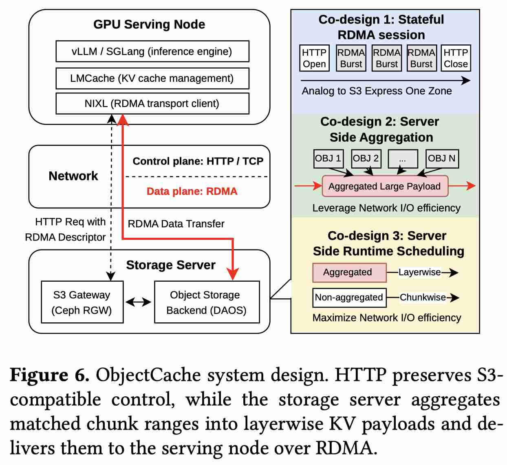
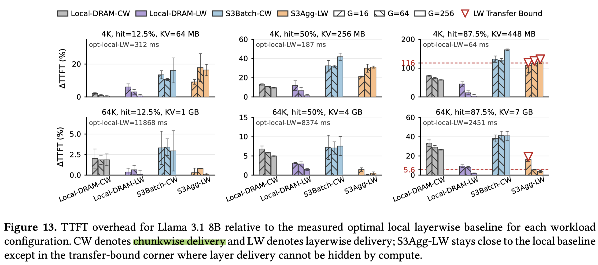

# ObjectCache: Layerwise Object-Storage Retrieval for KV Cache Reuse

> Yu Zhu, Aditya Dhakal, Yunming Xiao, Dejan Milojicic, Gustavo Alonso

> 注：以下论文笔记由 AI Agent 自动生成，可能存在理解偏差或遗漏，请以原论文为准。

## Abstract

Prefix KV caching has become a key mechanism in LLM serving: it reduces time to first token (TTFT) by avoiding redundant computation across requests that share a prefix (i.e., the system prompt). However, the accumulated KV cache is often larger than what GPU memory and local DRAM can hold. To preserve latency, current systems keep the KV cache in remote DRAM pools, increasing serving-cluster size and cost. In this paper, we explore a different approach: storing the KV cache in S3-compatible object storage so that capacity is no longer the constraint, while minimizing the impact on TTFT. We propose ObjectCache, which co-designs the storage protocol and transfer schedule so that the storage server delivers KV cache data in the order the GPU consumes it, overlapping data transfer with compute across concurrent requests. We prototype ObjectCache on a 100 Gbps RoCE cluster with NIXL, Ceph RGW, and DAOS. For 64K contexts, ObjectCache adds only 5.6% latency over local DRAM; for 4K contexts, ObjectCache adds 56--75 ms over the optimal local layerwise baseline. Under shared bandwidth caps, the scheduler reduces added TTFT by 1.2--1.8x compared with equal bandwidth sharing.

## 一句话总结

ObjectCache 把 prefix KV cache 从昂贵 DRAM pool 下沉到 S3-compatible object storage，并按 GPU layerwise 消费顺序流式取回，以 compute-transfer overlap 把容量层级引入 serving 路径。

## 创新点

1. KV-as-object-storage：把大规模可复用 prefix KV 存入对象存储，目标是用廉价容量替代远端 DRAM pool。
2. Layerwise retrieval protocol：存储端按 GPU 推理逐层消费顺序返回 KV slice，而不是一次性拉回整段 KV。
3. 带宽感知调度：在多请求共享带宽时，为不同请求分配取回节奏以最大化 transfer/compute overlap。

## 带来什么提升

1. 64K context 下相比 local DRAM 只增加 5.6% latency，说明对象存储并非一定只能做冷备。
2. 4K context 下额外开销约 56–75 ms，给出了短上下文 overlap 不足时的明确边界。
3. 共享带宽场景下比 equal sharing 降低 1.2–1.8× added TTFT，适合纳入 KV 多级存储 runtime 方向。

## 备注

- 收益依赖高速网络、存储协议和 layerwise streaming；普通对象存储直接替换未必成立。
