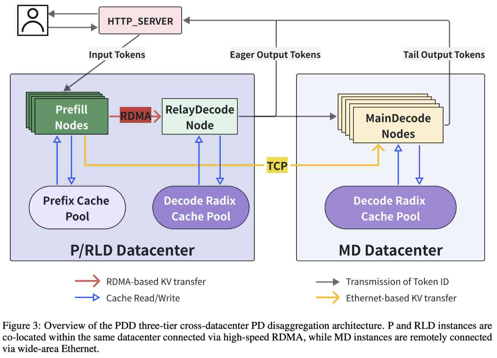

# PDD: Unleashing Economical and Flexible Heterogeneous LLM Inference via Cross-Datacenter Prefill-Decode Disaggregation

> Yida Wang, Xiuhong Li, Jianping Ma, Gan Sun, Yunshen Xu, Buhe Han, Jingxu Ng, Yuhao Luo, Ke Hong, Guohao Dai, Boxun Li, Yu Wang；Infinigence-AI、清华大学、上海交通大学、北京大学

> 注：以下论文笔记由 AI Agent 自动生成，可能存在理解偏差或遗漏，请以原技术报告为准。

## Abstract

跨数据中心低成本广域以太网可以把地理分散的异构集群连接起来，但 PD 分离会产生巨大的跨集群 KV Cache 传输开销，显著拉高 TTFT，尤其不适合长上下文、高前缀命中率、短输出的 Agentic workload。PDD 在 Prefill-Decode 分离基础上引入 Prefill、Relay Decode（RLD）和 Main Decode（MD）三级架构：RLD 在近端通过 RDMA 先解码，用早期输出掩盖远端 KV 传输；MD 收齐 KV 后仅接收 RLD 产生的 Token ID，并通过 Extend-Decode 在本地重建增量 KV，再接管后续生成。

## 一句话总结

PDD 不直接把跨数据中心的 KV 传输变快，而是用极小的近端 RLD 和本地重算把 WAN 传输延迟藏在用户已经看到的 token 生成过程中，从而让异构、跨地域 PD 分离满足服务级目标。

## 创新点

1. **三级跨数据中心 PD 架构**：P 与 RLD 位于同一数据中心，通过 RDMA 快速传递 KV；MD 位于远端，通过低成本广域以太网接收完整 KV，形成“近端接力 + 远端主解码”。
2. **Extend-Decode Handoff**：RLD 不向 MD 传输增量 KV，而只传 CPU resident 的 Token ID；MD 在 memory-bound decode 过程中批量重算增量 KV，并无缝继续生成，避免 WAN KV 传输以及额外 H2D/D2H 拷贝。
3. **面向 Agent 负载的系统协同**：Decode-side RadixCache（DRC）利用高 prefix hit 降低跨 DC payload；PDD 只保留 P-MD 和 P-RLD-MD 两条 pipeline，避免 P-RLD 终止路径破坏两侧 cache 一致性；同时支持 Catch-Up 与 One-Shot 两种 handoff，并动态约束 RLD 的输出长度。
4. **细粒度异构部署与异常请求处理**：将 compute-heavy 硬件用于 P、memory-bandwidth-optimized 硬件用于 MD，仅配置少量 RLD 资源；对“超长输入、超短输出”等奇异流量可在近端提前结束，避免无收益的跨 DC 传输。

## 带来什么提升

1. 在 DeepSeek-V4-pro 真实 Agentic trace、64K context、90% cache hit 的评测中，相比传统 Cross-DC PD，PDD 将 P90 TTFT 降低约 46%；报告表中的 IDC-PD 对比为 P50/P90/P99 TTFT `3.9/10.4/17.2s`，PDD 为 `4.2/9.8/14.4s`。
2. Extend-Decode handoff 只传 Token ID：100-token microbenchmark 中，最大 handoff latency 从直接传增量 KV 的 `512.6ms` 降至 `321.4ms`，并显著降低延迟方差与显存拷贝开销。
3. 相比同机房同构 PD，H100 Prefill + H200 Main Decode 的 PDD 配置在报告实验中将 RPS 从 `9.0` 提升到 `11.5`（`+27.8%`），总成本降低约 `3.5%–7.1%`，SLA-compliant goodput 的 BCR 提升 `32.4%–37.5%`。
4. DRC 在平均 90% prefix hit 下最多将所需跨数据中心带宽降低约 10 倍；但收益依赖命中率分布、WAN 带宽和 RLD 资源，不能简单理解为所有请求都获得同样的延迟下降。

## 备注

- PDD 与 PrfaaS 是互补关系：PrfaaS 主要通过请求调度处理长上下文 prefill 的 SLA 干扰，PDD 通过 RLD latency masking 处理 Agent 高命中、短输出负载的跨 DC KV 尾延迟；报告明确认为二者可以组合。
- 证据边界：报告的主要实验是中等规模、H100/H200 异构组合，RLD 使用 3 个 H100；MTP 关闭，部分系统优化因 DRC 兼容性未启用，其他芯片组合和更大规模下的收益仍需验证。
- 对 EfficientPaper 的研究价值：PDD 把“跨 DC KV 生命周期”从单纯传输问题推进为 `命中率分布 + WAN tail latency + RLD 资源 + handoff 重算 + pipeline consistency` 的联合调度问题，适合纳入 KV cost model 与 Agent workflow serving 方向。

## 参考

- 技术报告：[PDD-tech-report-release-v1.pdf](https://github.com/infinigence/pdd/blob/main/tech_report/PDD-tech-report-release-v1.pdf)
- 代码仓库：[infinigence/pdd](https://github.com/infinigence/pdd)
