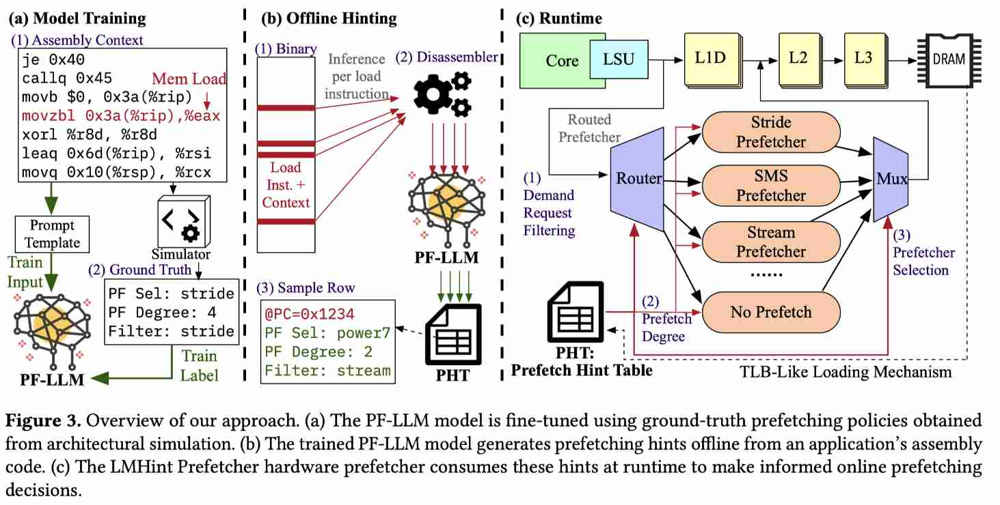

# PF-LLM: Large Language Model Hinted Hardware Prefetching

> Ceyu Xu, Xiangfeng Sun, Weihang Li, Chen Bai, Bangyan Wang, Mengming Li, Zhiyao Xie, Yuan Xie

## Abstract

Hardware data prefetching is a critical technique for mitigating memory latency in modern processors. While sophisticated hardware prefetching algorithms exist, their exclusive reliance on runtime information limits their ability to adapt quickly and comprehend broader program context. The key insight of PF-LLM is that the optimal prefetching strategy for a load instruction is often inferable from its static code context. PF-LLM fine-tunes a coding LLM to analyze assembly context around each load instruction and generate offline prefetching hints, which are consumed at runtime by a lightweight LMHint Prefetcher ensemble. Evaluation on memory-intensive SPEC 2017 benchmarks reports 9.8% average IPC improvement over state-of-the-art single prefetchers and 18.9% over state-of-the-art ensemble methods.

---

# PF-LLM: Large Language Model Hinted Hardware Prefetching

> 来源: https://fact-lab.hkust.edu.hk/publications/conference-paper/2025/xu-2025-pf-llm/3779212.3790202.pdf
> DOI: https://doi.org/10.1145/3779212.3790202
> 由 GPT 自动生成，请人工核验。

### 1. 研究背景与动机

现代处理器的单线程性能仍受到 memory wall 限制，硬件 data prefetching 是隐藏内存延迟的重要手段。已有 prefetcher 往往针对 stride、stream、spatial locality、irregular sequence 等特定访问模式设计；真实程序会在不同 phase 间切换，因此单一 prefetcher 覆盖不足，ensemble prefetcher 又需要在线选择策略。

现有在线 ensemble 方法的问题是：

- 需要 trial-and-error 学习过程，面对快速 phase 切换时收敛慢；
- 受片上面积和时延约束，只能使用简单启发式，无法利用更大范围的程序上下文；
- 错误选择可能污染 cache、浪费带宽，甚至破坏子 prefetcher 的内部状态。

PF-LLM 的核心观察是：很多 load instruction 的最佳 prefetch 策略可以从静态代码语义中推断出来，例如 atomic lock 不应 prefetch、struct array 遍历适合 stride、struct field 访问适合 spatial、字符串读取适合 stream。因此，作者尝试把复杂策略选择从 runtime hardware 移到 offline LLM 分析阶段。

### 2. PF-LLM 核心思想

PF-LLM 是一个面向硬件预取提示生成的 fine-tuned coding LLM。它离线分析目标 load instruction 前后各 128 行 assembly context，预测该 load 的 prefetching hints；运行时，LMHint Prefetcher 根据这些 per-PC hints 编排多个传统子 prefetcher。

一句话概括：**用离线 LLM 读静态汇编上下文，为每条 load 指令生成“选择哪个 prefetcher、预取多激进、是否过滤 demand request”的硬件提示，从而让 runtime prefetcher 近似拥有零延迟 oracle policy。**

### 3. 关键技术

| 技术 | 说明 |
|------|------|
| **Assembly-context hinting** | 输入目标 load 前后各 128 行汇编，共 257 行上下文；相比源码/IR，汇编可从任意静态二进制反汇编得到。 |
| **Small coding LLM fine-tuning** | 基于 Qwen-2.5-Coder-0.5B-Instruct 微调，不改模型结构；训练目标只计算 JSON hint 输出部分的 loss。 |
| **Simulator-generated labels** | 用 ChampSim 生成每个 load PC 的 ground-truth prefetch policy，训练集来自 SPEC 2006，测试/评估保留 SPEC 2017，避免 benchmark 泄漏。 |
| **Three-part prefetch hint** | 输出 prefetcher selection、prefetch degree、demand request filtering 三类提示；selection 是主要收益来源，degree/filtering 提供细粒度增益。 |
| **LMHint Prefetcher** | 运行时硬件 ensemble，根据 PC 查询 hint，控制允许哪个子 prefetcher 发出请求、设置 aggressiveness，并过滤不相关 demand request。 |
| **PHT + PHB hint storage** | 离线 JSON hints 转为紧凑二进制，存入主存 Prefetch Hint Table；片上 256-entry Prefetch Hint Buffer 类似 TLB 缓存最近 hint。 |
| **Reduced-cost ensemble** | LMHint-SDFR 只保留最常被选择的 4 个子 prefetcher，在不重新训练模型的情况下接近/略优于完整 11 子 prefetcher 版本。 |

### 4. 实验结果

| 指标 | 结果 |
|------|------|
| 会议/出处 | ASPLOS 2026, Volume 2 |
| 训练基础模型 | Qwen-2.5-Coder-0.5B-Instruct |
| 训练配置 | 8×NVIDIA H20，BF16，learning rate 1e-5，effective batch size 64，2 epochs |
| 标签/训练 benchmark | SPEC 2006 + ChampSim 模拟生成 labels |
| 主评估 benchmark | memory-intensive SPEC 2017 |
| PF-LLM hint 预测准确率 | **95.0%** held-out accuracy |
| 相比最佳 single prefetcher | **+9.8%** average IPC over Sandbox |
| 相比最佳 prior ensemble | **+18.9%** average IPC over Alecto |
| Web serving workload | Apache、MySQL、RocksDB、Xapian 上也优于现有 single/ensemble baseline，但收益较 SPEC 更 modest |
| 离线推理吞吐 | 1×H20 上最高约 **234 requests/s** |
| SPEC 2017 全套 hint 生成时间 | 8-GPU 系统约 **38.5 min**，与编译时间同量级 |
| Runtime hint 存储开销 | 每 load 约 7 bytes；约 **74.34 KB/MB binary**，静态程序 footprint 增加 **7.26%** |

### 5. 核心贡献

1. 提出 **LLM-guided microarchitecture** 范式：用离线 LLM 分析静态代码语义，指导运行时硬件动态决策。
2. 将 prefetcher ensemble 的复杂策略选择从片上在线学习转移到离线分析，避免 runtime trial-and-error 和片上复杂学习器。
3. 设计 PF-LLM + LMHint Prefetcher 接口，以 per-load PC hints 连接离线语义理解和在线硬件 prefetch。
4. 证明小模型也足够：0.5B coding LLM 经 simulator labels 微调后可达到 95% prefetch policy 预测准确率。
5. 在 SPEC 2017 上取得显著 IPC 提升，并展示 reduced-cost ensemble 可以减少硬件复杂度而不牺牲性能。

### 6. 局限性与讨论

- **静态二进制依赖**：当前方法不原生支持 JIT 或 bytecode runtime，例如 Java；作者建议未来可分析 IR。
- **ASLR 映射问题**：hints 以静态 PC 为索引，地址随机化会破坏映射；需要 OS loader 协同修正偏移。
- **硬件配置依赖**：最优 prefetch policy 与 cache size、bandwidth 等微架构参数有关；不同平台可能需要重新训练或把硬件参数加入 prompt。
- **与当前 LLM serving 主线的关系**：这篇不是 LLM 推理优化本身，而是用 LLM 作为离线程序分析器指导 CPU microarchitecture；对“training-free runtime policy + offline semantic hint”有启发价值。

### 7. 对当前研究的启发

- 可以借鉴其 **offline semantic hint + lightweight runtime policy** 模式：在 LLM serving 中，离线/低频分析 prompt、代码仓库、RAG 文档或历史 session，生成 runtime KV cache/offload/prefetch hints。
- PF-LLM 的 per-PC hint 类似 KV cache 系统中的 per-chunk/per-layer/per-head hint：不必在线做复杂推理，只需 runtime 快速查表和执行。
- 研究可转化为 **LLM-guided memory management**：用小模型或离线 profiling 预测 chunk reuse、KV hotness、recompute-vs-load 决策，再由 serving runtime 低开销执行。

