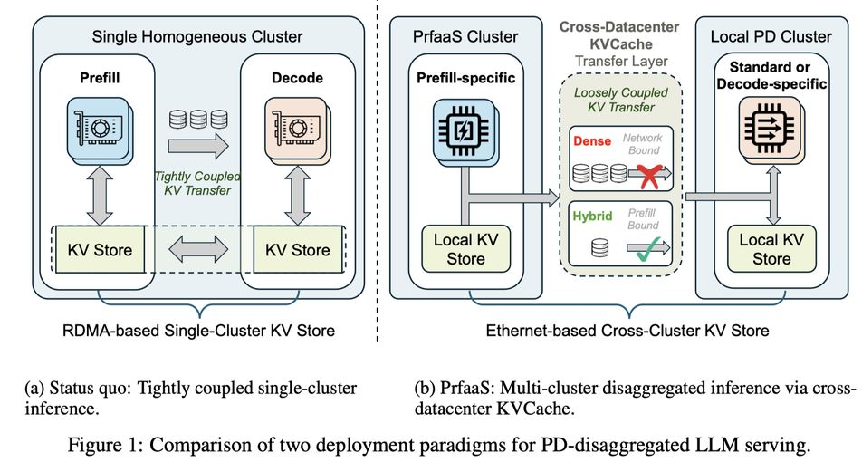

# Prefill-as-a-Service: KVCache of Next-Generation Models Could Go Cross-Datacenter

> Ruoyu Qin, Weiran He, Yaoyu Wang, Zheming Li, Xinran Xu, Yongwei Wu, Weimin Zheng, Mingxing Zhang

## Abstract

Prefill-decode (PD) disaggregation has become the standard architecture for large-scale LLM serving, but in practice its deployment boundary is still determined by KVCache transfer. In conventional dense-attention models, prefill generates huge KVCache traffics that keep prefill and decode tightly coupled within a single high-bandwidth network domain, limiting heterogeneous deployment and resource elasticity. Recent hybrid-attention architectures substantially reduce KVCache size, making cross-cluster KVCache transport increasingly plausible. However, smaller KVCache alone does not make heterogeneous cross-datacenter PD serving practical: real workloads remain bursty, request lengths are highly skewed, prefix caches are unevenly distributed, and inter-cluster bandwidth fluctuates. A naive design that fully externalizes prefill can therefore still suffer from congestion, unstable queueing, and poor utilization.
  We present Prefill-as-a-Service (PrfaaS), a cross-datacenter serving architecture that selectively offloads long-context prefill to standalone, compute-dense prefill clusters and transfers the resulting KVCache over commodity Ethernet to local PD clusters for decode. Rather than treating reduced KVCache as sufficient, PrfaaS combines model-side KV efficiency with system-side selective offloading, bandwidth-aware scheduling, and cache-aware request placement. This design removes the requirement that heterogeneous accelerators share the same low-latency RDMA fabric, enabling independent scaling of prefill and decode capacity across loosely coupled clusters. In a case study using an internal 1T-parameter hybrid model, a PrfaaS-augmented heterogeneous deployment achieves 54% higher serving throughput and 64% lower P90 TTFT than a homogeneous PD baseline, with approximately 15% throughput gain at equal cost, while consuming only modest cross-datacenter bandwidth.

---

*以下总结由 MiMo 生成：*

这篇论文针对大规模LLM服务中预填充与解码分离架构的部署边界受限问题，提出了一种跨数据中心的Prefill-as-a-Service（PrfaaS）架构。该方法通过选择性地将长上下文预填充卸载到独立的计算密集型集群，并利用带宽感知调度和缓存感知请求放置，实现了KVCache的跨数据中心传输。实验表明，在1T参数混合模型案例中，PrfaaS在异构部署下相比同构基线提升了54%的服务吞吐量并降低了64%的P90首次令牌时间，同时以约15%的吞吐增益实现成本效益，且仅需适度的跨数据中心带宽。
