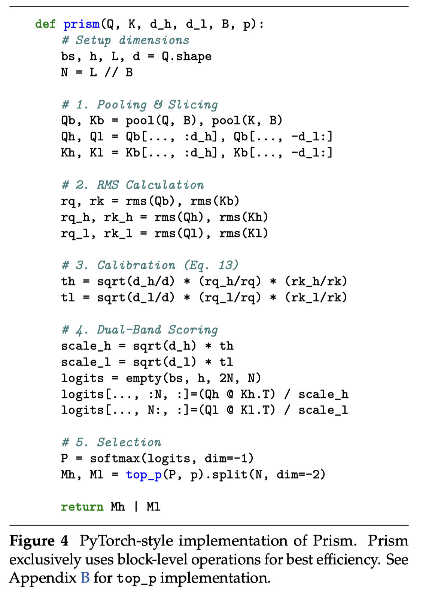

# Prism: Spectral-Aware Block-Sparse Attention

> Xinghao Wang, Pengyu Wang, Xiaoran Liu, Fangxu Liu, Jason Chu, Kai Song, Xipeng Qiu

## Abstract

Block-sparse attention is promising for accelerating long-context LLM pre-filling, yet identifying relevant blocks efficiently remains a bottleneck. Existing methods typically employ coarse-grained attention as a proxy for block importance estimation, but often resort to expensive token-level searching or scoring, resulting in significant selection overhead. In this work, we trace the inaccuracy of standard coarse-grained attention via mean pooling to a theoretical root cause: the interaction between mean pooling and Rotary Positional Embeddings (RoPE). We prove that mean pooling acts as a low-pass filter that induces destructive interference in high-frequency dimensions, effectively creating a "blind spot" for local positional information (e.g., slash patterns). To address this, we introduce Prism, a training-free spectral-aware approach that decomposes block selection into high-frequency and low-frequency branches. By applying energy-based temperature calibration, Prism restores the attenuated positional signals directly from pooled representations, enabling block importance estimation using purely block-level operations, thereby improving efficiency. Extensive evaluations confirm that Prism maintains accuracy parity with full attention while delivering up to $\mathbf{5.1\times}$ speedup.

RoPE的推导https://www.zhihu.com/search?q=rope%20%E4%BD%8D%E7%BD%AE%E7%BC%96%E7%A0%81&search_source=Suggestion&utm_content=search_suggestion&type=content

Block Pooling 对 query和key进行reduce，考虑到RoPE，Pooling对高频和低频的部分表现会有不一致的地方，基于此进行了改进