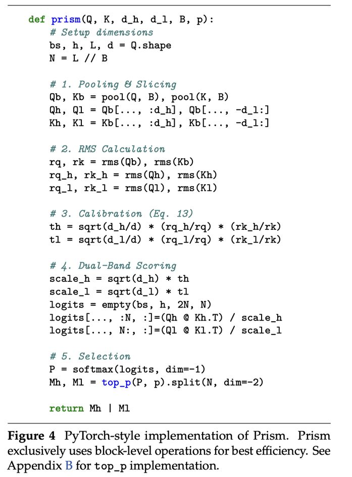

# Prism: Spectral-Aware Block-Sparse Attention

> Xinghao Wang, Pengyu Wang, Xiaoran Liu, Fangxu Liu, Jason Chu, Kai Song, Xipeng Qiu

> **生成声明**：本 note 由 AI Agent 自动生成，基于 arXiv 论文 2602.08426v1 全文阅读与分析。

---

## 一句话总结

Prism 通过频谱感知的双频分支设计，将 block-sparse attention 中的块重要性估计从昂贵的 token 级操作提升到纯块级操作，在 128K 上下文长度下实现高达 **5.1× 加速**，同时保持与全注意力相当的精度。

---

## 摘要翻译

Block-sparse attention 在加速长上下文 LLM 预填充方面前景广阔，但高效识别相关块仍然是一个瓶颈。现有方法通常使用粗粒度注意力作为块重要性估计的代理，但往往依赖昂贵的 token 级搜索或评分，导致显著的选择开销。在本文中，我们将标准粗粒度注意力通过均值池化（mean pooling）产生的不准确性的理论根源追溯到均值池化与旋转位置编码（RoPE）之间的交互。我们证明均值池化充当低通滤波器，在高频维度上引起破坏性干涉，有效地为局部位置信息（例如斜线模式）创造了一个"盲点"。为解决这一问题，我们引入了 Prism——一种免训练的频谱感知方法，将块选择分解为高频和低频分支。通过应用基于能量的温度校准，Prism 从池化表示中直接恢复衰减的位置信号，使得仅使用纯块级操作进行块重要性估计，从而提高效率。大量评估证实 Prism 在保持与全注意力精度一致的同时，实现了高达 **5.1×** 的加速。

---

## 研究动机

### 核心问题

长上下文 LLM 的自注意力机制计算复杂度随序列长度平方增长，在 token 并行预填充阶段造成巨大的计算瓶颈。Block-sparse attention 通过仅计算相关块的子集来近似全注意力，是解决这一问题的有效方案。

### 现有方法的局限

1. **粗粒度注意力估计不准确**：现有方法（如 MInference、FlexPrefill）依赖均值池化来压缩块为单一代表向量，但这会丢失高频位置信息。
2. **依赖昂贵的 token 级操作**：由于粗粒度估计不准确，SOTA 方法不得不依赖启发式搜索和 token 级验证来维持性能，导致选择开销显著。
3. **性能瓶颈**：在中等序列长度（如 8K-32K）时，选择开销往往抵消了稀疏性增益，使得这些方法在性能上不如高度优化的全注意力实现（如 FlashAttention）。

### 关键洞察

作者追溯了均值池化不准确的理论根源：**均值池化与 RoPE 的频谱交互**。RoPE 的频谱异质性自然地将注意力分解为不同的结构模式——高频维度编码精细的相对位置信息（斜线模式），低频维度捕获全局语义依赖（块稀疏模式）。然而，均值池化在高频维度上充当低通滤波器，导致破坏性干涉，使信号幅度坍缩，形成"盲点"。

---

## 方法（技术细节）

### 1. 粗粒度注意力的频谱衰减理论

**RoPE 的频谱结构**：RoPE 将特征对在复平面上旋转，旋转频率 θⱼ = b^(-2j/d)（b 为基底，如 Qwen3 的 10⁶）。高频维度（j→0）具有大旋转频率，编码局部位置信息；低频维度（j→d/2）旋转可忽略，编码全局语义内容。

**均值池化的低通滤波效应**：对块内 token 进行均值池化，等价于对 RoPE 旋转向量求几何级数之和。频谱衰减因子 λⱼ(B) 定义为池化向量幅度与原始向量幅度的比值：

$$\lambda_j(B) = \frac{1}{B} \left| \frac{\sin(B\theta_j/2)}{\sin(\theta_j/2)} \right|$$

在小频率时，这近似为归一化 sinc 函数：λⱼ(B) ≈ |sinc(Bθⱼ/(2π))|。

**三个频谱区域**（以 B=128, d=128, Qwen3 Base=10⁶ 为例）：
- **Dead Zone**（0 ≤ 2j ≲ 30）：信号幅度因全相位抵消而接近零
- **Transition Zone**（30 ≲ 2j ≲ 60）：信号开始恢复但仍然严重衰减
- **Semantic Zone**（2j > 60）：信号幅度完全保留，捕获全局语义信息

### 2. 能量分析

在 Qwen3-8B 上验证了理论衰减在实际模型表示中的体现。Token 级别下 Dead Zone 保持稳健幅度（RMS ≈ 1.0），证明高频位置特征对预训练模型具有内在重要性。但块池化后 Dead Zone 能量坍缩至近乎零（RMS ≈ 0.1），实证验证了均值池化的低通滤波效应。此外，Semantic Zone 的 RMS 始终高于 Full 频谱，且在池化后这种差异进一步加剧。

### 3. Prism 框架核心设计

#### 3.1 双频块重要性估计（Dual-Band Block Importance Estimation）

将 Q, K ∈ ℝ^(L×d) 切分为高频和低频两部分：
- 高频分支：取前 d_high 维度，得到 Q_high, K_high ∈ ℝ^(L×d_high)
- 低频分支：取后 d_low 维度，得到 Q_low, K_low ∈ ℝ^(L×d_low)

对两个分支分别进行均值池化，得到块级表示。然后使用分支特定的温度缩放因子 τ_high, τ_low 计算粗粒度注意力分数：

$$\bar{S}_z = \text{softmax}\left(\frac{\bar{Q}_z \bar{K}_z^T}{\tau_z \sqrt{d_z}}\right), \quad z \in \{high, low\}$$

最终块稀疏掩码 M = M_high ∪ M_low，其中 M_high, M_low 通过 top-p 选择生成。

#### 3.2 基于能量的温度校准（Energy-Based Temperature Calibration）

为对齐各频带的 logit 幅度，基于 RMS norm 推导分支特定温度：

$$\tau_z \approx \sqrt{\frac{d_z}{d} \cdot \frac{\text{RMS}(\bar{Q}_z)}{\text{RMS}(\bar{Q}_{full})} \cdot \frac{\text{RMS}(\bar{K}_z)}{\text{RMS}(\bar{K}_{full})}}$$

该公式恢复了被衰减的 logit 幅度，无需任何超参数调优。

#### 3.3 实现细节

- 块大小 B = 128（在精度和效率间取得平衡）
- 频带维度：d_high = 64, d_low = 96（确保覆盖过渡区，且维度为 32 的倍数以最大化 Tensor Core 吞吐量）
- Top-P 阈值：Llama-3.1-8B-Instruct 用 p = 0.95，Qwen 模型用 p = 0.93
- 使用自定义 Triton 内核实现重要性估计和块稀疏注意力
- **完全免训练**，仅使用块级操作

---

## 实验结果

### 评估基准

- **语言建模**：PG19（长上下文困惑度）
- **长上下文理解**：LongBench（多任务）
- **长上下文检索**：RULER（检索能力）
- **视频理解**：VideoMME + LongVideoBench

### 模型

- Llama-3.1-8B-Instruct (128K)
- Qwen3-8B (YaRN 扩展至 128K)
- Qwen3-VL-8B（多模态）

### 对比基线

- FlashAttention-2（全注意力）
- MInference、FlexPrefill、XAttention（SOTA 免训练动态块稀疏方法）

### 主要结果

#### 语言建模（PG19）
- Prism 在所有上下文长度下保持与全注意力几乎相同的困惑度（ΔPPL ≈ 0）
- 128K 时实现 **5.1× 加速**（XAttention 仅 3.0×）
- 实现了"双赢"：最高加速 + 全注意力精度

#### 长上下文理解（LongBench）
- Llama-3.1-8B-Instruct：平均 41.08（全注意力 41.47，退化 < 0.4%）
- Qwen-3-8B：平均 39.12（全注意力 39.49，退化 < 0.4%）
- 在某些任务上甚至优于全注意力（如 Qwen-3 Few-shot：58.36 vs 56.69）
- 显著优于 FlexPrefill 和 XAttention

#### 长上下文检索（RULER）
- 所有方法在配置阈值下表现相当
- Prism 使用纯块级操作达到同等性能（基线依赖 token 级估计）
- YaRN 扩展的 Qwen3-8B 上表现稳健

#### 视频理解
- VideoMME：与全注意力持平（71.22 vs 71.22）
- LongVideoBench：64.25（全注意力 65.00，XAttention 64.25）
- 长视频段（30-1 小时）上 Prism 超越全注意力（64.00 vs 63.11）
- 泛化到 Interleaved M-RoPE 变体

#### 效率
- 128K 时 5.1× 加速（FlashAttention 基线）
- 估计开销最低：128K 时仅 ~9ms（XAttention ~85ms）
- 内存开销最低：128K 时仅约 FlexPrefill 的 20%
- 在所有序列长度（8K-128K）上保持一致加速

### 消融实验

- **频谱划分**：仅使用低频分支（d_low=96, d_high=0）与全维度行为几乎一致，证实高频在均值池化中仅充当噪声
- **过渡区必要性**：将高频限制到理论死区（d_high=32）性能较差；扩展到 d_high=64 可捕获过渡区恢复的信号
- **重叠设计**：d_low=64 时在高密度下不稳定（U 形曲线）；d_high=96 创建频谱重叠，使过渡区同时被两个分支覆盖
- **温度校准效果**：有校准时 Pareto 前沿显著优于无校准（固定 τ=1.0）
- **块大小效应**：B=64 精度最好但估计延迟翻倍（~22ms vs ~9ms），B=128 是最佳平衡

---

## 优势

1. **免训练**：无需任何训练或微调，直接应用于预训练模型
2. **纯块级操作**：完全避免 token 级搜索或评分，选择开销极低
3. **频谱感知理论**：有坚实的数学理论基础（频谱衰减因子推导），解释了现有方法不准确的根源
4. **双频分支设计**：显式分离高频和低频信号，避免信号干扰
5. **能量校准**：基于频谱能量分布自适应推导温度，无需超参数调优
6. **多模态泛化**：适用于 YaRN、Interleaved M-RoPE 等 RoPE 变体
7. **高效的实现**：使用自定义 Triton 内核，最大化 GPU 利用率
8. **一致性加速**：在所有序列长度（8K-128K）上都保持加速，无"反超"现象

---

## 局限

1. **仅针对预填充阶段**：Block-sparse attention 主要用于加速预填充（pre-filling），对解码（decoding）阶段的加速效果有限
2. **依赖 RoPE 位置编码**：Prism 的理论基础依赖 RoPE 的频谱异质性，对于使用其他位置编码的模型（如 ALiBi、相对位置编码），可能不直接适用
3. **块大小与精度的权衡**：较小的块大小可提高精度但增加估计开销，需要根据具体场景选择
4. **Top-P 阈值调优**：不同模型需要不同的 Top-P 阈值（Llama 用 0.95，Qwen 用 0.93），可能需要针对特定模型进行调优
5. **模型规模验证**：论文主要在 8B 参数规模的模型上验证，更大规模模型（如 70B+）的效果有待验证
6. **长上下文检索**：在 RULER 等需要精准检索的任务上，Prism 与其他方法的差距不明显

---

## 与 EfficientPaper 相关的研究方向

### 直接相关
- **Block-Sparse Attention**：Prism 是 block-sparse attention 的最新进展，通过频谱感知设计解决了现有方法的选择开销问题
- **注意力稀疏化（Attention Sparsity）**：关键词为 `attention_sparsity`，与 EfficientPaper 中其他稀疏注意力研究直接相关
- **动态稀疏注意力**：Prism 采用动态块稀疏策略，根据输入内容自适应选择相关块

### Baseline 关联
- **FlexPrefill（2025）**：Prism 的 baseline 方法之一，是上下文感知的稀疏注意力机制
- **MInference（2024）**：另一种 SOTA 块稀疏方法，Prism 在效率和精度上均超越它
- **XAttention（2025）**：引入对角线评分机制，但因 token 级操作导致选择开销

### 扩展方向
- **长上下文 LLM 推理优化**：Prism 提供了高效的预填充加速方案，可与其他推理优化技术（如 KV Cache 压缩、投机解码）结合
- **多模态推理**：Prism 已在视频理解任务上验证有效性，可扩展到更多模态（音频、3D 等）
- **位置编码研究**：Prism 揭示了 RoPE 频谱异质性对池化操作的影响，对位置编码的理论研究有重要启示
- **高效 Transformer 架构**：Prism 的频谱分解思想可应用于更广泛的 Transformer 架构优化
- **自定义 GPU 内核**：Prism 使用 Triton 内核实现高效块稀疏注意力，对高效 GPU 计算有参考价值

---

## 参考信息

- **论文链接**：[arXiv:2602.08426v1](http://arxiv.org/abs/2602.08426v1)
- **代码仓库**：[GitHub](https://github.com/xinghaow99/prism)（PyTorch）
- **机构**：复旦大学、上海创新研究院、ByteDance、OpenMOSS
- **关键词**：attention_sparsity
- **Baseline**：FlexPrefill（2025）
