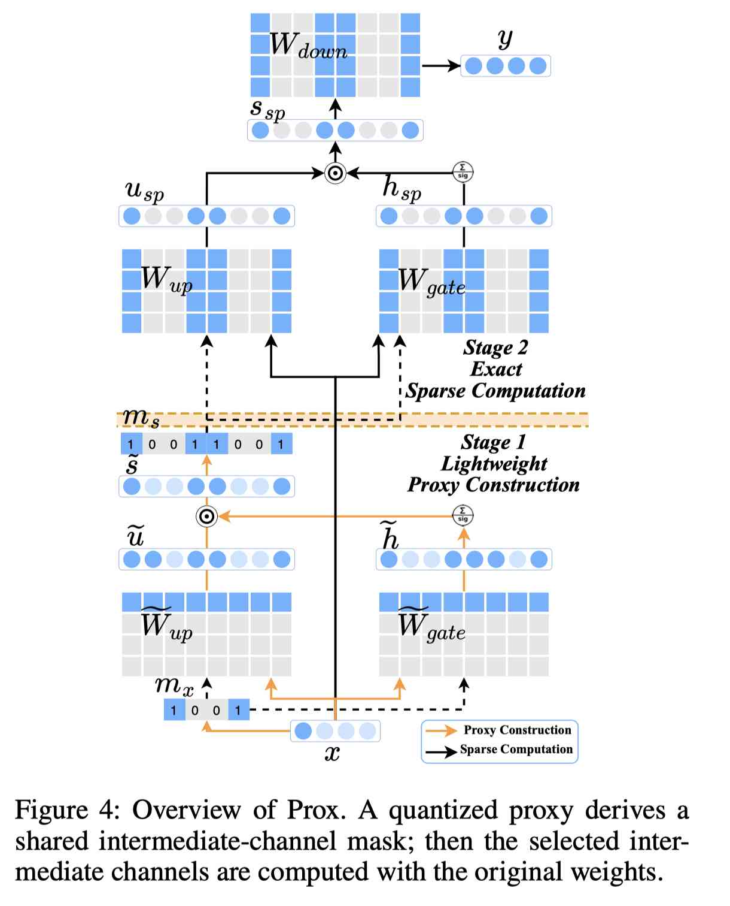

# Prox: Training-Free FFN Activation Sparsity via Approximate Intermediate-Channel Salience in LLMs

> Jinyi Liu, Wei Chen, Pengyu Chen, Xinyi Yuan, Minghe Bai, Guoquan Wu, Jun Wei

> 注：以下论文笔记由 AI Agent 自动生成，可能存在理解偏差或遗漏，请以原论文为准。

## Abstract

LLM 推理中 SwiGLU FFN 占据大量参数、访存和计算，activation sparsity 是重要的加速入口。已有 training-free 方法在高稀疏率下质量下降明显。Prox 发现 SwiGLU intermediate state 的幅值排序可以产生有效 channel mask，但直接计算该 state 需要 dense FFN。为此，Prox 先用输入稀疏和 INT4 proxy weights 低成本估计 mask，再只对选中 intermediate channels 做全精度精确计算，从而同时稀疏化 up、gate、down 三个 projection。

## 一句话总结

Prox 用量化 proxy 近似 intermediate-channel 的排序而非数值本身，把“计算完整 FFN 才能选 mask”的循环打破，实现无需训练的高质量 SwiGLU activation sparsity。

## 创新点

1. **Intermediate-state salience**：精确 SwiGLU state 的幅值排序是比输入启发式更可靠的 channel-selection signal；在 70% 稀疏率下，oracle 选择在多数模型上的相对困惑度增幅低于 3%。
2. **两阶段 proxy-mask 设计**：Stage 1 使用输入幅值稀疏和原权重的 INT4 proxy，近似 up/gate 两个分支并构造共享 mask；Stage 2 用原始全精度权重只计算选中 channels，避免 proxy 误差在三层 projection 中累积。
3. **联合预算分配**：用 $C_{Prox}=2\alpha(1-s_1)+3(1-s_2)$ 建模 proxy 阶段和精确阶段成本，在输入稀疏率 $s_1$ 与 intermediate 稀疏率 $s_2$ 之间分配目标 effective sparsity；默认以约 70% intermediate sparsity 作为质量锚点。
4. **硬件协同实现**：使用 fused split-N CUDA kernel、INT4 register unpack、FP32 partial reduction，以及 Stage 2 output-sparse/input-sparse kernel，减少三次 projection 的权重访问和 MAC。

## 带来什么提升

1. 在 Qwen3、Qwen3.5、Ministral、Mistral、Llama-3、Gemma-3 等 **10 个模型、6 个模型家族**上，Prox 在各稀疏率下整体优于 CATS、COUNTDOWN、TEAL 等 training-free baseline。
2. 在 **70% FFN sparsity** 下，Prox 最高取得 **1.99 倍端到端 decoding speedup**；在高稀疏率区间仍保持明显更好的下游任务精度-速度折中。
3. Prox 在 40%/50%/60% FFN sparsity 下保持接近 dense 的综合任务分数，例如 Qwen3-14B 分别为 **77.6/76.6/76.1**，而 70% 时仍为 **74.8**，优于对应 training-free 对照。
4. 方法与 weight quantization、sparse attention 正交，可叠加使用；但实际收益依赖单 batch decode 的 kernel、矩阵形状、GPU 架构和 proxy INT4 访存开销，理论稀疏率不等于同等比例的端到端加速。

## 备注

- Prox 主要针对 SwiGLU；论文另评估了 GeGLU-style Gemma-3，但对其他 FFN 结构的泛化仍需进一步验证。
- 当前公开正文未给出 Prox 代码仓库链接；元数据中的 `code.url` 保持为空。
