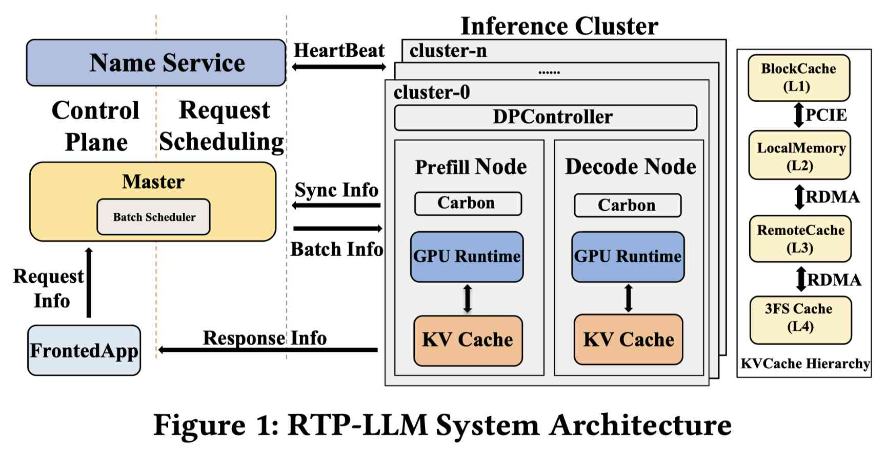

# RTP-LLM: High-Performance Alibaba LLM Inference Engine

> Boyu Tan, Jiarui Guo, Zongwei Lv, Haobo Sun, Tong Yang, et al.

> 注：以下论文笔记由 AI Agent 自动生成，可能存在理解偏差或遗漏，请以原论文为准。

## Abstract

Large Language Models (LLMs) have revolutionized AI applications, but deploying them at scale presents significant challenges. We present RTP-LLM, a high-performance inference engine for industrial-scale LLM deployment, successfully deployed across Alibaba Group serving over 100 million users. RTP-LLM addresses fundamental bottlenecks through integrated design. It optimizes model loading via file-order-driven I/O and parallel I/O-communication overlapping. The Prefill-Decode Disaggregation architecture decouples compute-intensive prefill from memory-bound decode phases, combined with hierarchical multi-tiered KV cache management enabling efficient cache reuse. In addition, RTP-LLM incorporates modular speculative decoding supporting multiple algorithms, adaptive KV cache quantization, and decoupled multimodal processing, with support for multi-level parallelism. Comprehensive evaluations across diverse model architectures (8B-235B parameters) have been conducted, where both controlled benchmarks and real production workloads are used. The results demonstrate RTP-LLM's superior performance against vLLM and SGLang: 4.7x-6.3x model loading speedup, 35-37% TTFT P95 latency reduction with 215% cache reuse improvement in production traffic scheduling, 1.12x-2.48x and 1.86x-2.52x throughput improvements in speculative decoding and multimodal inference, respectively, and 35-40% batch latency reduction with 1.9x-3.0x TTFT improvement in quantized inference.

## 一句话总结

RTP-LLM 是阿里巴巴自研的工业级 LLM 推理引擎，已在淘宝/天猫/菜鸟等业务服务 1 亿+ 用户，通过 Prefill-Decode 解耦、多级 KV cache 层次、模块化投机解码、自适应量化和多级并行等全栈优化，在真实生产流量上全面超越 vLLM 和 SGLang。

## 背景与问题

工业级 LLM 推理面临四大核心挑战：

1. **GPU 利用率低**：动态序列长度（短查询到 128K+ 上下文）导致静态 batching 策略无法适应，内存密集的自回归 attention 使计算单元空闲。
2. **KV cache 内存爆炸**：KV cache 随序列长度和 batch size 线性增长，成为 128K+ 上下文的主要内存瓶颈。
3. **架构异构性**：MoE 模型（600B+）需要高效专家路由和快速权重加载；多模态模型的 ViT 和 LLM 有完全不同的计算特性。
4. **运维脆弱性**：企业部署要求分钟级加载 600B+ 模型以支持快速迭代，现有系统缺乏生产级容错和滚动更新。

现有系统（vLLM、TensorRT-LLM、FlashAttention）各自优化孤立组件，忽视了生产级部署所需的系统性协同。

## 核心方法

RTP-LLM 是一个全栈推理引擎，核心架构包括：

### 1. 优化模型加载（Challenge IV）
- **File-order-driven I/O**：按文件布局顺序读取权重，最大化磁盘吞吐
- **Shared memory reuse**：跨进程共享已加载权重
- **Parallel I/O-communication overlapping**：权重加载与 GPU broadcast 重叠
- 效果：4.7x-6.3x 加速（vs vLLM/SGLang），支持分钟级 600B+ 模型部署

### 2. Prefill-Decode 解耦（Challenge I & II）
- 物理解耦 compute-intensive prefill 和 memory-bound decode 到独立集群
- 独立扩缩容：prefill 引擎最大化吞吐（大 batch），decode 引擎优化低延迟内存访问
- **Dynamic Traffic Scheduling**：基于队列状态、KV cache 占用、延迟目标动态调度
- 效果：35-37% TTFT P95 延迟降低，prefill 机器数减少 75%

### 3. 多级 KV Cache 管理（Challenge II）
四层层次结构：
- **L1 BlockCache**：GPU HBM（最快）
- **L2 LocalMemory**：本地 CPU 内存（PCIe）
- **L3 RemoteCache**：远端 CPU 内存（RDMA）
- **L4 3FS Cache**：分布式文件系统存储（持久化）

统一 hash-based prefix matching 实现跨请求 KV cache 复用。调度时并行查询 Local 和 Remote Cache Manager，综合匹配长度和预测延迟计算调度分数。

### 4. 模块化投机解码（Challenge I）
支持多种算法的统一框架：
- **Naive Speculative Sampling**：小 GPT 模型做 proposer
- **MTP (Multi-Token Prediction)**：DeepSeek-V3 风格，单次前向传播预测多 token
- **Eagle**：自回归头预测未来 hidden state
- **Prompt Lookup**：N-gram 匹配历史 prompt（代码编辑场景高效）

框架分为四个解耦组件：ProposeExecutor → ScoreExecutor → SpeculativeSampler → SpeculativeUpdater。
效果：1.12x-2.48x 吞吐提升，Aone Copilot 实现 1000 tokens/s 推理。

### 5. 自适应量化（Challenge III）
- **Weight-Only Quantization**：GPTQ、AWQ、HQQ，权重 INT4/INT8，激活 FP16/BF16
- **KV Cache Quantization**：on-the-fly INT8/INT4/FP8，per-tensor/per-block dynamic scaling
- FP8 集成：利用硬件加速器支持
- 效果：35-40% batch latency 降低，1.9x-3.0x TTFT 提升

### 6. 多级并行（Challenge III）
- **Tensor Parallelism (TP)**：单节点内跨 GPU 分割权重矩阵
- **Pipeline Parallelism (PP)**：跨 GPU 分配连续层
- **Data Parallelism (DP)**：集群级模型复制，配合动态 batching
- **Expert Parallelism (EP)**：MoE 模型的稀疏专家分布

### 7. 解耦多模态处理
- ViT 和 LLM 独立部署，使用独立 CUDA stream
- 避免 ViT/LLM 竞争，高并发下计算重叠
- 效果：1.86x-2.52x 吞吐提升，2.12x-2.36x TTFT 降低

## 实验设置

- **硬件**：Linux 5.10, 64 CPU cores, 600GB memory, 8 GPUs per server
- **模型**：8B-235B（Qwen3-8B, Qwen3-32B, 235B MoE 等）
- **Baseline**：vLLM, SGLang
- **评估**：控制基准 + 阿里巴巴真实生产流量（淘宝、天猫、菜鸟）
- **工作负载**：input 200K tokens, output 16K tokens

## 主要结果

| 指标 | RTP-LLM 表现 |
|------|-------------|
| 模型加载 | 4.7x-6.3x 加速 vs vLLM/SGLang |
| TTFT P95（生产流量） | 降低 35-37%，cache reuse +215% |
| Prefill 机器数 | 减少 75% |
| 投机解码吞吐 | 1.12x-2.48x 提升 |
| 多模态吞吐 | 1.86x-2.52x 提升 |
| 量化 batch latency | 降低 35-40%，TTFT 1.9x-3.0x 提升 |
| 生产 MTP 效率 | ~1.9 tokens/step，KV cache 利用率 >90% |

## 优点与局限

**优点：**
- **生产验证**：1 亿+ 用户的真实部署，不是实验室原型
- **全栈集成**：加载、调度、PD 解耦、KV cache、投机解码、量化、多模态、并行一站式覆盖
- **开源**
- **架构异构支持**：dense、MoE（600B+）、多模态
- **企业级特性**：容错、滚动更新、per-request 性能隔离

**局限：**
- 论文偏工程描述，理论创新深度有限
- 未开源代码 URL（仅提到 open-source availability）
- 评估主要在阿里巴巴内部硬件上，可复现性有限
- 未来计划探索 DSA（DeepSeek Sparse Attention）机制

## 与 EfficientPaper 主题的关系

RTP-LLM 属于 **deployment** 领域，是一个涵盖 serving、scheduling、KV cache management、quantization、speculative decoding 等多个 EfficientPaper 主题的综合系统。它与 EfficientPaper 中的 SGLang、vLLM、PagedAttention、Splitwise、Mooncake 等 serving 系统直接对比，也与 KV cache 管理（PredictKV、Tutti）、量化（GPTQ、AWQ）、投机解码（Eagle）等多个方向交叉。

该论文的核心价值在于展示了**生产级推理系统的全栈协同设计**——单点优化（如更快的 attention kernel 或更好的 KV cache 压缩）在生产环境中可能被其他瓶颈抵消，只有系统性集成才能真正兑现性能。

## 可复现/实现要点

1. **模型加载优化**：file-order I/O + shared memory + I/O-communication overlap
2. **PD 解耦**：物理分离 prefill/decode 集群，动态流量调度
3. **KV cache 四层**：GPU HBM → 本地 CPU → 远端 RDMA → 3FS 分布式存储
4. **Cache matching**：统一 hash-based prefix matching，并行查询 local/remote
5. **投机解码**：模块化 C++ 框架，支持 MTP/Eagle/Prompt Lookup/Naive
6. **量化**：GPTQ/AWQ weight-only + on-the-fly KV cache INT8/INT4/FP8
7. **并行**：TP + PP + DP + EP 混合，235B MoE 模型实测
8. **多模态**：ViT/LLM 解耦部署，独立 CUDA stream

## 个人备注

- 这是一个典型的"系统集成"论文，每个单独组件（PD 解耦、KV cache 层次、投机解码、量化）都有独立论文，但 RTP-LLM 的价值在于它们的协同设计和生产验证
- KV cache 四级层次（HBM → CPU → RDMA → 3FS）与 EfficientPaper 中 PredictKV 的六级层次思路一致，说明分层 KV cache 已成为工业共识
- Prefill-Decode 解耦与 Splitwise、Mooncake 的思路一致，但 RTP-LLM 加入了 chat ID 感知的 cache affinity 调度
- MTP 投机解码在 235B MoE 上实现 ~1.9 tokens/step，KV cache 利用率 >90%，是生产验证的重要数据点
- 未来方向：DSA（DeepSeek Sparse Attention）机制的集成
