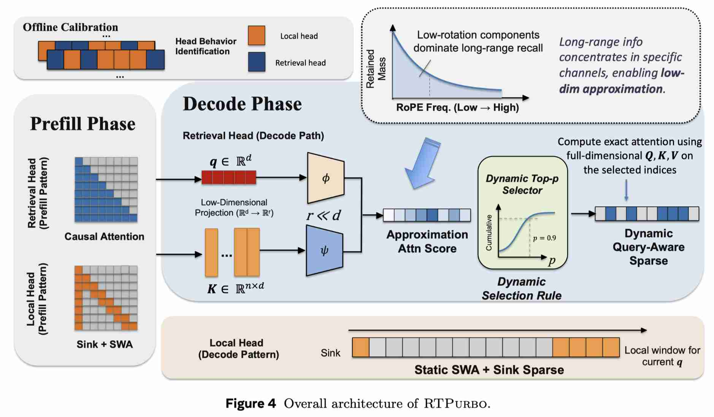

# Full Attention Strikes Back: Transferring Full Attention into Sparse within Hundred Training Steps

> Yanke Zhou, Yiduo Li, Hanlin Tang, Maohua Li, Kan Liu, Lan Tao, Lin Qu, Yuan Yao, Xiaoxing Ma
> Nanjing University, Alibaba Group
> arXiv: 2605.16928, 2026

> 注：以下论文笔记由 AI Agent 自动生成，可能存在理解偏差或遗漏，请以原论文为准。

## Abstract

Long-context inference in large language models is bottlenecked by the quadratic cost of full attention. Existing efficient alternatives often rely either on native sparse training or on heuristic token eviction, creating an undesirable trade-off among efficiency, training cost, and accuracy. In this work, we show that full-attention LLMs are already intrinsically sparse and can be transformed into highly sparse models with only minimal adaptation. Our approach is built on three observations: (1) only a small subset of attention heads truly requires full long-context processing; (2) long-range retrieval is governed primarily by a low-dimensional subspace, allowing relevant tokens to be retrieved efficiently with a 16-dimensional indexer; and (3) the useful token budget is strongly query-dependent, making dynamic top-p selection more suitable than fixed top-k sparsification. Based on these insights, we propose RTPurbo, which retains the full KV cache only for retrieval heads and introduces a lightweight token indexer for sparse attention. By exploiting the model's intrinsic sparsity, RTPurbo achieves sparsification with only a few hundred training steps. Experiments on long-context benchmarks and reasoning tasks show that RTPurbo preserves near-lossless accuracy while delivering substantial efficiency gains, including up to a 9.36× prefill speedup at 1M context and about a 2.01× decode speedup. These results suggest that strong sparse inference can be obtained from standard full-attention training without expensive native sparse pretraining.

## 一句话总结

RTPurbo 利用 Full Attention 模型内生的稀疏性，通过 Head 选择 + 低维索引 + 动态 top-p 三阶段技术，仅需 600 步微调即可将 Full Attention 转化为高效稀疏推理，实现最高 9.36× prefill 加速且精度无损。

## 背景与问题

随着 Agent 应用带来的长序列需求，传统 GPT 架构的 Attention 部分由于 O(N²) 计算复杂度，正逐渐被视为性能瓶颈而遭到替换。目前业界主流方案分为两种：

- **Linear Attention**：以 Qwen-Next 和 Kimi-K2 为代表，通过改进后的 Linear Attention 实现信息压缩，存储代价 O(1)，计算代价 O(N)
- **Sparse Attention**：以 DeepSeek-V4 为代表，通过稀疏化优化计算开销，实践中达到 90%+ 稀疏度

然而，本文指出 **Full Attention 模型自身就蕴含着巨大的效率空间**，无需替换架构即可实现高效稀疏推理。此前 RTPurbo（V1）已经证明，使用 Full Attention + SWA 可以将 85% 的注意力头变成 SWA，实现 5× 压缩。RTPurbo 在此基础上进一步压缩剩余 15% Full Attention，实现 16~32 倍计算压缩。

## 核心方法

### 三个核心发现

#### 发现一：85% 的注意力头天然适配滑动窗口

在 Full Attention 模型中，不同 Head 承担不同职责：
- **召回头（Retrieval Head，约 15%）**：注意力分布非常稀疏，只关注少数关键 token，负责长距离信息召回
- **流式头（Streaming Head，约 85%）**：注意力分布相对均匀，更多关注局部上下文

这种分工模式在不同输入、不同序列长度下高度稳定，是模型在预训练中自发习得的内在结构。直接推论：85% 的 Full Attention 计算可以安全地替换为 SWA，真正需要解决的只有剩余 15% 召回头的高效计算问题。

#### 发现二：长程检索由低维子空间主导

召回头的核心任务是在整个序列中做语义匹配。通过深入分析 RoPE 位置编码的频率结构，团队发现了召回头的 RoPE 分量存在显著的维度冗余：

- **低频分量（θ_i 较小）**：随位置偏移缓慢变化，承载 token 间的语义相关性信号
- **高频分量（θ_i 较大）**：随位置偏移快速振荡，引入距离敏感性干扰

对于长距离检索而言，高频分量导致注意力得分随位置距离剧烈波动，削弱了语义信号的稳定传递。因此，召回头本质上只会利用 RoPE 低频分量。由此设计一个低维 projector，通过低秩映射将原始特征维度从 D 压缩至 r=16（其中 r ≪ D），系统性地保留低频语义分量、过滤高频位置噪声。实验验证，仅 16 维即可达到 90%+ 的 token 召回率。

#### 发现三：序列维度的冗余——基于高质量特征的自适应聚类

低秩投影带来的增益不止于计算量的直接降低——它从根本上改善了 Key 向量在语义空间中的分布质量。高频噪声被过滤后，语义相似的 token 在低秩空间中天然聚拢，语义无关的 token 彼此远离。基于这一特性，引入自适应聚类，构建两级漏斗式计算流程：

1. **粗粒度匹配**：将 N 个 token 聚类为 K 个语义簇（如 K=128），Query 先与 K 个簇中心做轻量级匹配，复杂度仅 O(N·K)
2. **细粒度计算**：仅在命中的相关簇内执行完整 Attention 计算

两阶段串联，整体复杂度从 O(N²) 跃迁至 O(N·K)。两步压缩之间存在显著的协同增益：特征维度压缩提纯后的向量让聚类中心更精准，使得在极端压缩比下依然保持高召回率。

#### 发现四：动态 top-p 显著优于固定 top-k

不同的 Attention Head、不同的序列长度、不同的 Query，所需的上下文 token 数量差异巨大（可达三个数量级的差异），因此不存在一个固定的 k 值能同时满足所有场景。

RTPurbo 采用动态 top-p 策略：对每个 query 保留累积注意力得分达到 p（如 0.9）的 token 集合。同时设计了无排序的 top-p 解码核——通过 256-bin 直方图替代排序操作，将评分与筛选融合为单次 kernel launch，内存开销压缩至 O(1)。

### 整体架构

最终的推理架构：
- **流式头（85%）** → SWA（窗口 8192）+ Sink tokens（4 个）
- **召回头（15%）** → 低秩投影（r=16）+ 聚类索引 + 动态 top-p

### 两阶段微调训练

- **阶段 1——投影对齐**：冻结模型主体，仅训练各召回头的低秩投影矩阵，最小化投影注意力分布与原始分布之间的 KL 散度
- **阶段 2——端到端自蒸馏**：启用稀疏模式，稀疏模型学习原始稠密模型的 next-token 预测分布（仅对齐 top-10 logits）

仅需约 600 步，约 1M label tokens。在数十万亿 token 的预训练语境下，1M token 几乎可以忽略。

### 硬件感知的解码内核

- **Sort-free top-p via histogram**：每个 CTA 计算低维注意力分数并原子性沉积到 256-bin 直方图中，扫描直方图找到 top-p 阈值并写入 block-level binary mask，融合评分和选择为单次 kernel launch，O(1) 内存开销
- **Bandwidth-optimized sparse decoding**：单 warp CTA 无共享内存，所有状态保持在寄存器中，允许 SM 最大化并发 CTA 和未完成内存请求，2-token unrolling 和向量化 half2 指令实现加载与计算重叠

## 技术细节

- **Head 选择方法**：离线校准，构造长文档并在首尾插入相同 "needle" span，测量后一 needle 到前一 needle 的注意力质量作为检索分数
- **低维投影**：对 pre-RoPE 表征进行低秩映射（W^Q_h, W^K_h ∈ R^{r×d_h}, r=16），保留低频语义分量，过滤高频位置噪声
- **动态 top-p**：累积注意力得分达 0.9 的 token 集合，相比固定 top-k 更适应 query-dependent 的注意力分布
- **聚类索引**：先在低维空间做 K=128 的语义聚类，再在命中簇内做细粒度注意力计算
- **训练数据**：FineWeb + Dolma 3 Longmimo Mix，采样 32K~80K token 长度文档
- **评估框架**：lm-eval，硬件 NVIDIA H20 GPU，Python 3.14, CUDA 12.8, PyTorch 2.8

## 实验设置

### 模型
- Qwen3-Coder-30B-A3B（长上下文评估）
- Qwen3-30B-A3B-Think（推理评估）

### 评估基准
- **长上下文**：LongBench（16 个子任务），RULER（32K/64K）
- **推理**：AIME24, AIME25, MMLU-PRO
- **超长上下文**：128K~512K multi-hop 任务

### 基线
- RazorAttn（RazorAttention, 2024）
- MInference（2024）
- FlexPrefill（2025）
- Quest（2024）
- SnapKV（2024）

### RTPurbo 配置
| 配置项 | 值 |
|--------|------|
| Retrieval head ratio | 15% |
| Sliding window size | 8192 |
| Sink tokens | 4 |
| Low-dim size | 16 |
| Top-p | 0.9 |
| Kernel block | 64 |

## 主要结果

### 准确度

**LongBench**（平均分）：
- Full Attn: 53.80
- **RTPurbo (top-p): 54.24**（最高）
- RTPurbo (top-k): 53.30
- RazorAttn: 52.98
- MInference: 48.39
- FlexPrefill: 49.42
- Quest: 50.69
- SnapKV: 50.74

**RULER 32K**（平均分）：
- Full Attn: 89.65
- **RTPurbo (top-p): 90.06**（最高，超过 Full Attn）
- RTPurbo (top-k): 84.36
- RazorAttn: 88.69

**RULER 64K**（平均分）：
- Full Attn: 86.23
- **RTPurbo (top-p): 85.49**（接近 Full Attn，远超其他）
- MInference: 65.61
- FlexPrefill: 77.77

**推理任务**（AIME24/25）：
- Full Attn: 86.67/86.67
- **RTPurbo (top-p): 86.67/86.67**（完全无损）
- RTPurbo (top-k): 80.00/80.00

### 效率

**Prefill 加速**（vs FlashAttention-2）：
- 32K: 2.83×
- 64K: 4.25×
- 128K: 5.92×
- 256K: 7.47×
- 512K: 8.62×
- **1M: 9.36×**

**Decode 加速**（vs FlashAttention-2）：
- **1M: 2.01×**

**动态稀疏度**（top-p=0.9）：
- 32K niah-S: 78.7% sparsity, 468.8 active tokens, >0.95 attention mass
- 32K multi-K: 77.8% sparsity, 2462.1 active tokens, >0.96 attention mass
- 64K niah-S: 89.2% sparsity, 1126.8 active tokens, >0.93 attention mass
- 512K: 超过 97.1% sparsity

### 超长上下文（128K~512K）

在 128K~512K multi-hop 任务上，MInference 和 FlexPrefill 在极端长度下出现灾难性衰减（如 512K multi-K: MInference 4.2, FlexPrefill 89.4 vs RTPurbo 75.0），RTPurbo 保持稳健高准确度且高稀疏度。

## 优点与局限

### 优点
1. **无需架构替换**：从标准 Full Attention 模型出发，仅需 600 步微调，避免昂贵的 native sparse pretraining
2. **近无损准确度**：在 LongBench、RULER、推理任务上均达到或超过 Full Attention 水平
3. **高效硬件内核**：自定义 CUDA kernel 实现 sort-free top-p，O(1) 内存开销
4. **可解释性强**：Head 选择和稀疏策略基于明确的语义分析
5. **极低训练成本**：仅 600 步，约 1M label tokens

### 局限
1. **依赖离线校准**：Head 选择需要离线校准步骤，不同模型可能需要重新校准
2. **仅验证 MoE 模型**：实验仅在 Qwen3-Coder-30B-A3B 和 Qwen3-30B-A3B-Think 上验证，未覆盖 dense 模型
3. **Decode 加速相对有限**：相比 Prefill 的 9.36× 加速，Decode 加速仅 2.01×，可能受内存带宽限制
4. **top-p 阈值固定**：p=0.9 是固定值，可能在不同场景下需要调优

## 与 EfficientPaper 主题的关系

本文属于 **Attention 稀疏化**方向（attention_sparsity），与 EfficientPaper 的核心主题高度相关：

- 与 **方向 2（Attention 稀疏化）** 直接对应：RTPurbo 从"后验启发式选择"走向"训练时内生稀疏"，是 SparseForcing 和 CompactAttention 的重要补充
- 与 **方向 1（KV Cache 管理）** 有交叉：RTPurbo 的 15% 召回头仍需 Full KV cache，但 85% 流式头的 SWA 设计可与 KV 管理策略协同
- 与 **方向 6（硬件感知算法设计）** 相关：自定义 CUDA kernel 和 sort-free top-p 解码内核体现了硬件感知的算法设计思路
- 与 **方向 8（投机解码）** 有潜在联系：稀疏注意力可以与投机解码结合，进一步加速推理

## 可复现/实现要点

1. **Head 选择**：需要离线校准，构造长文档并插入 needle span，测量检索分数
2. **低维投影**：r=16 的 pre-RoPE 投影矩阵，通过 KL 散度最小化训练
3. **训练流程**：两阶段——投影对齐（冻结主干）+ 端到端自蒸馏（top-10 logits 对齐）
4. **硬件内核**：自定义 CUDA kernel，需要实现 256-bin histogram、block-level binary mask、single-warp CTA
5. **评估**：使用 lm-eval 框架，H20 GPU（或等效），PyTorch 2.8 + CUDA 12.8

## 个人备注

- RTPurbo 的核心洞察是"Full Attention 的稀疏性是内生的，微调只是完成从隐式到显式的转化"，这个观点值得深入思考
- 低维投影 + 自适应聚类 + 动态 top-p 三阶段协同效应是本文的最大技术贡献
- 与 DeepSeek-V4 的 Sparse Attention 路线相比，RTPurbo 的优势在于无需从头训练，仅需微调
- 后续可关注：(1) 是否适用于 dense 模型？(2) 与 Linear Attention 架构的结合？(3) 在 MoE 专家并行中的进一步优化？
- RTPurbo 的代码已开源（https://github.com/alibaba/rtp-llm），可复现
