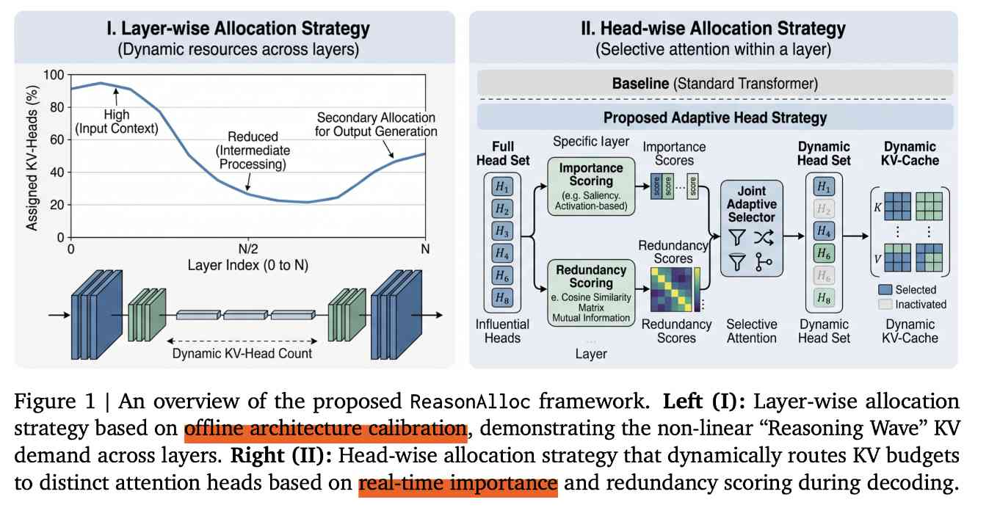

# ReasonAlloc: Hierarchical Decoding-Time KV Cache Budget Allocation for Reasoning Models

> Wenhao Liu, Hao Shi, Yunhe Li, Weizhi Fei, Xiangyuan Wang, Mengzhe Ruan, Hanxu Hou, Peisong Wang, Linqi Song, Shuang Qiu

**在decoding中动态的分配不同head的kv cache稀疏度，对比offline calibration方式**

> 注：以下论文笔记由 AI Agent 自动生成，可能存在理解偏差或遗漏，请以原论文为准。

## Abstract

Long chain-of-thought (CoT) trajectories in large language model (LLM) reasoning cause severe inference bottlenecks due to rapid key-value (KV) cache growth. Current decoding-time compression methods mitigate this issue via token eviction, but typically assume a uniform budget distribution across all layers and heads. In contrast, existing non-uniform budget allocation methods are predominantly designed for the static prompt prefill phase, and they do not capture the stepwise context demands of autoregressive reasoning. To bridge this gap, we propose ReasonAlloc, a training-free framework that recasts decoding-time KV compression as a hierarchical budget allocation problem. ReasonAlloc operates at two complementary levels: an offline layer-wise preallocation strategy captures an architecture-driven demand pattern which we call “Reasoning Wave”, while an online head-wise strategy reallocates resources during decoding to information-rich heads based on real-time utility. Evaluations on mathematical reasoning benchmarks (MATH-500, AIME 2024) using DeepSeek-R1-Distill-Llama-8B, DeepSeek-R1-Distill-Qwen-14B, and AceReason-14B show that ReasonAlloc outperforms uniform-budget R-KV, SnapKV, and Pyramid-RKV, with the largest gains at small budgets (128-512 tokens). ReasonAlloc is plug-and-play with existing token-eviction policies and introduces negligible inference-time overhead.

## 一句话总结

ReasonAlloc 把推理模型解码期 KV 压缩从“所有层/头平均分预算后再删 token”改成“先按模型结构给层分预算，再按实时 utility 给 head 动态分预算”，让小 KV budget 下的长 CoT 推理保留更关键的历史信息。

## 创新点

1. 提出 **Reasoning Wave** 观察：推理模型的层级 KV 需求不是 PyramidKV 假设的单调递减，而是浅层高、中层下降并震荡、深层回升；且同一模型内跨任务较稳定，跨架构差异更大。
2. 设计两级预算分配：离线用少量 calibration prompts 估计每层达到 attention-mass 阈值 $\rho$ 所需 token 数，再经 power smoothing、上下界保护和归一化得到稳定 layer budget。
3. 在线每隔 $\Delta$ 个 decoding step，根据底层 token scorer（论文实验用 R-KV 的 importance + redundancy score）统计每个 head 的高 utility token 需求，并用同一 robustification operator 动态分配 head budget，避免关键 head 被均匀预算饿死。

## 带来什么提升

1. 小预算准确率提升明显：R1-Llama-8B 在 MATH-500、512-token budget 下达到 82.50%，高于 SnapKV 63.62% 和 uniform R-KV 76.48%；AIME 2024、256-token budget 下达到 20.00%，高于 SnapKV 1.25% 和 uniform R-KV 10.42%。
2. 相比静态非均匀启发式更适合解码期：Pyramid-RKV 在部分中等预算可竞争，但整体弱于 ReasonAlloc，例如 AIME 2024、1024 budget 为 39.17% vs. 49.17%，说明 prefill-centric 单调 budget schedule 不能直接迁移到长 CoT decoding。
3. 系统开销很小：head routing 每 128 step 刷新一次且向量化执行；在 8K/1024 setting 下 ReasonAlloc 218.78 tok/s，接近 uniform R-KV 217.35 tok/s；16K generation 下相对 FullKV 最高 5.52× speedup，主要来自 bounded KV cache 支持更大 batch。

## 备注

- ReasonAlloc 不是新的 token eviction scorer，而是包在 SnapKV/R-KV 等 scorer 前的一层 budget router；真正“删谁”仍由底层 eviction policy 决定。
- 适用边界是 GPU HBM 内 KV budget 紧张的长 CoT 推理；若问题是完整 KV 必须跨 CPU/NVMe/远端存储保留，则更接近 offload/verify 类系统问题。
- 论文未给出官方代码仓库；元数据中的 code URL 保持为空。