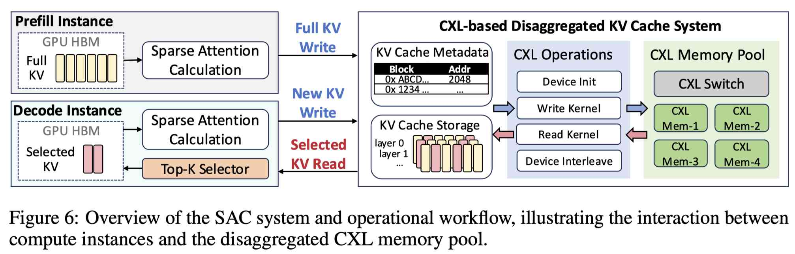

# SAC: Disaggregated KV Cache System for Sparse Attention LLMs with CXL

> Ruiyang Ma, Teng Ma, Junru Li, Hantian Zha, Xuchun Shang, Qingda Hu, Zheng Liu, Xinjun Yang, Tao Ma, Guojie Luo

> 注：以下论文笔记由 AI Agent 自动生成，可能存在理解偏差或遗漏，请以原论文为准。

## Abstract

The scaling of LLMs toward long-context inference has shifted the primary serving system bottleneck from computation to memory capacity. Traditional solutions for dense attention models rely on RDMA-based disaggregated memory pools, which perform coarse-grained fetching of the entire prefix KV cache from remote storage to local memory before decoding. However, this approach is fundamentally inefficient for emerging sparse attention models. While only a small fraction of KV entries are active during decoding, these systems still fetch the full KV cache locally, leading to severe transmission bottlenecks and local memory wastage. To address this, we propose SAC, the first efficient disaggregated KV cache system optimized for sparse attention models. By leveraging the low-latency, cache-line granularity load/store semantics of Compute Express Link (CXL), SAC fetches only the required top-k KV entries on demand during inference. Evaluations on DeepSeek-V3.2 using SGLang show that SAC achieves 2.1× higher throughput, 9.7× lower TTFT, and 1.8× lower TBT compared to RDMA-based baselines, establishing CXL-based disaggregation as the superior infrastructure for emerging sparse attention models.

## 一句话总结

SAC 针对 DeepSeek-V3.2 等采用原生稀疏注意力（DSA）的模型，利用 CXL 的 1.04-1.64× DRAM 延迟和 cache-line 粒度 load/store 语义，替代 RDMA 的全量 KV 预取，改为每层按需只取 top-k KV 条目，同时消除传输瓶颈和本地内存浪费，在 128K 上下文下实现 2.1× 吞吐提升、9.7× TTFT 降低，接近本地 DRAM 性能上限的 91%。

## 创新点

1. **全解析：为什么 RDMA 对稀疏注意力模型失效**：首次系统分析了 RDMA 全量预取策略对 sparse attention 的两大浪费——(P1) 128K 上下文中仅 21% KV 被实际访问，但完整 prefix（9.2GB/request）必须驻留本地，导致 TB 级本地内存成本爆炸；(P2) 高并发下 RDMA 的数十 GB 全量传输打满带宽，TTFT 降到数十秒级别。
2. **CXL 替代 RDMA 的按需架构设计**：CXL 的 cache-line 粒度 load/store 语义天然适配每层动态确定的 top-k 索引，无需 RDMA 的 memory pinning、queue pair 同步和上下文切换；SAC 把全量 KV cache 存在 CXL 全局地址空间，每层解码时用原生 load/store 取 top-k（K=2048）到 GPU，再由 HiSparse 硬件执行注意力，彻底消除了全量传输。系统架构由 Prefill Instance、Decode Instance（基于 SGLang 的 HiSparse）和 CXL 解耦 KV cache 系统三层组成。
3. **CXL 设备交错（interleaving）带宽优化与 layer-first 内存布局**：通过 XConn XC50256 CXL 交换机（256 PCIe 5.0 lanes，512GB/s）轮询分配多 GPU rank 到不同 CXL 设备，避免链路竞争，吞吐再提升 9.2%；CXL 的近 DRAM 延迟使得 KV cache 可采用与本地 GPU 完全相同的 layer-first 布局，无需 RDMA 系统复杂的局部性感知调度。

## 带来什么提升

1. **吞吐 2.1×、TTFT 9.7×、TBT 1.8×**：在 8×H20 GPU + 2TB CXL 内存池 + DeepSeek-V3.2（AWQ 4-bit）上，SAC 相比 RDMA 解耦池，Round-2（Cache Hit）场景吞吐提升 2.1×、首 token 延迟降低 9.7×、token 间隔降低 1.8×。
2. **仅 9% 吞吐损失（vs 本地 DRAM 上限）**：CXL 访问延迟仅为本地 DRAM 的 1.04-1.64×，SAC 在所有测量中均达本地DRAM性能的91%以上，远优于 RDMA（RDMA 延迟 4-19.7× DRAM）。
3. **随上下文长度扩展的吞吐优势持续增长**：在 32K 上下文下 SAC 已有显著优势；到 128K 上下文（KV cache 达数十 GB）时，SAC vs RDMA 的吞吐优势最大，验证了 CXL 在 KV cache 规模扩大时的 scaling 优势。

## 备注

- 这是 Alibaba Cloud 内部系统（与 MoonCake/LMCache 同属 KV 解耦方向），采用 CXL 2.0/3.0 硬件，属于较新型基础设施研究。
- Baseline 对比 RDMA 全量预取；但 SAC 的核心问题是 CXL 访问语义对稀疏 KV 的适配性，与 TRACT/Beluga 等 CXL dense 专注思路不同。
- 对 KV 解耦感兴趣者可对比阅读 KVServe（服务感知 KV 压缩，优化传输带宽）、SplitZip（KV 压缩优化传输）和 DeepSeek 的稀疏注意力工作。
