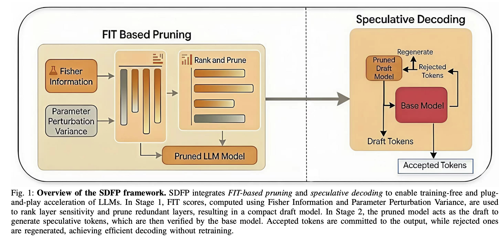

# SDFP: Speculative Decoding with FIT-Pruned Models for Training-Free and Plug-and-Play LLM Acceleration

> Hanyu Wei, Zunhai Su, Peng Lu, Chao Li, Spandan Tiwari, Ashish Sirasao, Yuhan Dong

## Abstract

Large language models (LLMs) underpin interactive multimedia applications such as captioning, retrieval, recommendation, and creative content generation, yet their autoregressive decoding incurs substantial latency. Speculative decoding reduces latency using a lightweight draft model, but deployment is often limited by the cost and complexity of acquiring, tuning, and maintaining an effective draft model. Recent approaches usually require auxiliary training or specialization, and even training-free methods incur costly search or optimization. We propose SDFP, a fully training-free and plug-and-play framework that builds the draft model via Fisher Information Trace (FIT)-based layer pruning of a given LLM. Using layer sensitivity as a proxy for output perturbation, SDFP removes low-impact layers to obtain a compact draft while preserving compatibility with the original model for standard speculative verification. SDFP needs no additional training, hyperparameter tuning, or separately maintained drafts, enabling rapid, deployment-friendly draft construction. Across benchmarks, SDFP delivers 1.32x-1.5x decoding speedup without altering the target model's output distribution, supporting low-latency multimedia applications.
