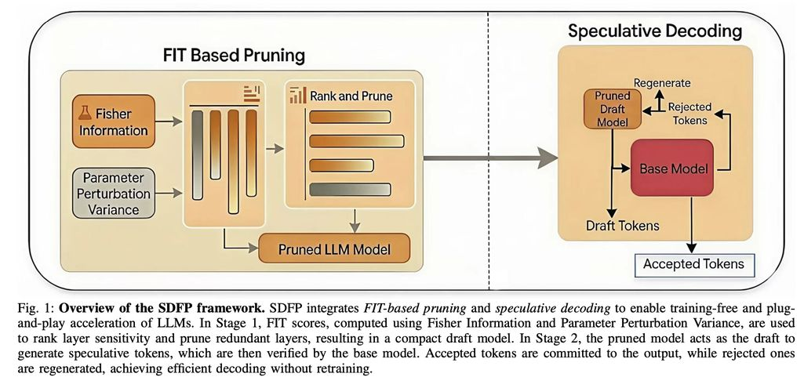

# SDFP: Speculative Decoding with FIT-Pruned Models for Training-Free and Plug-and-Play LLM Acceleration

> Hanyu Wei, Zunhai Su, Peng Lu, Chao Li, Spandan Tiwari, Ashish Sirasao, Yuhan Dong

> 注：以下论文笔记由 AI Agent 自动生成，可能存在理解偏差或遗漏，请以原论文为准。

## Abstract

Large language models (LLMs) underpin interactive multimedia applications such as captioning, retrieval, recommendation, and creative content generation, yet their autoregressive decoding incurs substantial latency. Speculative decoding reduces latency using a lightweight draft model, but deployment is often limited by the cost and complexity of acquiring, tuning, and maintaining an effective draft model. Recent approaches usually require auxiliary training or specialization, and even training-free methods incur costly search or optimization. We propose SDFP, a fully training-free and plug-and-play framework that builds the draft model via Fisher Information Trace (FIT)-based layer pruning of a given LLM. Using layer sensitivity as a proxy for output perturbation, SDFP removes low-impact layers to obtain a compact draft while preserving compatibility with the original model for standard speculative verification. SDFP needs no additional training, hyperparameter tuning, or separately maintained drafts, enabling rapid, deployment-friendly draft construction. Across benchmarks, SDFP delivers 1.32x-1.5x decoding speedup without altering the target model's output distribution, supporting low-latency multimedia applications.

## 一句话总结

SDFP 是一个免训练的即插即用推测解码框架，通过 Fisher 信息迹（FIT）剪枝构建轻量级草稿模型，实现 1.32×-1.5× 解码加速，解决了推测解码中草稿模型获取和维护成本高的问题。

## 背景与问题

- **推测解码（Speculative Decoding）**：
  - 使用轻量级草稿模型预测多个 token，然后由目标模型验证
  - 保留目标模型的输出分布（无损）
  - 但草稿模型的获取和维护成本高
- **现有方法的局限**：
  - **需要训练**：需要辅助训练或微调
  - **需要优化**：需要超参数调优或手动优化
  - **需要维护**：需要单独维护草稿模型
  - **成本高**：获取和维护草稿模型的成本和复杂性
- **核心问题**：如何在不训练、不优化、不维护的情况下，构建高效的推测解码草稿模型？

## 核心方法

### 1. Fisher 信息迹（FIT）敏感性建模

**核心思想**：使用 Fisher 信息迹（FIT）评估层敏感性，指导剪枝。

**FIT 信息论基础**：
- **Fisher 信息矩阵（FIM）**：衡量小参数扰动如何改变模型输出分布
- **KL 散度近似**：DKL(pθ ∥ pθ+δθ) = 1/2 δθ⊤ I(θ) δθ
- **层敏感性**：高 Fisher 曲率的参数对性能更关键

**FIT 指标**：
- **层敏感性**：Ω = Σ_{l=1}^L Tr(I(θ_l)) E[δθ_l²]
- **经验 Fisher 近似**：高效计算，无需二阶导数

**剪枝策略**：
- 计算层的 FIT 分数
- 按升序排序，选择低 FIT 分数的层进行剪枝
- 保留高 FIT 分数的层

### 2. SDFP 框架

**两个阶段**：

**阶段 A：FIT 基层剪枝**
- 输入：预训练 LLM、校准数据集、剪枝比例 r、推测深度 k、最大长度 Lmax
- 计算损失和梯度
- 计算层的 FIT 分数
- 按升序排序，选择低 FIT 分数的层
- 构建草稿模型（移除低敏感性层）

**阶段 B：推测解码**
- 使用剪枝后的草稿模型生成推测 token
- 由目标模型验证
- 接受的 token 提交到输出
- 拒绝的 token 重新生成

**关键特性**：
- **免训练**：无需额外训练或微调
- **即插即用**：无需超参数调优或手动优化
- **快速部署**：直接应用一次性的 FIT 剪枝和推测解码
- **无损**：保留目标模型的输出分布

## 主要结果

### 性能提升

- **解码加速**：1.32×-1.5×（在基准测试中）
- **离线开销**：可忽略（无需额外训练或优化）
- **输出分布**：不改变目标模型的输出分布（无损）

### 关键发现

1. **FIT 有效**：FIT 能准确评估层敏感性，指导剪枝
2. **免训练有效**：SDFP 无需训练，直接应用推测解码
3. **即插即用有效**：无需超参数调优或手动优化
4. **鲁棒性**：在不同模型和评估领域上保持高性能
5. **通用性**：适用于交互式和多媒体系统

## 优点与局限

### 优点

1. **免训练**：无需额外训练或微调
2. **即插即用**：无需超参数调优或手动优化
3. **快速部署**：直接应用一次性的 FIT 剪枝和推测解码
4. **无损**：保留目标模型的输出分布
5. **高效**：1.32×-1.5× 解码加速，可忽略的离线开销
6. **通用**：适用于交互式和多媒体系统

### 局限

1. **剪枝依赖**：性能依赖于 FIT 剪枝的准确性
2. **评估范围**：主要在 LLaMA-2-7B/13B 上评估，其他模型需进一步测试
3. **推测深度**：推测深度 k 是超参数，需要调优
4. **无代码开源**：代码 URL 为空，可能尚未开源

## 与 EfficientPaper 主题的关系

SDFP 属于 **Sparse Pruning**（`sparse_pruning`）、**Structured Sparsity**（`structured_sparsity`）和 **Speculative Decoding**（`speculative_decoding`）领域，核心贡献包括：

- **FIT 基层剪枝**：使用 Fisher 信息迹评估层敏感性
- **推测解码**：使用剪枝后的草稿模型进行推测解码

与 EfficientPaper 中已有论文的关系：
- **SWIFT**（2025）：层跳过推测解码
- **SpecInfer**（2024）：推测解码
- **EAGLE**（2024）：推测解码
- **Medusa**（2024）：推测解码
- **VQKV**（2026）：向量量化 KV 缓存

## 可复现/实现要点

1. **FIT 计算**：计算损失和梯度，计算层的 FIT 分数
2. **层剪枝**：按升序排序，选择低 FIT 分数的层
3. **推测解码**：使用剪枝后的草稿模型生成推测 token
4. **验证**：由目标模型验证，接受的 token 提交到输出
5. **评估**：LLaMA-2-7B/13B，1.32×-1.5× 加速

## 个人备注

- SDFP 的核心洞察是：**FIT 可以作为统一的层敏感性指标**，同时捕捉参数和激活敏感性。
- 免训练和即插即用是关键设计选择，它使 SDFP 快速部署，无需额外训练或优化。
- 推测解码与 FIT 剪枝的结合是关键优化，它实现了无损的解码加速。
- 论文来自 Tsinghua University 和 AMD，说明这是一个学术界和工业界合作的实用系统。
- 值得关注的未来方向：(1) 更多模型的验证；(2) 与其他推测解码方法的结合；(3) 端到端的优化。
