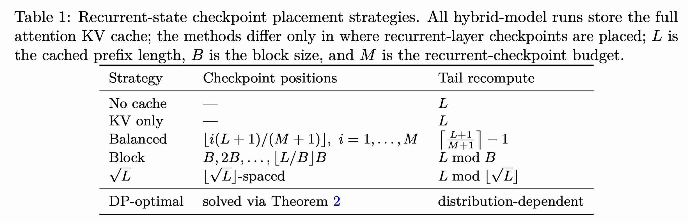

# Sparse Prefix Caching for Hybrid and Recurrent LLM Serving

> Mikhail Shirokikh, Sergey Nikolenko

**存储哪些位置的 recurrent state，最简单是按照block，或者每个token都存一个 state，该工作是基于分布动态调整**

> 注：以下论文笔记由 AI Agent 自动生成，可能存在理解偏差或遗漏，请以原论文为准。

## Abstract

Prefix caching 是自回归 LLM serving 的重要延迟优化，但现有系统通常假设每个 token 都有可复用的 dense KV。对于 SSM/线性递归层，继续计算只需要一个固定大小的 recurrent hidden state，而不需要完整历史。本文提出在前缀内只保存少量精确 recurrent-state checkpoint；命中后从不超过重叠深度的最深 checkpoint 恢复，并精确重算剩余后缀。作者将 checkpoint placement 建模为给定 overlap-depth 分布下的优化问题，给出精确的 $O(NM)$ 动态规划，并在 QuALITY、NarrativeQA 与 System Prompts 上验证其收益。

## 一句话总结

SPC 把混合/递归 LLM 的前缀复用从“保存全部 recurrent state 或完全不缓存”扩展为“按未来重叠分布选择少量精确 checkpoint”，用离线 DP 交换 checkpoint 显存和后缀重算量。

## 创新点

1. **提出 sparse prefix caching。** 对长度为 $N$ 的已缓存前缀只保存 $M$ 个 recurrent-state checkpoint；请求与前缀重叠到深度 $t$ 时，从最大的不超过 $t$ 的 checkpoint 恢复，重算 $t-\ell(t;C)$ 个 token。该机制不改变 recurrent update，也不引入近似，因此输出与完整 prefill 完全一致。
2. **把 placement 形式化为分布感知的一维 weighted k-median。** 给定 overlap depth 分布 $p_t$，最小化期望 recurrent 重算量；均匀分布或 worst-case 下，checkpoint 等距排列最优，但真实 workload 的 overlap 分布通常高度非均匀。
3. **给出精确动态规划和高效求解。** $dp[m,j]$ 表示用 $m$ 个 checkpoint 覆盖深度 $1\ldots j$ 的最小代价，利用前缀和与单调 convex-hull trick，每层 $O(N)$、总计 $O(NM)$；优化可离线计算，不增加 serving critical path 的决策开销。
4. **处理历史分布估计与漂移。** 证明目标函数对 overlap 分布具有 Lipschitz 稳定性，因此可以用经验 histogram 近似真实分布；进一步用指数加权 histogram 跟踪分布漂移，实验中采用 $\gamma=0.99$、每 10 个请求更新一次 schedule。
5. **明确与 cache admission/eviction 的边界。** SPC 优化的是“单个 retained cache entry 内部 checkpoint 放在哪里”，而不是决定哪些 entry 被保留；论文用 fixed last-$K$ policy 隔离 placement 效果，并指出它可与 Marconi 的 admission/eviction 结合。

## 带来什么提升

1. 在 QuALITY、NarrativeQA 和 System Prompts 的真实 overlap 数据上，DP-optimal schedule 在 recurrent-work reduction / token savings 的 Pareto frontier 上持续优于 balanced、block、sqrt 和 logarithmic 等固定策略；checkpoint 预算较小时优势最大。
2. 在 QuALITY 与 System Prompts 上，使用 Qwen-3.5-0.8B 的 1 个 full-attention layer + 3 个 GatedDeltaNet layer 做 prototype wall-clock 测试，分布感知 placement 改善了 layer-group 的时间-存储 Pareto frontier；在 System Prompts 上通常以更少 checkpoint 达到 block caching 的运行时间。
3. 方法保持 exact output，不依赖新的 recurrent update kernel；对能精确提取/恢复 hidden state 的 recurrent/SSM 层适用，hybrid 模型仍可同时保留 full-attention KV 并叠加既有 KV compression。
4. 当 overlap 分布集中在较短前缀时，DP 会把 checkpoint 密集放在 divergence peak 附近而放弃低概率尾部；当预算增加或分布接近 full-prefix point mass 时，各策略逐渐收敛，说明收益来自 workload-aware placement 而非固定 spacing 本身。

## 备注

- 适用场景是多个请求共享“较长但不完全相同”的前缀，例如同一长文档上的多个问题、带静态长 system prompt 的请求或 RAG 文本；append-only chat 中只保存最后状态通常已经足够，额外收益有限。
- 实验将 attention KV cache 完整保存，只比较 recurrent checkpoint placement；原型在 RTX 2080 Super 上运行，wall-clock 主要是代表性 layer group 而非完整模型 serving，且 checkpoint capture 与计时分开执行。生产化仍需高效的 state extraction/restoration，并需与 admission、eviction、prefix trie 分支和真实 cache loading cost 联合优化。
- 论文将单前缀问题推广到 star/comb 型 prefix trie 时可按边分解，但一般带分支、共享容量和 eviction 的全 trie placement 仍是开放问题。
