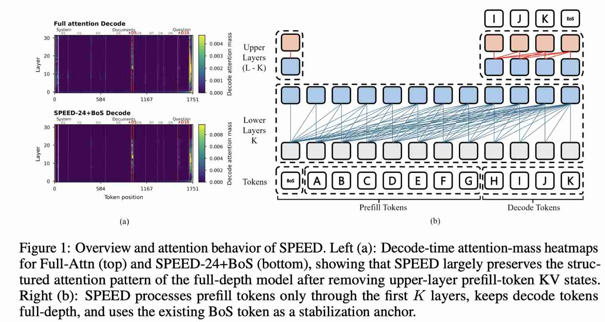

# Shallow Prefill, Deep Decoding: Efficient Long-Context Inference via Layer-Asymmetric KV Visibility

> Jungsuk Oh, Hyeseo Jeon, Hyunjune Ji, Kyongmin Kong, Jay-Yoon Lee

## Abstract

Long-context inference in decoder-only language models is costly because long prompts are processed during Prefill, cached at every layer, and repeatedly attended to during autoregressive Decode. We introduce \emph{Shallow Prefill, dEEp Decode} (SPEED), a phase-asymmetric KV-visibility policy that materializes non-anchor prompt-token KV states only in lower layers while keeping Decode-phase tokens full-depth. Unlike previous approaches that make upper-layer prompt KV states cheaper to store or construct, SPEED removes prefill tokens from the upper-layer Decode visibility set altogether. With a minimal BoS anchor, this simple change preserves broad benchmark quality while reducing long-context cost. In a controlled Llama-3.1-8B instruction-tuning study, SPEED using only 75\% of layers for prefill tokens reaches 51.2 average score on OLMES-style benchmarks, compared with 51.4 for the full-depth baseline, while improving TTFT by 33\%, TPOT by 22\%, and reducing active KV memory by 25.0\% at 128K context. Layer-wise diagnostics suggest that this cutoff retains the main prompt-selection and representation-stabilization regions of the full-depth model. These results show that long-context prompt tokens need not always persist as full-depth KV-cache objects when Decode-phase tokens remain full-depth.

浅层用所有的kv cache，深层用一部分kv cache，本质上还是sparse attention，只不过每层的稀疏度不同？

---

*以下总结由 MiMo 生成：*

这篇论文旨在解决长上下文推理中预填充阶段成本高昂的问题，即长提示词在每一层都被缓存并在解码阶段反复被关注。
作者提出了”浅预填充，深解码”（SPEED）方法，通过一种非对称的KV可见性策略，仅在较低层缓存非锚点提示词的KV状态，而解码阶段的词保持全层深度。
实验表明，在Llama-3.1-8B模型上，SPEED仅使用75%的层处理预填充词，就能在保持接近全层基线性能的同时，将首次响应时间提升33%、每次生成时间提升22%，并减少25%的活跃KV内存占用。

---

## 论文详细总结

### 1. 研究背景与动机

长上下文推理中，预填充阶段的 KV 缓存在每一层都被存储并在解码时反复使用，导致高昂的计算和内存开销。现有方法尝试让上层 prompt KV “更便宜地存储或构造”，但本文提出更激进的思路：直接将预填充 token 从上层解码可见集中移除。

### 2. SPEED 核心思想

**阶段不对称的 KV 可见性策略**：预填充 token 的 KV 状态仅在较低层保留，解码 token 在所有层（全深度）保留。上层解码时只能看到自己生成的 token。

### 3. 关键技术

| 技术 | 说明 |
|------|------|
| **Layer-Asymmetric KV Visibility** | 层不对称 KV 可见性，打破”所有层对所有 token 可见”的假设 |
| **75% 层截断** | 仅使用 75% 的层缓存预填充 token KV |
| **BOS 锚点** | 使用最小化的 BOS 锚点维持全局信息 |

### 4. 实验结果（Llama-3.1-8B, 128K 上下文）

| 指标 | 结果 |
|------|------|
| TTFT（首 token 延迟） | **改善 33%** |
| TPOT（每 token 延迟） | **改善 22%** |
| 活跃 KV 内存 | **减少 25%** |
| OLMES 基准精度 | 仅下降 0.2 分（51.2 vs 51.4）|

### 5. 核心贡献

1. 证明长上下文 prompt token **不必始终以全深度 KV 缓存**形式存在
2. 无需复杂压缩或重构机制，仅通过调整 KV 可见性即可实现显著加速
3. 以极小质量损失换取显著效率提升
