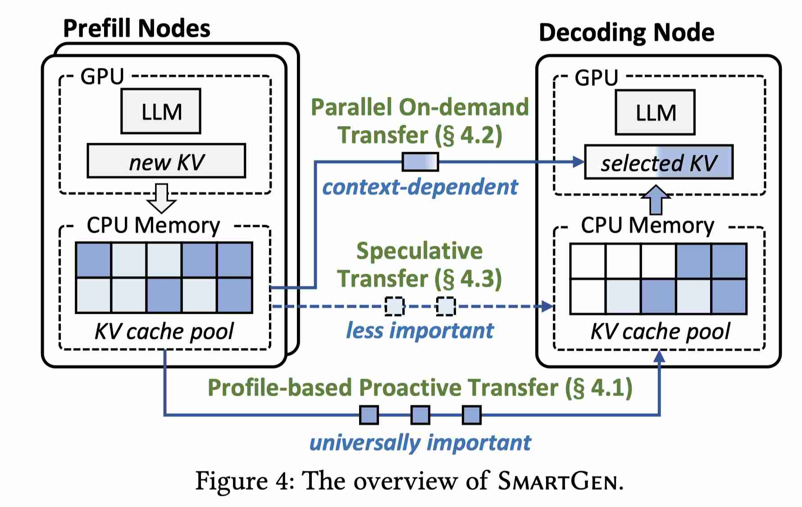

# SmartGen: Seamless Disaggregated LLM Inference with Selective KV Cache Transfer

> Xuchuan Luo, Jiacheng Shen, Xin Wang, Yangfan Zhou

> 注：以下论文笔记由 AI Agent 自动生成，可能存在理解偏差或遗漏，请以原论文为准。

## Abstract

在 Prefill/Decode 分离的 LLM 推理中，Prefill 节点需要把巨大的 KV Cache 传给 Decode 节点；在低带宽云实例上，传输会造成明显的 stage-transition stall 和较高的 time-to-second-token（TTST）。SmartGen 将 KV cache transfer 变为重要性感知的选择性传输：Prefill 阶段只主动发送预计重要的 KV，Decode 阶段并行按需获取缺失 KV，并利用空闲资源逐步推测性地传完剩余 KV。在保持后续解码性能和精度可比的情况下，TTST 相比全量传输最高降低 4.3 倍。

## 一句话总结

SmartGen 把动态 KV 稀疏性从 attention 计算阶段延伸到 P/D 分离的网络传输阶段，用“主动传输 + 并行按需传输 + 后台推测传输”消除低带宽环境下的 KV 交接停顿。

## 创新点

1. **Profile-based proactive transfer**：通过校准数据离线统计各层 KV block 的选择频率，利用重要 token 的位置相似性构造 importance matrix；在线根据 Prefill 时间与全量传输时间估计可被计算覆盖的 block 数量，优先传输 universally important KV。前两层 KV 始终保留，并按 workload/prompt length 分组或周期性更新 profile。
2. **Parallel on-demand transfer**：将 KV index 按本地/远端拆分，同时发起本地 KV 加载和远端 RDMA 获取，把网络 round-trip 从本地加载关键路径中移走。通过对 index mask 排序使远端 KV 在每行中连续，并结合 RDMA scatter-gather 降低细粒度 I/O 次数。
3. **Non-intrusive speculative transfer**：利用 attention 计算期间 CPU、NIC 和部分网络资源的空闲窗口，按重要性后台发送尚未传输的 KV；每轮只发送固定比例，默认 10%，在约 10 个 decode iteration 内完成剩余 KV 迁移，避免干扰前台按需请求。
4. **可插拔的 transfer engine**：SmartGen 以统一 KV index 抽象兼容 InfiniGen、HATA 等动态 KV selection 方法，并针对不同网络带宽自动在选择性传输和全量传输之间切换。

## 带来什么提升

1. 在 Llama-3.1、Qwen3、Gemma-3、Phi-4 和 LongBench 多种任务上，相比 full transfer，TTST 最高降低 **4.3 倍**；Qwen3-14B、batch size 6 的 MultiFieldQA 中，SmartGen 的 TTST 达到约 **3.7 倍降低**。
2. 相比 vanilla partial transfer，SmartGen 在 batch size 6 时 TBT 更低约 **1.5 倍**；其中 profile-based、parallel on-demand、speculative 三个组件分别继续降低 TBT，完整组合后的 TBT 接近所有 KV 已在本地的理想情况。
3. 网络带宽从 32 Gbps 降至 15 Gbps 时，SmartGen 相比 full transfer 的 TTST 优势从 **2.5 倍扩大到 3.3 倍**，相比 partial transfer 的 TBT 优势从 **1.4 倍扩大到 1.6 倍**，说明方案对低带宽环境更有价值。
4. SmartGen 的 LongBench 精度总体接近 full-cache baseline；相较之下，HACK 的 2-bit KV 量化在部分任务上最低只有约 **77% 相对精度**。代价是 profile、KV selection metadata 和前两层 KV 在极低带宽下仍会占用网络，论文在 15 Gbps 场景中将其列为后续优化点。

## 备注

- 实验使用 3 个 Prefill 节点和 1 个 Decode 节点，主要为 Alibaba Cloud L20 实例及 15/25/32 Gbps 网络；默认最多 60K batched input tokens、输出 64 tokens、每层 1K KV blocks、speculative ratio 10%。
- 论文的关键假设是重要 KV 在相近 prompt length 和不同数据集之间存在位置相似性；工作负载变化较大时需要周期性或分组 profiling。
- SmartGen 解决的是 P/D 分离中的 KV 传输瓶颈，不等同于减少 attention 所需的 KV 计算量；缺失 KV 仍会被按需取回，因此主要收益来自网络传输调度和计算-通信 overlap。
