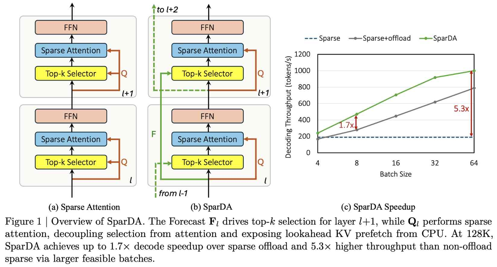

# SparDA: Sparse Decoupled Attention for Efficient Long-Context LLM Inference

> Yaosheng Fu, Guangxuan Xiao, Xin Dong, Song Han, Oreste Villa

> 注：以下论文笔记由 AI Agent 自动生成，可能存在理解偏差或遗漏，请以原论文为准。

## Abstract

SparDA 针对长上下文 sparse attention 推理中的两个残余瓶颈：KV cache 仍随上下文增长、CPU offload 会引入 PCIe 传输延迟；同时 sparse selection 本身仍可能是 $O(T^2)$ 并在长上下文下占主导。它在每层 Q/K/V 之外加入 Forecast projection，提前预测下一层要访问的 KV blocks，使 CPU→GPU 预取能与当前层执行重叠；同时 GQA 下每个 group 只用一个 Forecast head，降低 selector 开销。

## 一句话总结

SparDA 把 sparse attention 的“选哪些 KV block”从当前层 Query 中解耦出来，变成下一层 KV 访问的可训练 forecast signal，从而把稀疏选择同时变成计算优化和 offload prefetch hint。

## 创新点

1. **One-layer-ahead Forecast projection**：每层新增 Forecast $F_l$，用第 $l$ 层 hidden state 预测第 $l+1$ 层需要的 KV blocks；当前层 Query 只负责 attention，Forecast 负责下一层 Top-k selection。
2. **GQA-aware compact indexer**：Forecast 与实际 attention query 解耦后，不需要保留完整 query-head 结构；GQA 下每个 group 一个 Forecast head，减少多头 selector 的重复打分，并可跳过 softmax 排序开销。
3. **异步 KV prefetch 系统化**：decode 时完整 KV cache 可放在 CPU pinned memory，Forecast 提前暴露下一层 block list；runtime 用独立 CUDA stream + persistent UVA Triton kernel 预取 KV blocks，并用 batch-adaptive CTA 数量平衡 PCIe 吞吐和 SM 占用。

## 带来什么提升

1. **速度提升**：相对 sparse-attention offload baseline，SparDA 在 8B sparse-pretrained 模型上最高达到 **1.25× prefill speedup** 和 **1.7× decode speedup**。
2. **吞吐提升**：通过让单 GPU 支持更大的可行 batch size，SparDA 相对 non-offload sparse baseline 最高达到 **5.3× decode throughput**。
3. **精度基本保持或略升**：MiniCPM4.1-8B 平均分从 Sparse 的 61.4 到 SparDA 的 61.7；NOSA-8B 从 49.4 到 51.7，reasoning 从 50.7 提升到 57.2；RULER 32K–128K 上两个模型均持续优于 Sparse。

## 备注

- SparDA 不改变 sparse attention pattern 本身，而是改造 selection path：让模型提前输出 serving system 能消费的 memory-access contract。
- 它与 MSA/DSA 类工作互补：MSA 更偏训练期原生稀疏 + kernel co-design，SparDA 更偏已有 sparse backbone 上的 selection/offload 调度优化。
- 局限是必须依赖已有 block-sparse backbone，收益强依赖 CPU offload、PCIe/UVA kernel 和推理引擎；如果 KV 全在 HBM 或硬件拓扑变化，瓶颈分布会变。
