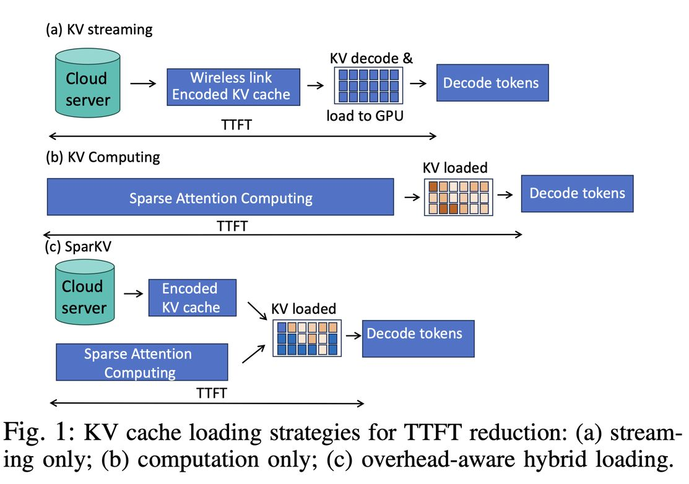

# SparKV: Overhead-Aware KV Cache Loading for Efficient On-Device LLM Inference

> Hongyao Liu, Liuqun Zhai, Junyi Wang, Zhengru Fang

> 注：以下论文笔记由 AI Agent 自动生成，可能存在理解偏差或遗漏，请以原论文为准。

## Abstract

Efficient inference for on-device Large Language Models (LLMs) remains challenging due to limited hardware resources and the high cost of the prefill stage, which processes the full input context to construct Key-Value (KV) caches. We present SparKV, an adaptive KV loading framework that combines cloud-based KV streaming with on-device computation. SparKV models the cost of individual KV chunks and decides whether each chunk should be streamed or computed locally, while overlapping the two execution paths to reduce latency. To handle fluctuations in wireless connectivity and edge resource availability, SparKV further refines offline-generated schedules at runtime to rebalance communication and computation costs. Experiments across diverse datasets, LLMs, and edge devices show that SparKV reduces Time-to-First-Token by 1.3×-5.1× with negligible impact on response quality, while lowering per-request energy consumption by 1.5× to 3.3×, demonstrating its robustness and practicality for real-world on-device deployment.

## 一句话总结

SparKV 是一个开销感知的 KV 缓存加载框架，结合云端 KV 流式传输与设备端计算，通过动态调度和运行时适应，在边缘设备上将 TTFT 降低 1.3×-5.1×，能耗降低 1.5×-3.3×，解决了设备端 LLM 推理中预填充阶段开销高的问题。

## 背景与问题

- **设备端 LLM 推理挑战**：
  - 硬件资源有限（内存、计算、带宽）
  - 预填充阶段（构建 KV 缓存）是主要瓶颈
  - 上下文重用（如多轮对话、文档分析）进一步增加开销
- **现有方法的局限**：
  - **KV 流式传输**：压缩后存储在云端，按需传输到边缘设备。优点：低延迟、低能耗。缺点：网络波动、隐私风险
  - **设备端计算**：使用稀疏注意力等技术加速本地预填充。优点：隐私保护、无云端依赖。缺点：高延迟、高能耗
  - **简单重叠**：简单重叠流式传输和计算，但存在三个局限：
    1. 计算依赖严格（Transformer 的层级和因果依赖）
    2. 忽略块级开销异构性
    3. 无法适应无线网络波动
- **核心问题**：如何在边缘设备上高效加载 KV 缓存，同时降低 TTFT 和能耗？

## 核心方法

### 1. KV 块调度器（KV Chunk Scheduler）

**核心思想**：将 KV 缓存沿 token、注意力头和 Transformer 层维度分割成索引块，为每个块做出依赖感知的加载决策。

**调度策略**：
- **云端分割**：将 KV 缓存分割成索引块
- **依赖感知**：考虑 token 级和层级依赖
- **开销感知**：根据块的传输和计算开销决定是流式传输还是本地计算
- **目标**：最小化端到端 TTFT

### 2. 开销模型（Overhead Model）

**核心思想**：使用轻量级多层感知器（MLP）预测每个块的计算延迟。

**方法**：
- **特征**：注意力稀疏性特征
- **预测**：估计每个块的计算延迟
- **输入**：注意力稀疏性模式
- **输出**：计算延迟估计

### 3. 运行时控制器（Runtime Controller）

**核心思想**：监控无线吞吐量和边缘计算余量，在滑动窗口内动态迁移块。

**方法**：
- **监控**：无线吞吐量和边缘计算余量
- **滑动窗口**：动态适应网络波动
- **动态迁移**：根据条件变化在流式传输和计算路径之间迁移块
- **目标**：处理无线网络波动和边缘资源可用性变化

### 4. 重叠执行

**核心思想**：在允许依赖的情况下，将流式传输和计算路径重叠执行。

**实现**：
- **依赖分析**：考虑 token 级和层级依赖
- **重叠策略**：在依赖允许时重叠执行
- **目标**：最大化并行度，降低 TTFT

## 主要结果

### 性能提升

- **TTFT 降低**：1.3×-5.1×（相比现有高效 KV 加载方案）
- **能耗降低**：1.5×-3.3×（每请求能耗）
- **响应质量**：无显著影响（F1 ≥ 0.9）
- **鲁棒性**：在不同计算可用性和真实无线条件下保持稳健

### 关键发现

1. **混合加载有效**：结合流式传输和本地计算的混合方法显著优于单一路径
2. **块级开销异构性**：不同块的计算和传输开销差异巨大（17.7× 变异）
3. **运行时适应重要**：简单重叠在无线边缘环境中不足，需要运行时适应
4. **隐私保护**：本地计算路径保护隐私，避免云端依赖
5. **能耗优势**：网络接口功耗（2-3W）远低于 GPU 计算（20-30W）

## 优点与局限

### 优点

1. **开销感知**：基于块级开销的动态调度，避免盲目重叠
2. **运行时适应**：监控无线吞吐量和计算余量，动态迁移块
3. **隐私保护**：本地计算路径保护隐私
4. **高效**：TTFT 降低 1.3×-5.1×，能耗降低 1.5×-3.3×
5. **鲁棒性**：在不同计算可用性和无线条件下保持稳健
6. **实用**：支持多种 LLM（Qwen3-4B、Llama-3.1-8B、Qwen3-VL-8B）和边缘设备

### 局限

1. **依赖云端**：需要云端存储和传输 KV 缓存，存在隐私和延迟风险
2. **网络波动**：无线网络波动可能影响性能
3. **MLP 预测**：开销模型依赖于 MLP 预测，可能不够准确
4. **评估范围**：主要在特定设备和数据集上评估，更复杂场景需进一步测试
5. **无代码开源**：代码 URL 为空，可能尚未开源

## 与 EfficientPaper 主题的关系

SparKV 属于 **KV Cache Management**（`kv_cache_management`）和 **Overlap**（`overlap`）领域，核心贡献包括：

- **开销感知 KV 缓存加载**：结合云端流式传输和设备端计算
- **运行时适应**：监控无线吞吐量和计算余量，动态迁移块
- **隐私保护**：本地计算路径保护隐私

与 EfficientPaper 中已有论文的关系：
- **CacheGen**（2024）：KV 缓存压缩和传输
- **KIVI**（2024）：KV 缓存量化
- **SpargeAttention**（2025）：稀疏注意力加速
- **AutoOverlap**（2026）：计算-通信重叠
- **FlashPrefill**（2026）：预填充阶段优化

## 可复现/实现要点

1. **KV 块分割**：沿 token、注意力头和 Transformer 层维度分割
2. **开销模型**：轻量级 MLP，基于注意力稀疏性特征
3. **运行时控制器**：滑动窗口监控，动态迁移块
4. **重叠执行**：依赖感知的重叠策略
5. **实验配置**：Qwen3-4B、Llama-3.1-8B、Qwen3-VL-8B；Redmi K80 Pro、Jetson Orin、Jetson AGX；TriviaQA、HotpotQA、VideoMME
6. **能耗测量**：使用小米智能插座测量 NIC 功耗，隔离 NPU 功耗

## 个人备注

- SparKV 的核心洞察是：**块级开销异构性意味着简单重叠不足**，需要基于开销的动态调度。
- 运行时适应是关键优化，它使 SparKV 能够适应无线网络波动和边缘资源可用性变化。
- 隐私保护是实际部署的重要考虑，本地计算路径保护隐私，避免云端依赖。
- 论文来自 City University of Hong Kong，且基于 IoT 场景，说明这是一个实用的系统。
- 值得关注的未来方向：(1) 更复杂的网络条件下的适应；(2) 更多 LLM 和边缘设备的验证；(3) 与在线学习的结合。
