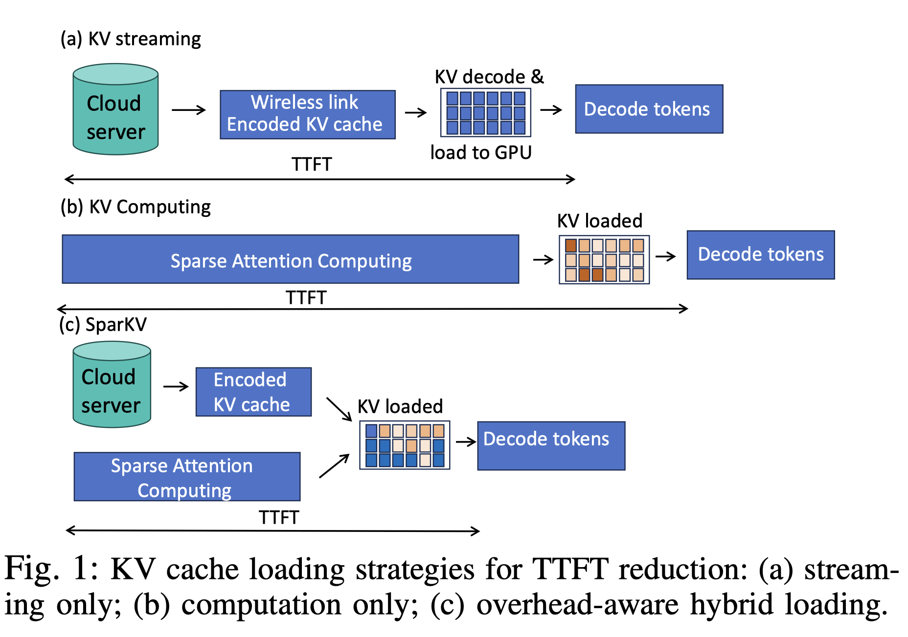

# SparKV: Overhead-Aware KV Cache Loading for Efficient On-Device LLM Inference

> Hongyao Liu, Liuqun Zhai, Junyi Wang, Zhengru Fang

## Abstract

Efficient inference for on-device Large Language Models (LLMs) remains challenging due to limited hardware resources and the high cost of the prefill stage, which processes the full input context to construct Key-Value (KV) caches. We present SparKV, an adaptive KV loading framework that combines cloud-based KV streaming with on-device computation. SparKV models the cost of individual KV chunks and decides whether each chunk should be streamed or computed locally, while overlapping the two execution paths to reduce latency. To handle fluctuations in wireless connectivity and edge resource availability, SparKV further refines offline-generated schedules at runtime to rebalance communication and computation costs. Experiments across diverse datasets, LLMs, and edge devices show that SparKV reduces Time-to-First-Token by 1.3$x-5.1x with negligible impact on response quality, while lowering per-request energy consumption by 1.5x to 3.3x, demonstrating its robustness and practicality for real-world on-device deployment.

---

*以下总结由 MiMo 生成：*

这篇论文针对设备端大语言模型推理中预填充阶段开销高的问题，提出了一种开销感知的KV缓存加载框架SparKV。该方法结合云端KV流式传输与本地计算，通过建模KV块的传输与计算成本，动态决定各块的处理方式，并重叠执行路径以降低延迟。实验表明，SparKV在保证响应质量的同时，将首词生成时间降低1.3-5.1倍，每请求能耗降低1.5-3.3倍，显著提升了设备端部署的效率与实用性。
