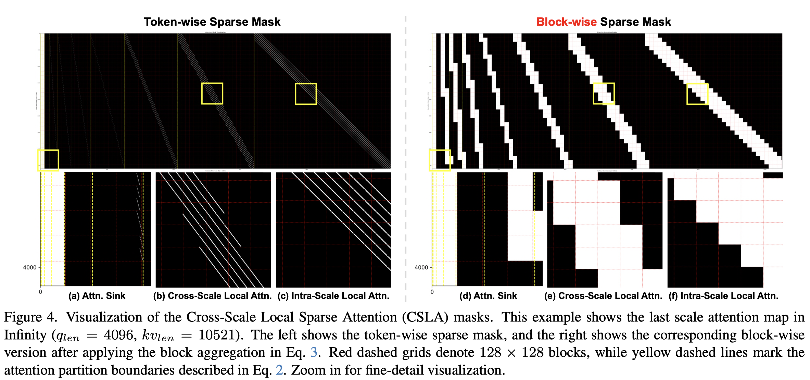

# SparVAR: Exploring Sparsity in Visual AutoRegressive Modeling for Training-Free Acceleration

> Zekun Li, Ning Wang, Tongxin Bai, Changwang Mei, Peisong Wang, Shuang Qiu, Jian Cheng

## Abstract

Visual AutoRegressive (VAR) modeling has garnered significant attention for its innovative next-scale prediction paradigm. However, mainstream VAR paradigms attend to all tokens across historical scales at each autoregressive step. As the next scale resolution grows, the computational complexity of attention increases quartically with resolution, causing substantial latency. Prior accelerations often skip high-resolution scales, which speeds up inference but discards high-frequency details and harms image quality. To address these problems, we present SparVAR, a training-free acceleration framework that exploits three properties of VAR attention: (i) strong attention sinks, (ii) cross-scale activation similarity, and (iii) pronounced locality. Specifically, we dynamically predict the sparse attention pattern of later high-resolution scales from a sparse decision scale, and construct scale self-similar sparse attention via an efficient index-mapping mechanism, enabling high-efficiency sparse attention computation at large scales. Furthermore, we propose cross-scale local sparse attention and implement an efficient block-wise sparse kernel, which achieves $\mathbf{> 5\times}$ faster forward speed than FlashAttention. Extensive experiments demonstrate that the proposed SparseVAR can reduce the generation time of an 8B model producing $1024\times1024$ high-resolution images to the 1s, without skipping the last scales. Compared with the VAR baseline accelerated by FlashAttention, our method achieves a $\mathbf{1.57\times}$ speed-up while preserving almost all high-frequency details. When combined with existing scale-skipping strategies, SparseVAR attains up to a $\mathbf{2.28\times}$ acceleration, while maintaining competitive visual generation quality. Code is available at https://github.com/CAS-CLab/SparVAR.
