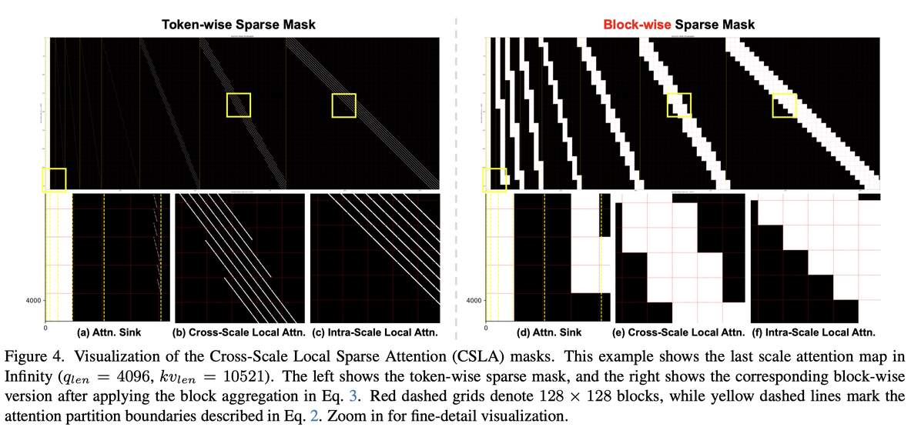

# SparVAR: Exploring Sparsity in Visual AutoRegressive Modeling for Training-Free Acceleration

> Zekun Li, Ning Wang, Tongxin Bai, Changwang Mei, Peisong Wang, Shuang Qiu, Jian Cheng

> ⚠️ **声明**：本 note 由 AI Agent（Hermes）自动生成，基于论文原文的全文阅读和分析。生成时间：2026年6月。

---

## 一句话总结

SparVAR 利用视觉自回归（VAR）模型中注意力激活的跨尺度自相似性、注意力汇聚（attention sink）和空间局部性三大稀疏性质，设计了两个即插即用的稀疏注意力模块，在不跳过任何分辨率尺度的前提下实现 1.57× 推理加速，同时几乎完全保留高频细节。

---

## 摘要翻译

视觉自回归（VAR）建模因其创新的 next-scale 预测范式而备受关注。然而，主流 VAR 范式在每个自回归步骤中都对所有历史尺度的所有 token 进行注意力计算。随着下一个尺度分辨率的增长，注意力的计算复杂度与分辨率呈四次方增长，导致显著的延迟。以往的加速方法通常跳过高分辨率尺度，虽然加速了推理，但丢弃了高频细节并损害了图像质量。为解决这些问题，本文提出 SparVAR，一个免训练加速框架，利用 VAR 注意力的三个性质：（i）强注意力汇聚，（ii）跨尺度激活相似性，和（iii）显著的空间局部性。具体而言，该方法从一个稀疏决策尺度动态预测后续高分辨率尺度的稀疏注意力模式，并通过高效的索引映射机制构建跨尺度自相似稀疏注意力，从而在大尺度上实现高效的稀疏注意力计算。此外，本文提出跨尺度局部稀疏注意力并实现高效的分块稀疏核，其前向速度比 FlashAttention 快 5 倍以上。大量实验表明，SparVAR 可以将 8B 模型生成 1024×1024 高分辨率图像的时间缩短至 1 秒，且无需跳过最后的尺度。与 FlashAttention 加速的 VAR 基线相比，该方法实现了 1.57× 加速，同时几乎完全保留高频细节。结合现有的跳尺度策略，SparVAR 可实现高达 2.28× 加速，同时保持竞争力的视觉生成质量。

---

## 研究动机

1. **VAR 模型的推理瓶颈**：VAR 模型采用 next-scale 预测范式，每个自回归步骤需要对所有历史尺度的 token 进行注意力计算，导致注意力复杂度与分辨率呈四次方增长（O(n²) → O(n⁴)）。在 1024×1024 图像生成中，最后两个大尺度步骤约占总运行时间的 60%。

2. **KV 缓存的内存压力**：8B VAR 模型生成 1024×1024 图像需要近 60GB GPU 内存，严重限制了批推理和部署。

3. **现有加速方法的局限**：FastVAR 和 SkipVAR 等方法通过跳过高分辨率尺度来加速推理，虽然降低了计算量，但导致高频细节丢失、纹理退化，且低级指标（PSNR、SSIM、LPIPS）明显下降。

4. **核心问题**：能否在不跳过任何尺度的情况下实现有效的 VAR 加速？

---

## 方法（技术细节）

### 3.1 观察：VAR 注意力的三个稀疏性质

通过对预训练 VAR 模型（Infinity）的注意力激活模式进行系统分析，作者发现了三个关键现象：

**（1）强注意力汇聚（Strong Attention Sinks）**
- 一小部分早期尺度的 token 持续吸引高注意力权重，充当"全局锚点"。
- 实验表明，仅保留前 4~5 个尺度的 KV 缓存，模型仍能重建准确的对象布局和全局结构。

**（2）跨尺度激活相似性（Cross-Scale Activation Similarity）**
- 相邻尺度的注意力激活模式高度相似：当前尺度 k 的注意力模式可以通过上采样前一尺度 k-1 的注意力模式来预测。
- 形式化表达：A(k,i) ≈ Upsample(A(k-1,i-1)), ∀i ≥ 2
- 这为跨尺度稀疏注意力提供了理论基础。

**（3）显著的空间局部性（Pronounced Spatial Locality）**
- 随着分辨率增加，注意力越来越集中在局部空间邻域内。
- 表现为跨尺度的对角线激活模式。

### 3.2 CS4A：跨尺度自相似稀疏注意力

**核心思想**：从一个稀疏决策尺度（Sparse Decision Scale S）提取稀疏模式，跨尺度映射到高分辨率尺度。

**步骤**：
1. **稀疏决策尺度选择**：固定 S 为中间尺度（如 Scale 10），在该尺度执行完整密集注意力计算。
2. **列和（Column-Sum）策略**：对注意力图 P(S) 按查询块（block size C）分区，计算列和张量 D(S)，然后通过 Top-K 选择最被关注的 key 索引 inds(S)。
3. **跨尺度稀疏索引映射**：通过两个阶段的变换（查询块单应性和相对尺度对齐），将 inds(S) 投影到目标尺度 K 的空间网格。
4. **稀疏计算**：在后续高分辨率尺度 k > S 上，仅对映射后的稀疏索引执行注意力计算。

**缓存机制**：O(k) ≈ O(k)cache + ΔO(k)，其中 O(k)cache 是从决策尺度上采样的缓存输出，进一步增强高频视觉保真度。

### 3.3 CSLA：跨尺度局部稀疏注意力

**核心思想**：利用空间局部性先验，构建高效的分块稀疏注意力核。

**跨尺度局部映射**：
- 对于每个查询 token，根据其空间位置，仅关注历史尺度中其邻近区域的 KV token。
- 融合注意力汇聚（sink region S）和跨尺度/跨尺度内局部区域，构建统一的 token 级稀疏掩码。

**分块稀疏掩码（Block-wise Sparse Mask）**：
- 将查询和 key 维度均匀划分为大小为 B 的块。
- 基于 FlexAttention 框架实现。
- 在 block size 128 时，CSLA 前向速度比 FlashAttention 快 **5.61×**，比朴素 token 级稀疏注意力快 **15.26×**。

**CS4A vs CSLA 混合配置**：
- 浅层（激活模式分散）更适合 CS4A，深层（激活模式集中于局部）更适合 CSLA。
- 默认配置：约 60% CS4A + 40% CSLA。

---

## 实验结果

### 实验设置
- **基准模型**：Infinity-2B 和 Infinity-8B（VAR 文本到图像模型）
- **基准模型**：HART（另一种 VAR 模型，验证泛化性）
- **评估指标**：GenEval、DPG-Bench、HPSv2.1、ImageReward（高层指标）；PSNR、SSIM、LPIPS（低层指标）
- **硬件**：NVIDIA H100 GPU

### 主要结果

**1. GenEval 基准（1024×1024）**

| 设置 | 模型 | 加速比 | 延迟 | GenEval | PSNR | SSIM | LPIPS |
|------|------|--------|------|---------|------|------|-------|
| 无跳尺度 | Infinity-8B | 1.00× | 1.65s | 0.798 | - | - | - |
| 无跳尺度 | FastVAR | 1.14× | 1.45s | 0.792 | 17.403 | 0.630 | 0.333 |
| 无跳尺度 | ScaleKV | 0.67× | 2.45s | 0.793 | 23.423 | 0.803 | 0.153 |
| **无跳尺度** | **SparVAR** | **1.57×** | **1.05s** | **0.796** | **29.481** | **0.920** | **0.073** |
| 跳最后2尺度 | FastVAR | 1.79× | 0.92s | 0.790 | 15.265 | 0.533 | 0.421 |
| **跳最后2尺度** | **SparVAR** | **2.28×** | **0.72s** | **0.800** | **17.096** | **0.579** | **0.374** |
| 动态跳尺度 | SkipVAR-8B | 1.71× | 0.97s | 0.789 | 17.980 | 0.641 | 0.337 |
| **动态跳尺度** | **SparVAR** | **2.05×** | **0.80s** | **0.796** | **19.614** | **0.694** | **0.296** |

**关键发现**：
- 不跳尺度时：SparVAR 8B 实现 1.57× 加速，PSNR 高达 29.481（远超 FastVAR 的 17.403 和 ScaleKV 的 23.423），将生成时间缩短至约 1 秒。
- 结合跳尺度时：最高 2.28× 加速，同时维持竞争力的 GenEval 分数。

**2. 人类偏好评估（HPSv2.1 / ImageReward）**

| 设置 | 模型 | HPSv2.1 Average | ImageReward |
|------|------|----------------|-------------|
| 无跳尺度 | Infinity-8B | 31.00 | 1.0529 |
| 无跳尺度 | FastVAR | 30.62 | 1.0380 |
| **无跳尺度** | **SparVAR** | **31.01** | **1.0533** |

SparVAR 在人类偏好评估中达到甚至超越基线水平。

**3. DPG-Bench**

SparVAR 8B 无跳尺度整体得分 86.411，与基线（86.440）相当，且在跳尺度设置中甚至超越基线（86.468）。

**4. 泛化性（HART 模型）**

在另一个 VAR 模型 HART 上也验证了 SparVAR 的有效性，实现 1.16× 加速，且 GenEval、HPSv2.1、ImageReward 均优于 FastVAR 并超越基线。

**5. 内存消耗**

- 8B 无跳尺度：Torch Mem. 37.48GB，NV Mem. 45.45GB（基线 37.11GB / 55.75GB）
- 与 KV 压缩结合：Torch Mem. 30.42GB，NV Mem. 35.18GB
- SparVAR 的稀疏注意力模块与 KV 压缩方法兼容，可进一步优化内存。

**6. 消融实验**

| 方法 | 加速比 | 延迟 | PSNR | SSIM | LPIPS |
|------|--------|------|------|------|-------|
| Infinity-8B | 1.00× | 1.65s | - | - | - |
| + CS4A (w/o cache) | 1.46× | 1.13s | 25.665 | 0.837 | 0.131 |
| + CS4A (w/ cache) | 1.43× | 1.15s | 26.359 | 0.860 | 0.114 |
| + CSLA (block-wise) | **1.57×** | **1.05s** | **29.481** | **0.920** | **0.073** |

- CS4A 单独可实现 1.46× 加速，加入缓存输出后 PSNR 提升约 0.7。
- CSLA 的加入进一步提升空间一致性，达到最优性能。

---

## 优势

1. **免训练（Training-Free）**：无需对预训练模型进行任何微调或再训练，直接作为即插即用模块应用。
2. **不跳尺度**：与 FastVAR、SkipVAR 不同，SparVAR 不跳过高分辨率尺度，保留了完整的高频细节。
3. **显著加速**：8B 模型 1024×1024 图像生成时间降至约 1 秒（1.57× 加速），结合跳尺度可达 2.28×。
4. **高质量保留**：PSNR 接近 30，SSIM 超过 0.9，LPIPS 低于 0.1，高频细节保留能力远超其他方法。
5. **人类偏好优势**：在 HPSv2.1 和 ImageReward 评估中达到甚至超越基线水平。
6. **硬件友好的稀疏计算**：基于 FlexAttention 框架的分块稀疏核，CSLA 前向速度比 FlashAttention 快 5.61×。
7. **泛化性好**：在 Infinity-2B、Infinity-8B 和 HART 三种 VAR 模型上均有效。
8. **与 KV 压缩兼容**：可与 ScaleKV 等 KV 压缩方法叠加使用，进一步优化内存。

---

## 局限

1. **内存优化有限**：SparVAR 的主要目标是推理延迟而非内存最小化。虽然与 KV 压缩兼容，但自身对内存的优化有限。
2. **稀疏决策尺度选择**：需要固定一个中间尺度（如 Scale 10）作为稀疏决策尺度，不同模型可能需要调整。
3. **Top-K 比例敏感**：稀疏度与生成质量之间的平衡需要仔细调节（Top-K ≈ 0.2 为最佳）。
4. **额外开销**：CS4A 的索引映射和内存 gather 操作比 CSLA 有轻微延迟开销，需要合理配置混合比例。
5. **仅适用于 VAR 模型**：该方法针对 VAR 模型的 next-scale 预测范式设计，不直接适用于传统自回归或扩散模型。
6. **H100 GPU 验证**：实验仅在 NVIDIA H100 上验证，其他硬件平台的性能有待测试。

---

## 与 EfficientPaper 相关的研究方向

### 1. 注意力稀疏化与高效推理
SparVAR 属于 attention sparsity 方向，与 EfficientPaper 中的 `sparse_pruning` 和 `attention_sparsity` 关键词直接相关。该工作展示了在视觉自回归模型中利用注意力模式的跨尺度自相似性进行稀疏化的新范式。

### 2. 免训练加速（Training-Free Acceleration）
SparVAR 是免训练加速框架，与 EfficientPaper 中的 `2025/AttentionSinks`（注意力汇聚）、`2025/flashattention`（FlashAttention）和 `2026/SPEED` 等工作有密切联系。这些方法共同探索了如何在不重新训练的情况下加速模型推理。

### 3. 视觉自回归模型（VAR）加速
- **FastVAR**：通过 token 剪枝和跳尺度加速，但牺牲高频细节。
- **SkipVAR**：自适应跳尺度，但需要重训练且存在质量下降。
- **ScaleKV**：KV 缓存压缩，改善内存但加速有限。
- **SparVAR**：填补了"不跳尺度、不重训练、不牺牲质量"的空白。

### 4. 高效稀疏计算核设计
SparVAR 基于 FlexAttention 实现分块稀疏核，与 FlashAttention、FlashAttention-2/3、Triton、TileLang 等 AI 系统优化方向密切相关。

### 5. 注意力汇聚（Attention Sinks）
SparVAR 利用了注意力汇聚特性，与 Xiao et al.（2024）提出的 Attention Sinks 概念一致，展示了早期尺度 token 作为"全局锚点"的作用。

### 6. 扩散模型 vs 自回归模型的加速对比
SparVAR 的加速策略（跨尺度稀疏）与扩散模型的加速策略（如 Chipmunk 的时间稀疏）正交，为两类模型的加速提供了互补的视角。

---

## 代码仓库

- **GitHub**: https://github.com/CAS-CLab/SparVAR
- **框架**: PyTorch

## 关联论文（Baseline）

- `2025/AttentionSinks` — 注意力汇聚
- `2022/flashattention` — FlashAttention
- `2026/SPEED` — SPEED
