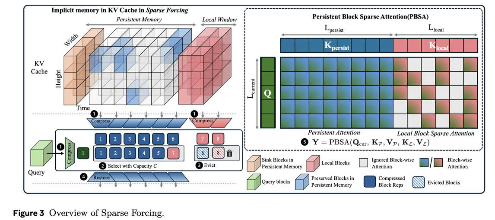

# Sparse Forcing: Native Trainable Sparse Attention for Real-time Autoregressive Diffusion Video Generation

> Boxun Xu, Yuming Du, Zichang Liu, Siyu Yang, Ziyang Jiang, Siqi Yan, Rajasi Saha, Albert Pumarola, Wenchen Wang, Peng Li

## Abstract

We introduce Sparse Forcing, a training-and-inference paradigm for autoregressive video diffusion models that improves long-horizon generation quality while reducing decoding latency. Sparse Forcing is motivated by an empirical observation in autoregressive diffusion rollouts: attention concentrates on a persistent subset of salient visual blocks, forming an implicit spatiotemporal memory in the KV cache, and exhibits a locally structured block-sparse pattern within sliding windows. Building on this observation, we propose a trainable native sparsity mechanism that learns to compress, preserve, and update these persistent blocks while restricting computation within each local window to a dynamically selected local neighborhood. To make the approach practical at scale for both training and inference, we further propose Persistent Block-Sparse Attention (PBSA), an efficient GPU kernel that accelerates sparse attention and memory updates for low-latency, memory-efficient decoding. Experiments show that Sparse Forcing improves the VBench score by +0.26 over Self-Forcing on 5-second text-to-video generation while delivering a 1.11-1.17x decoding speedup and 42% lower peak KV-cache footprint. The gains are more pronounced on longer-horizon rollouts, delivering improved visual quality with +0.68 and +2.74 VBench improvements, and 1.22x and 1.27x speedups on 20-second and 1-minute generations, respectively.

---

*以下总结由 MiMo 生成：*

这篇论文针对自回归视频扩散模型在长时程生成中质量下降和解码延迟高的问题，提出了一种名为Sparse Forcing的训练与推理范式。该方法基于注意力机制在KV缓存中形成隐式时空记忆的观察，设计了一种可训练的原生稀疏机制，通过动态选择局部邻域来压缩和更新持久性视觉块。作者进一步提出了高效的GPU内核PBSA，实现了稀疏注意力和内存更新的加速。实验表明，Sparse Forcing在5秒文本到视频生成中VBench分数提升0.26，解码速度提升1.11-1.17倍，KV缓存峰值占用降低42%，在更长时程生成中效果更显著。
