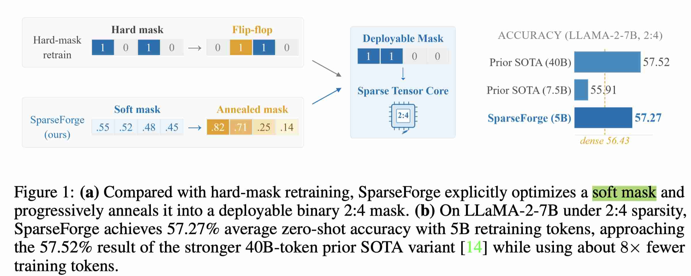

# SparseForge: Efficient Semi-Structured LLM Sparsification via Annealing of Hessian-Guided Soft-Mask

> Liu Hanzuo, Chaofan Lin, Weixuan Sun, Yulong Wang, Key, Rayying, Mingyu Gao



---

*以下内容由 AI Agent 自动生成（生成时间：2026-06-04），基于论文全文阅读。*

---

## 一句话总结

SparseForge 通过 Hessian 感知的软掩码渐进退火机制，仅用 5B 重训练 token 即可实现 LLaMA-2-7B 2:4 半结构化稀疏模型 57.27% 的零样本准确率，超越稠密模型并接近用 40B token 的 SOTA 方法，将重训练成本降低约 8 倍。

---

## 摘要翻译

半结构化稀疏性为加速大语言模型（LLM）提供了具有硬件原生支持的实用路径，但训练后半结构化剪枝常因强结构耦合导致显著质量退化。现有方法依赖大规模稀疏重训练来恢复精度，计算成本极高。

我们提出 SparseForge，一个后训练框架，通过直接优化稀疏掩码而非扩大重训练 token 数来提升恢复效率。SparseForge 结合 Hessian 感知的重要性估计与软掩码的渐进退火，将其转化为硬件可执行的结构化稀疏模式，实现稳定高效的稀疏恢复。在 LLaMA-2-7B 的 2:4 稀疏度下，SparseForge 仅用 5B 重训练 token 即达到 57.27% 的平均零样本准确率，超越稠密模型的 56.43%，并接近使用 40B token 的 SOTA 方法（57.52%）。该精度-效率权衡的改进在不同模型族中表现一致。

---

## 研究动机

1. **半结构化稀疏的硬件优势**：2:4 稀疏模式被 NVIDIA Ampere 架构的稀疏 Tensor Core 原生支持，是目前少数能同时实现有意义压缩和硬件加速的稀疏模式。
2. **训练后剪枝的核心瓶颈**：在半结构化约束下，权重在每个组内竞争，过早的硬二值化决策会将优化器锁定在次优稀疏子空间。现有方法（如 SparseGPT、Wanda）依赖一次性重要性评分加硬投影，在半结构化场景下表现脆弱。
3. **重训练效率低下**：现有重训练方法（如 CAST）通过扩大重训练 token 规模来恢复精度，但作者发现**掩码质量而非重训练规模**才是瓶颈——即使大量重训练，精度仍受所选稀疏模式支配。
4. **核心洞察**：应将掩码视为可连续优化的变量，而非过早固定为离散二值模式；改善掩码优化质量可以大幅降低对大规模重训练的依赖。

---

## 方法（技术细节）

SparseForge 采用 **掩码退火（Mask Annealing）** 管线，分为**加热阶段（Heating）**和**淬火阶段（Quenching）**：

### 1. 双轨重训练循环（Heating Stage）

在加热阶段，SparseForge 在统一的重训练循环中联合优化模型权重 $W$ 和软掩码 $m \in [0,1]^{D \times C}$：

- **权重更新**：遵循 AST/CAST 范式，使用带掩码的前向传播，可选加入 SLoRB（稀疏低秩分支）补偿剪枝造成的容量损失。
- **掩码更新**：每隔 $T_{update}$ 步通过专用学习规则更新，与权重更新解耦，确保在半结构化约束下更稳定。
- **损失函数**：$L = \lambda_{task} L_{task} + \lambda_{KL} L_{KL} + \lambda_{mid} L_{mid}$，其中 $L_{mid}$ 是为掩码设计的二值偏好正则项。

### 2. Hessian 感知软掩码更新（§4.2）

利用二阶 Hessian 信息估计权重重要性：

- **重要性得分**：$s = (H + \epsilon) \odot W^2$，其中 $H$ 是近似 Hessian 对角线，通过 Hutchinson 随机估计器（$E[(Hv) \odot v] = \text{diag}(H)$，$v \sim \text{Rademacher}(\pm 1)$）计算，维护指数移动平均。
- **软门控**：对组内得分标准化后，通过 sigmoid 温度控制的软门控 $G = \sigma((\tilde{s} - \tau)/T)$ 和硬目标 $\bar{G} = \text{TopK}_N(\tilde{s})$，编码 N:M 竞争。
- **掩码更新规则**：通过中惩罚残差 $\delta = m - \bar{G}$ 推动软掩码向结构化目标靠拢，最终用 EMA 更新：$m \leftarrow (1-\alpha) \cdot m + \alpha \cdot \tilde{G}$。

### 3. 渐进软到硬掩码淬火（§4.3）

通过三个退火控制量实现平滑过渡：

- **二值偏好正则项**：$L_{mid} = \frac{1}{|m|} \sum_{i,j} m_{ij}(1 - m_{ij})$，在 $m=0.5$ 时最大，$m \in \{0,1\}$ 时最小，权重 $\lambda_{mid}$ 随训练逐步加强。
- **结构混合因子 $\beta$**：将软门控 $G$ 与硬目标 $\bar{G}$ 渐进混合，$G \leftarrow (1-\beta)G + \beta\bar{G}$，$\beta: 0 \to 1$，使用三次 Hermite 曲线平滑调度。
- **温度退火**：$T \leftarrow \gamma T$（$\gamma \in (0,1)$），使软阈值随训练单调锐化。
- **最终淬火**：通过线性插值 $m_{eff} = x \cdot m + (1-x) \cdot \mathbf{1}[m > \theta]$，$x$ 从 1 到 0 退火，达到 0 后执行最终结构投影，冻结二值掩码，进行短时微调。

### 4. 算法伪代码（Algorithm 1）

```
初始化: W 密集权重, m ← 1, T ← T0, β ← 0
可选初始化 SLoRB 分支 (P, B)
for t = 1 to Tmax:
    采样批次 (X, Y)
    计算带软掩码 m 的稀疏前向传播
    通过 STE 更新 W 和 B
    if t mod Tupdate = 0:
        计算 Hessian 重要性得分 s
        合成软门控 G 和硬目标 ¯G
        混合结构: G ← (1-β)G + β ¯G
        注入中惩罚: ˜G ← clamp(G - η·λmid·(m - ¯G), 0, 1)
        更新掩码: m ← (1-α)·m + α·˜G
        退火调度: T ← γT; 推进 β, λmid
返回: 近硬掩码 m 和训练模型
```

---

## 实验结果

### 主要结果（LLaMA-2-7B, 2:4 稀疏）

| 方法 | 模式 | 重训练 Token | 平均零样本准确率 | WikiText-2 PPL |
|------|------|-------------|------------------|----------------|
| Dense | Dense | 2T | 56.43% | 5.12 |
| Wanda | 2:4 | × | 45.98% | 11.29 |
| SparseGPT | 2:4 | × | 47.16% | 10.42 |
| MaskLLM | 2:4 | 2B | 52.09% | 6.72 |
| Naive Retrain | 2:4 | 10B | 54.73% | 5.78 |
| AST + SLoRB | 2:4 | 7.5B | – | – |
| CAST | 2:4 | 7.5B | 55.91% | 5.58 |
| **CAST†（持续训练）** | 2:4 | **40B** | **57.52%** | **5.21** |
| **SparseForge（1.25B）** | 2:4 | 1.25B | 55.96% | 6.24 |
| **SparseForge†（5B）** | 2:4 | **5B** | **57.27%** | **6.09** |

**核心发现**：SparseForge 用 5B token 即可接近 CAST† 用 40B token 达到的精度（57.27% vs 57.52%），重训练成本降低约 8 倍，且超越稠密模型（56.43%）。

### 跨模型族结果（2:4 稀疏）

| 模型 | Dense 准确率 | SparseForge 准确率 | 差值 |
|------|-------------|-------------------|------|
| GPT-2-Medium | 40.97% | 40.31% | -0.66 |
| GPT-2-Large | 42.76% | 42.10% | -0.66 |
| GPT-2-XL | 45.49% | 44.34% | -1.15 |
| OPT-2.7B | 47.76% | 46.67% | -1.09 |
| Qwen3-1.7B | 56.51% | 53.33% | -3.18 |
| Qwen3-8B | 65.73% | 63.31% | -2.42 |
| Qwen3-14B | 68.36% | 65.44% | -2.93 |
| DeepSeek-MoE | 59.54% | 58.57% | -0.97 |

**跨模型一致性**：在不同架构和规模上，准确率下降幅度较小（0.66%–3.18%），表明连续掩码优化+渐进淬火是跨模型族鲁棒的稀疏恢复策略。

### 消融实验（LLaMA-2-7B, 2:4 稀疏, C4 数据, 1.25B token）

| 变体 | Wiki PPL | Mean Acc. | 与完整版差异 |
|------|---------|-----------|-------------|
| 完整 SparseForge | 6.38 | 57.23% | – |
| 用 Dolmino-mix 数据 | 6.10 | 59.22% | +1.99% |
| 减半 token (10k 步) | 6.48 | 55.89% | -1.34% |
| 用 magnitude 评分替代 Hessian | 6.53 | 55.61% | -1.62% |
| 去掉 SLoRB | 6.36 | 55.04% | -2.19% |
| 用更大教师模型 (13B) | 6.61 | 54.87% | -2.36% |
| 去掉蒸馏 | 6.66 | 55.72% | -1.51% |

**关键发现**：
- 数据质量影响显著：Dolmino-mix 数据使准确率提升近 2%
- Hessian 感知评分优于 magnitude 评分 1.62%
- SLoRB 分支贡献最大（-2.19%），蒸馏和教师模型规模也有贡献

### Block-16 稀疏扩展

SparseForge 还在 block-16 稀疏模式下进行了评估：
- LLaMA-2-7B：从 59.70% 降至 59.02%（仅 -0.68%）
- OPT-2.7B：从 47.76% 升至 47.93%（+0.17%）
- 说明该方法不限于 2:4 模式，可扩展到其他结构化稀疏。

### 端到端推理加速（NVIDIA H800）

| 配置 | Sparse | Dense | 加速比 |
|------|--------|-------|--------|
| (128, 128) | 108.72 tokens/s | 75.41 tokens/s | 1.44× |
| (128, 1024) | 106.18 tokens/s | 74.63 tokens/s | 1.42× |
| (1024, 128) | 103.87 tokens/s | 73.62 tokens/s | 1.41× |
| (1024, 1024) | 101.29 tokens/s | 72.38 tokens/s | 1.40× |
| 显存 | 7.31 GB | 12.55 GB | 0.58× |

实际部署中，2:4 稀疏模型在 H800 上实现 **1.4×–1.44× 吞吐加速**，模型权重显存降至 **58%**。

---

## 优势

1. **极高的重训练效率**：仅用 5B token（vs CAST† 40B token），实现接近的精度，重训练成本降低 8 倍。
2. **掩码质量优先策略**：创新性地将瓶颈从重训练规模转移到掩码质量，通过连续优化软掩码实现更好的结构化选择。
3. **Hessian 感知的重要性估计**：利用二阶信息（Hutchinson 随机估计器）更准确地捕获组内竞争中的权重重要性，优于 magnitude-based 评分。
4. **渐进退火机制**：通过三个退火控制量（二值偏好正则、结构混合因子、温度退火）实现平滑的软到硬过渡，避免突变投影误差。
5. **跨模型族鲁棒性**：在 GPT-2、OPT、LLaMA-2、Qwen3、DeepSeek-MoE 等多种架构上均表现一致。
6. **实际部署友好**：2:4 稀疏模式获得硬件原生支持，在 H800 上实现 1.4× 吞吐加速和 42% 显存节省。
7. **双轨解耦设计**：权重和掩码优化解耦，掩码更新独立，避免在半结构化约束下不稳定。
8. **可扩展到其他结构化模式**：Block-16 稀疏扩展实验表明方法不限于 2:4 模式。

---

## 局限

1. **数据依赖性**：结果对重训练语料选择敏感。Qwen3 系列的较大退化（-3.18%）可能源于其推理导向的预训练混合数据与 C4 通用数据的不匹配。
2. **稀疏模式范围有限**：主要实验聚焦 2:4 模式，block-16 的研究仅在附录中进行初步评估。
3. **固定模型族评估**：仅在有限的模型家族上验证，未覆盖更多架构（如 MiMo、Yi 等）。
4. **精度仍有差距**：虽然接近 SOTA，但 SparseForge†（5B）的 57.27% 仍略低于 CAST†（40B）的 57.52%，说明在极高精度要求下仍可能需要更多 token。
5. **计算开销**：需要在 32 个 L20A GPU 上训练约 50 GPU 小时，虽然比 CAST 低，但并非零开销。
6. **PPL 性能偏高**：SparseForge 的 WikiText-2 PPL 为 6.09，高于 CAST† 的 5.21，表明在困惑度指标上仍有改进空间。
7. **缺乏 1:2 或更高稀疏度评估**：主要实验在 50% 稀疏度（2:4）下进行，未探索更高稀疏度的可行性。

---

## 与 EfficientPaper 相关的研究方向

SparseForge 是 **稀疏剪枝（Sparse Pruning）** 和 **权重量化（Weight Sparsity）** 领域的重要工作，与 EfficientPaper 库中以下研究方向紧密相关：

### 直接相关论文（Baseline）
- **Wanda (2024)**：SparseForge 与其对比，Wanda 是无重训练的剪枝方法，但精度远低于 SparseForge。
- **SparseGPT (2023)**：同样是一次性剪枝方法，SparseForge 通过重训练大幅超越其精度。

### 相关研究方向
1. **半结构化稀疏训练**：SparseForge 与 AST、CAST、MaskLLM 等半结构化方法属于同一技术路线，但通过掩码质量优先策略显著降低重训练成本。
2. **二阶/信息论剪枝**：SparseForge 使用 Hessian 信息进行重要性估计，与 WoodFisher、OBD 等经典二阶剪枝方法有理论联系。
3. **连续松弛与可微剪枝**：SparseForge 的软掩码优化与 DiffPruning、Neural Architecture Search 中的可微搜索方法有共通之处。
4. **知识蒸馏辅助稀疏化**：SparseForge 使用蒸馏损失，与 LLM 剪枝中的蒸馏方法（如 GKD、DistiLLM）相关。
5. **低秩补偿（SLoRB）**：SparseForge 引入的稀疏低秩分支机制与 LoRA、QLoRA 等参数高效微调方法有交叉。
6. **硬件对齐的模型压缩**：SparseForge 的 2:4 模式直接利用 NVIDIA Sparse Tensor Core，属于硬件友好的高效推理优化。
7. **渐进式训练策略**：退火机制与 curriculum learning、progressive training 等训练范式有方法论联系。

---

*注：本 note 由 AI Agent 自动生成，基于 arXiv 论文全文（2605.06402v1）阅读，内容可能存在不完全准确之处，请以原论文为准。*
