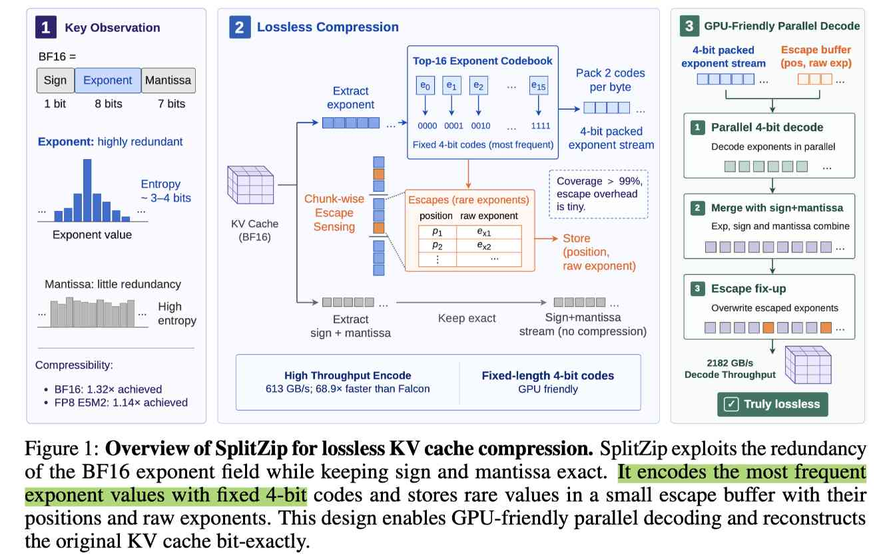

# SplitZip: Ultra Fast Lossless KV Compression for Disaggregated LLM Serving

> Yipin Guo, Siddharth Joshi

> 注：以下论文笔记由 AI Agent 自动生成，可能存在理解偏差或遗漏，请以原论文为准。

## Abstract

Contemporary systems serving LLMs have adopted prefill-decode disaggregation. Prefill workers generate a KV cache that must be transferred to decode workers before generation can begin, making transfer a bottleneck for long-input and agentic workloads. Existing lossless codecs primarily target offline weight compression, run on CPUs, or use variable-length coding whose compression cannot keep up with KV production. SplitZip is a GPU-friendly lossless compressor for KV cache transfer that preserves KV tensors bitwise and integrates into serving frameworks without modifying model execution. It exploits redundancy in floating-point exponents, encoding frequent exponent values with fixed-length codes and routing rare exponents through sparse escapes. SplitZip achieves 613.3 GB/s compression throughput and 2181.8 GB/s decompression throughput; end-to-end transfer experiments show up to 1.32x speedup for BF16 KV cache transfer, 1.30x speedup for TTFT, and 1.23x request throughput increase.

- kv cache压缩 解压缩，降低PD 分离传输kv cache负载

- 在SGLang Mooncake 上改进

## 一句话总结

SplitZip 是面向 PD 分离 serving 的 GPU lossless KV transfer codec：不改变 KV 数值，利用 BF16/FP8 exponent 分布冗余做固定长度编码和稀疏 escape。

## 创新点

1. lossless KV transfer compression：针对 prefill→decode KV 传输而非模型权重，保证 bitwise-preserving，不引入精度损失。
2. GPU-friendly fixed-code path：用 top-16 exponent 4-bit code 覆盖 99% 以上元素，少量 rare exponent 走 sparse escape，避免 Huffman 变长码的串行依赖。
3. 服务框架可插拔：压缩/解压在 KV 迁移路径完成，不需要改模型计算语义。

## 带来什么提升

1. BF16 KV 上压缩吞吐 613.3 GB/s、解压吞吐 2181.8 GB/s，适合 latency-critical codec path。
2. 端到端 BF16 KV transfer 最高加速 1.32×，TTFT 最高加速 1.30×，request throughput 最高提升 1.23×。
3. 对 FP8 E5M2 KV 仍可额外获得最高 1.14× 压缩，说明低精度 KV 仍存在可利用 exponent 冗余。

## 备注

- 这是通信带宽优化，不减少 decode worker 最终需要持有的 KV 语义容量；适合与 KVServe/PD disaggregation 组合。
