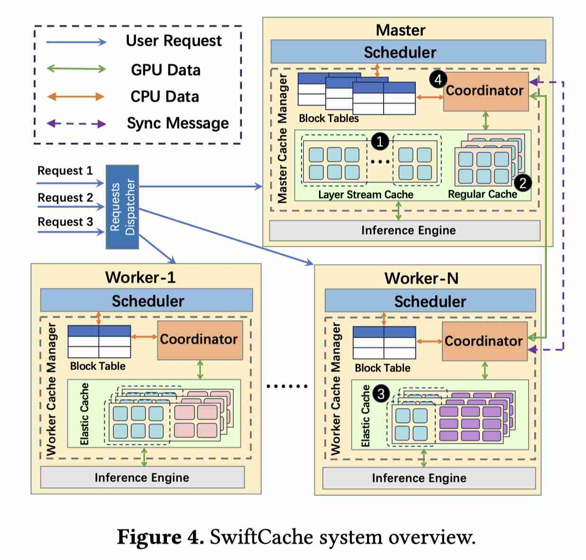

# SwiftCache: Efficient LLM Serving for Multi-turn Conversations with Heterogeneous KV Cache Sharing

> Jianmin Hu, Minxian Xu, Sa Wang, Chong Ma, Min Shen, Kejiang Ye, Lin Qu, Chengzhong Xu

> 注：以下论文笔记由 AI Agent 自动生成，可能存在理解偏差或遗漏，请以原论文为准。

## Abstract

Multi-turn conversation is a fundamental scenario in LLM applications, widely used in chatbots and AI agents. As the conversation evolves, historical tokens accumulate continuously. Existing systems cache their key-value (KV) pairs to avoid redundant computation. However, limited GPU memory (HBM) capacity often forces these KV caches to be offloaded to CPU memory or SSD, making KV cache reloads increasingly costly in terms of latency as the context grows. Meanwhile, the constrained HBM capacity also limits the maximum inference length, thereby restricting the number of turns that can be supported in a conversation. To address these two challenges, we propose SwiftCache, a collaborative inference system that enables heterogeneous models to share underutilized GPU memory and NVLink bandwidth within a server. Specifically, models with low KV cache demand donate idle GPU memory to store the prefix cache of high-demand models, allowing cross-model KV cache sharing over NVLink and avoiding slow PCIe transfers. SwiftCache further reduces memory pressure by keeping only the KV cache of the currently active layer in local GPU memory, thereby enabling longer-context inference. Our experiments on real-world workloads show that SwiftCache reduces P99 time-to-first-token (TTFT) by up to 69% and extends maximum context length by up to 3.98x compared to vLLM and SGLang, with minimal interference to co-located models.

## 一句话总结

SwiftCache 把多轮对话中的历史 KV 从单模型私有缓存扩展成同机异构模型之间可共享的 GPU/NVLink 资源池，用低 KV 压力模型的空闲 HBM 承载高需求模型的 prefix cache。

## 创新点

1. 异构模型协作式 KV 共享：让 co-located 模型按 KV 需求差异互借 HBM，通过 NVLink 访问远端 GPU 上的 prefix cache，避开 PCIe/CPU/SSD reload。
2. 按层活跃 KV 管理：本地只保留当前活跃 layer 的 KV，其余 prefix KV 可放在 donor GPU，降低单模型 HBM 峰值。
3. 面向真实多轮会话的 serving 机制：把 cache placement、NVLink transfer、模型干扰控制结合起来，而不是只做离线 KV 压缩。

## 带来什么提升

1. 相比 vLLM/SGLang，P99 TTFT 最高降低 69%，直接改善长对话首 token 延迟。
2. 最大上下文长度最高扩展 3.98×，缓解多轮历史不断累积导致的 HBM 容量墙。
3. 对共置模型干扰较小，说明跨模型 KV cache sharing 可以作为异构 serving 集群的系统级优化方向。

## 备注

- 更偏单机多 GPU/NVLink 场景；跨节点或无高速互联时收益会受限。
