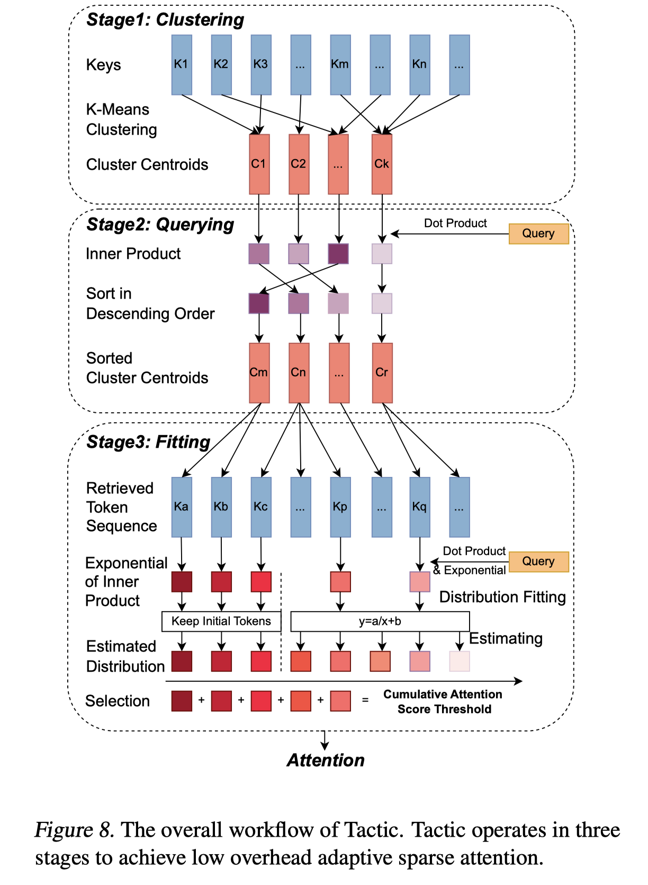

# Tactic: Adaptive Sparse Attention with Clustering and Distribution Fitting for Long-Context LLMs

> Kan Zhu, Tian Tang, Qinyu Xu, Yile Gu, Zhichen Zeng, Rohan Kadekodi, Liangyu Zhao, Ang Li, Arvind Krishnamurthy, Baris Kasikci

## Abstract

Long-context models are essential for many applications but face inefficiencies in loading large KV caches during decoding. Prior methods enforce fixed token budgets for sparse attention, assuming a set number of tokens can approximate full attention. However, these methods overlook variations in the importance of attention across heads, layers, and contexts. To address these limitations, we propose Tactic, a sparsity-adaptive and calibration-free sparse attention mechanism that dynamically selects tokens based on their cumulative attention scores rather than a fixed token budget. By setting a target fraction of total attention scores, Tactic ensures that token selection naturally adapts to variations in attention sparsity. To efficiently approximate this selection, Tactic leverages clustering-based sorting and distribution fitting, allowing it to accurately estimate token importance with minimal computational overhead. We show that Tactic outperforms existing sparse attention algorithms, achieving superior accuracy and up to 7.29x decode attention speedup. This improvement translates to an overall 1.58x end-to-end inference speedup, making Tactic a practical and effective solution for long-context LLM inference in accuracy-sensitive applications.

---

*以下总结由 MiMo 生成：*

这篇论文针对长上下文大语言模型在解码时加载大KV缓存效率低下的问题，提出了一种名为Tactic的自适应稀疏注意力机制。该方法通过动态选择基于累积注意力分数的令牌，而非固定令牌预算，并利用聚类排序和分布拟合来高效近似令牌重要性。实验表明，Tactic在保持高精度的同时，实现了高达7.29倍的解码注意力加速和1.58倍的端到端推理加速，优于现有稀疏注意力算法。
