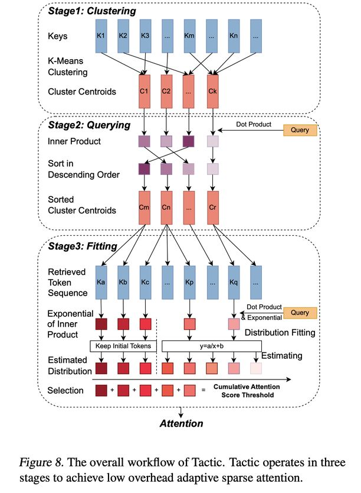

# Tactic: Adaptive Sparse Attention with Clustering and Distribution Fitting for Long-Context LLMs

> Kan Zhu, Tian Tang, Qinyu Xu, Yile Gu, Zhichen Zeng, Rohan Kadekodi, Liangyu Zhao, Ang Li, Arvind Krishnamurthy, Baris Kasikci

## 一句话总结

Tactic 提出了一种基于累积注意力分数的自适应稀疏注意力机制，利用聚类排序和分布拟合技术，动态选择关键 token，实现了在长上下文 LLM 推理中高达 7.29× 的解码注意力加速和 1.58× 的端到端推理加速，同时保持优于现有方法的精度。

---

## 摘要翻译

长上下文模型对许多应用至关重要，但在解码时加载大规模 KV 缓存存在效率低下的问题。现有方法为稀疏注意力设置了固定的 token 预算，假设固定数量的 token 可以近似完整注意力。然而，这些方法忽略了注意力在不同 head、层和上下文中的重要性差异。为解决这些局限性，我们提出了 Tactic——一种稀疏自适应且无需校准的稀疏注意力机制，它基于 token 的累积注意力分数而非固定 token 预算来动态选择 token。通过设定总注意力分数的目标比例，Tactic 确保 token 选择能够自然适应注意力稀疏性的变化。为高效近似这一选择过程，Tactic 利用基于聚类的排序和分布拟合，以极小的计算开销准确估计 token 重要性。我们证明 Tactic 在精度上优于现有稀疏注意力算法，实现了高达 7.29× 的解码注意力加速，对应 1.58× 的端到端推理加速，使其成为精度敏感应用中长上下文 LLM 推理的实用高效解决方案。

---

## 研究动机

### 长上下文推理的瓶颈

随着多轮交互和长文档处理需求的增加，LLM 的上下文长度已扩展到百万 token 级别。然而，KV 缓存的内存需求与上下文长度成正比，加载 KV 缓存成为解码时的主要瓶颈——在自回归解码中，KV 缓存加载可占总延迟的 50% 以上。

### 现有方法的局限

现有固定 token 预算方法（如 Quest、H2O）存在以下问题：

1. **全局固定预算的不足**：所有 head 和层使用统一的 token 预算，但不同 head 展现出截然不同的稀疏性模式——部分 head 为"检索型 head"（注意力分布均匀），部分为"流式型 head"（注意力集中在少数 token 上）。统一预算导致流式型 head 分配过多 token，而检索型 head 引入显著估计误差。

2. **静态分配的不适应性**：PyramidKV、AdaKV 等方法尝试使用校准数据或预定义规则动态分配预算，但仍然受限于静态分配，无法适应不同 query token 和上下文的变化。例如，生成 "The Answer is..." 时，"Answer" 仅需局部信息，而 "is" 需要更广泛上下文，两者稀疏性差异显著。

3. **缺乏理论保证**：固定 token 预算无法保证注意力近似误差的上界。

---

## 方法（技术细节）

### 核心思想：累积注意力分数目标

Tactic 的核心创新在于将 token 选择目标从"固定 token 数量"转变为"累积注意力分数达到目标比例 P"。

**数学定义**：设 p(I) 为选中 token 集合 I 的累积注意力分数：

$$p(I) = \sum_{i \in I} s_i = \frac{\sum_{i \in I} \exp(q k_i^\top / \sqrt{d})}{\sum_{i=1}^n \exp(q k_i^\top / \sqrt{d})}$$

**理论保证**：注意力输出误差的上界为：

$$\epsilon(I) \leq 2(1 - p(I)) \max_i \|v_i\|$$

由于 V 向量的范数在不同 token 间变化很小（图 2 证实），设置 P 接近 1.0 可以保证稀疏注意力与完整注意力的差异有界。

### 三阶段工作流程

#### 阶段 1：聚类（Clustering）

在 prefill 阶段，对每个 head 的 Key 向量执行 K-means 聚类：

- **基于 Key 向量相似度**：与先前方法（如 Quest）使用位置相邻性不同，Tactic 利用 Key 向量的向量距离进行聚类，因为相邻 token 的 Key 向量在嵌入空间中往往分散（图 6 的 t-SNE 可视化证实）。
- **平均聚类大小**：实验选择 32 个 token/簇以平衡精度和效率。
- **迭代次数**：最多 10 次迭代，实际收敛更快。
- **开销**：聚类时间在不同序列长度下均低于 prefill 时间的 6%。

#### 阶段 2：查询排序（Querying）

在 decode 阶段，通过 Query 向量与簇质心的点积确定簇的"关键性"：

- 按关键性降序排列簇，获得部分排序的 token 列表。
- 使用点积（而非距离）直接关联注意力分数，更准确。

#### 阶段 3：分布拟合（Distribution Fitting）

观察到排序后的注意力分数遵循平滑分布（长尾分布），Tactic 使用轻量函数 y = a/x + b 进行拟合：

- **参数估计**：在曲线中段选择两个片段（如 10% 和 60% 处），计算每个片段的平均值，解出参数 a 和 b。
- **异常值处理**：前 1-2% 的 token 通常是异常值（注意力分数高但不符合曲线），对这些 token 直接计算 exp(q·k/√d)。
- **累积分数追踪**：利用拟合的曲线估算所有 token 的注意力分数，计算达到目标累积分数所需的最小 token 数。

### Group Query Attention 优化

对于使用 GQA 的模型，同一组内的多个 query head 可能选择不同的 KV token。Tactic 通过取 union（并集）简化问题——加载所有 query head 选择的 token 并集，避免重复加载。消融实验显示，取 union 可实现高达 1.65× 的注意力加速。

### 注意力计算实现

- 使用 FlashInfer 进行实际注意力计算。
- 处理 head 间的不平衡工作负载：将每个请求拆分为子请求，每个子请求处理一个 KV head 及其对应的 Query head，将 head 级不平衡转化为序列级不平衡。
- 每隔固定解码步数（如 2048）更新聚类，以平衡效率和精度。
- 对新生成的 token 执行完整注意力。
- 实际加载的 KV cache 仅约原始大小的 2.5%。

---

## 实验结果

### 实验设置

- **模型**：Llama-3.1-8B-Instruct（GQA）、MegaBeam-Mistral-7B-512k（512K 上下文）
- **数据集**：PG19（语言建模）、LongBench（6 个任务）、RULER（长上下文基准）
- **基线方法**：Quest、PyramidKV、Ada-SnapKV
- **硬件**：Nvidia Ada 6000 GPU，CUDA 12.4

### 准确性

1. **PG19 语言建模**：在 80% 和 90% 阈值下，Tactic 的 KL 散度（与完整注意力的差异）在所有基线中最低（图 9）。

2. **LongBench 任务**（表 2）：
   - 在 70% 阈值下，Tactic 在多数任务上优于 Quest、PyramidKV 和 AdaKV。
   - 在 90% 阈值下，Tactic 性能接近完整注意力，在所有基线中表现最优。
   - 例如，Llama-3.1-8B-Instruct 上：
     - MultiFieldQA：Tactic 54.35 vs PyramidKV 48.15 vs AdaKV 49.15（90% 阈值）
     - NarrativeQA：Tactic 29.59 vs PyramidKV 26.97 vs AdaKV 27.86（90% 阈值）

3. **RULER 基准**（表 4）：
   - 在 75% 阈值下，Tactic 平均准确率 84.7（Llama）和 85.2（MegaBeam），远高于 PyramidKV（63.1/77.1）和 Ada-SnapKV（59.2/76.8）。
   - 在 90% 阈值下，Tactic 平均准确率 84.6（Llama），接近完整注意力的 86.8。

### 效率

1. **解码注意力加速**：最高达 7.29×，解码阶段延迟显著降低（图 10）。
2. **端到端加速**：最高达 1.58×（图 12），考虑了 prefill 阶段和聚类开销。
3. **聚类开销**：在所有序列长度下，聚类时间均低于 prefill 时间的 6%。
4. **Query Head Union**：取 union 可实现最高 1.65× 注意力加速（图 11）。
5. **实际 token 选择**：Tactic 选择的 token 数远少于 token 总数，仅加载约 2.5% 的 KV cache（表 3 显示平均选择 token 数）。

---

## 优势

1. **自适应性**：基于累积注意力分数而非固定 token 预算，自然适应不同 head、层、query token 和上下文的稀疏性变化，无需校准数据。

2. **理论保证**：累积注意力分数目标提供了注意力近似误差的明确上界（公式 6），这是固定预算方法所不具备的。

3. **高精度**：在多个基准上（PG19、LongBench、RULER）一致性地优于 Quest、PyramidKV、AdaKV 等现有方法，在 90% 阈值下接近完整注意力性能。

4. **显著加速**：解码注意力最高 7.29× 加速，端到端 1.58× 加速，对长上下文推理具有实际意义。

5. **无需校准**：与 PyramidKV 等需要校准数据的方法不同，Tactic 完全无需预校准，适应性强。

6. **基于语义的聚类**：使用 K-means 基于 Key 向量相似度聚类，而非位置相邻性，更符合注意力计算的本质（Query-Key 交互）。

7. **轻量分布拟合**：使用简单的 y = a/x + b 函数拟合注意力分数分布，计算开销极小。

8. **兼容 GQA**：通过 union 操作兼容 GQA 模型，实际加载的 KV cache 远小于原始大小。

---

## 局限

1. **聚类开销**：聚类时间随序列长度二次增长（主要来自距离计算），虽然占 prefill 时间不到 6%，但在超长序列（如 128K）下仍可能成为瓶颈。

2. **固定阈值的灵活性**：当前使用固定的累积注意力分数阈值 P，虽然自适应性已优于固定预算方法，但未考虑不同任务对精度和速度的权衡需求。

3. **分布拟合的近似误差**：前 1-2% 的异常值 token 需要直接计算，分布拟合在注意力分数分布非平滑时可能引入误差。

4. **聚类更新间隔**：每 2048 步更新一次聚类，在此间隔内聚类可能过时，影响 token 选择的准确性。

5. **缺乏训练数据的利用**：Tactic 是后训练方法，完全不利用训练数据或模型内部信息（如注意力权重），可能错过进一步优化的机会。

6. **仅关注解码阶段**：Tactic 主要针对 decode 阶段的 KV cache 加载优化，未涉及 prefill 阶段的优化。

7. **代码未开源**：目前代码 URL 为空，限制了社区的复现和扩展。

8. **评估规模有限**：仅在 7B/8B 模型上进行了评估，未验证在更大模型（如 70B+）上的效果。

---

## 与 EfficientPaper 相关的研究方向

Tactic 属于 **attention_sparsity** 和 **kv_cache_management** 两个关键词领域，与以下研究方向密切相关：

1. **KV 缓存压缩与管理**：Tactic 通过稀疏注意力选择性加载 KV 缓存，与 KV 缓存压缩（如 GQA、MQA）和缓存驱逐策略（如 H2O、Quest）密切相关。

2. **稀疏注意力机制**：Tactic 的自适应稀疏注意力设计与注意力稀疏性研究（如 StreamingLLM、SnapKV）互补，提供了新的视角——基于累积注意力分数而非固定预算。

3. **长上下文 LLM 推理优化**：作为 ICLR 2026 论文，Tactic 是长上下文推理优化的重要进展，与 Pythagora、RingAttention 等方法共同推动长上下文效率。

4. **高效注意力计算**：Tactic 的聚类排序和分布拟合技术为高效注意力计算提供了新思路，可与 FlashInfer、FlashAttention 等硬件优化方法结合。

5. **动态 KV 缓存分配**：Tactic 的自适应 token 选择机制与动态 KV 缓存分配（如 AdaKV、PyramidKV）相关，但提供了更灵活、无需校准的解决方案。

6. **Group Query Attention 优化**：Tactic 通过 union 操作优化 GQA 模型的 KV 缓存访问，为 GQA 模型的高效推理提供了新方法。

7. **注意力模式分析**：论文对注意力稀疏性在 head、层、query token 和上下文间的变异进行了详细分析，为理解注意力机制的内在结构提供了有价值的见解。

---

*本笔记由 AI Agent（Hermes Agent）自动生成，基于论文全文分析。生成时间：2026年6月4日。*
*论文来源：arXiv:2502.12216v1，发表于 ICLR 2026。*
*注：本笔记仅供参考，具体细节请以论文原文为准。*
