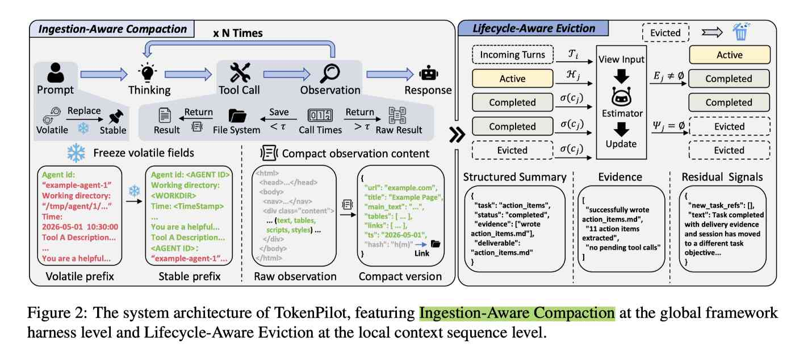

# TokenPilot: Cache-Efficient Context Management for LLM Agents

> Buqiang Xu, Zirui Xue, Dianmou Chen, et al.

> 注：以下论文笔记由 AI Agent 自动生成，可能存在理解偏差或遗漏，请以原论文为准。

## Abstract

As LLM agents are deployed in long-horizon sessions, context accumulation drives up inference costs. Existing approaches utilize text pruning or dynamic memory eviction to minimize token footprints; however, their unconstrained sequence mutations alter layouts, introducing prefix mismatches and cache invalidation. This reveals a critical trade-off between text sparsity and prompt cache continuity. To address this, we present TokenPilot, a dual-granularity context management framework. Globally, Ingestion-Aware Compaction acts as a framework harness to stabilize prompt prefixes and eliminate open-world environmental noise at the ingestion gate. Locally, Lifecycle-Aware Eviction monitors the ongoing residual utility of context segments, enforcing a conservative batch-turn schedule to offload content segments only when task relevance expires. Experiments on PinchBench and Claw-Eval under both isolated and continuous modes demonstrate that TokenPilot reduces costs by 61% and 56% in isolated mode, and 61% and 87% in continuous mode, while maintaining competitive performance compared to prior systems.

## 一句话总结

TokenPilot 通过全局前缀稳定化（将运行时易变字段替换为占位符以保持 byte-identical prefix）和局部生命周期感知驱逐（三状态机：active→completed→evictable，按批次保守驱逐）的双粒度框架，在不破坏 prompt cache 连续性的前提下大幅压缩 agent 上下文，实现 61-87% 推理成本降低。

## 创新点

1. **文本稀疏性 vs cache 连续性的 trade-off 洞察**：现有上下文压缩方法（截断/折叠/驱逐）以减少 token 为目标，但频繁的布局变动导致 KV cache 前缀不匹配、命中率骤降，反而抵消 token 节省收益。TokenPilot 明确将 cache 连续性纳入优化目标。
2. **全局 Ingestion-Aware Compaction**：在 harness 层对 prompt 前缀做确定性规范化——将易变运行时变量（agent ID、时间戳、工作目录）替换为静态占位符，保证跨 turn 的 byte-identical prefix；同时在 ingestion gate 对环境反馈（工具返回的 HTML/JSON）做去噪降维，通过 hash 索引保留完整内容的 fallback 回调。
3. **局部 Lifecycle-Aware Eviction**：将上下文划分 segment，维护三状态（active / completed / evictable）；completed 状态不立即驱逐，由基于模型的在线估计器每 B 个 turn 批量评估残余效用 Ψ，仅当 Ψ=∅ 时才转入 evictable，保守调度避免逐 turn 的碎片化 paging。

## 带来什么提升

1. **大幅成本降低**：在 PinchBench 上 isolated mode 成本降 61%，continuous mode 降 61%；在 Claw-Eval 上 isolated mode 降 56%，continuous mode 降 87%，同时 Overall 性能与 Vanilla agent 相当甚至更优（81.0 vs 80.5）。
2. **Cache 命中率显著提升**：相比 Vanilla agent，TokenPilot 在 continuous mode 下 cache read tokens 从 55.3M 增至 58.0M（isolated）且 cache miss 从 8.753M 降至 1.933M，命中率提升约 5×。
3. **兼容性强**：作为 harness-level 框架可与任意 LLM backend 配合，已集成到 LightMem2（ZJU-NLP 开源项目），不依赖特定推理引擎。

## 备注

- 评估基准 PinchBench 和 Claw-Eval 涵盖 11 类任务（Productivity / Research / Writing / Code / Analysis / CSV / Log / Meeting / Memory / Skill / Integration），覆盖面广。
- Baselines 包括 LLMLingua-2、SelectiveContext、LCM、Pichay、Summary、MemoBrain、AgentSwing、Keep-Last-N、MemOS 等，均为外部记忆/压缩系统，均不在 EfficientPaper 现有 meta 中，因此 baseline 引用留空。
