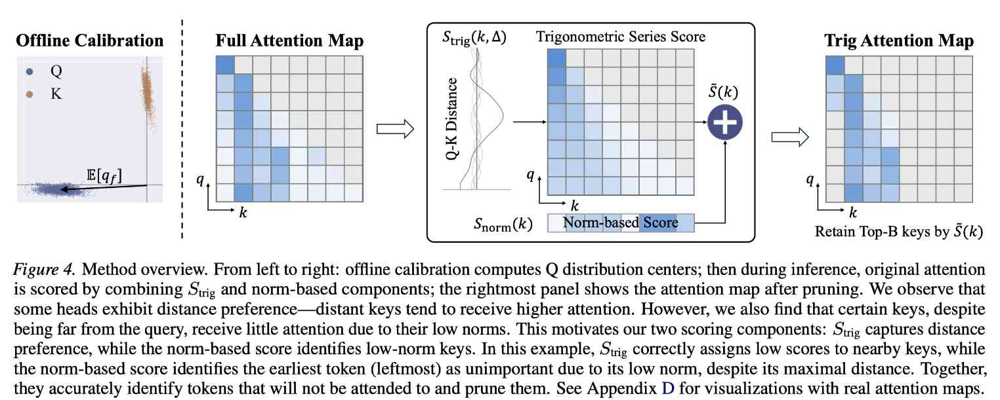

# TriAttention: Efficient Long Reasoning with Trigonometric KV Compression

> Weian Mao, Xi Lin, Wei Huang, Yuxin Xie, Tianfu Fu, Bohan Zhuang, Song Han, Yukang Chen

## Abstract

Extended reasoning in large language models (LLMs) creates severe KV cache memory bottlenecks. Leading KV cache compression methods estimate KV importance using attention scores from recent post-RoPE queries. However, queries rotate with position during RoPE, making representative queries very few, leading to poor top-key selection and unstable reasoning. To avoid this issue, we turn to the pre-RoPE space, where we observe that Q and K vectors are highly concentrated around fixed non-zero centers and remain stable across positions -- Q/K concentration. We show that this concentration causes queries to preferentially attend to keys at specific distances (e.g., nearest keys), with the centers determining which distances are preferred via a trigonometric series. Based on this, we propose TriAttention to estimate key importance by leveraging these centers. Via the trigonometric series, we use the distance preference characterized by these centers to score keys according to their positions, and also leverage Q/K norms as an additional signal for importance estimation. On AIME25 with 32K-token generation, TriAttention matches Full Attention reasoning accuracy while achieving 2.5x higher throughput or 10.7x KV memory reduction, whereas leading baselines achieve only about half the accuracy at the same efficiency. TriAttention enables OpenClaw deployment on a single consumer GPU, where long context would otherwise cause out-of-memory with Full Attention.

---

*以下总结由 MiMo 生成：*

这篇论文旨在解决大语言模型在长推理任务中KV缓存内存瓶颈的问题。为此，作者提出了一种名为TriAttention的方法，通过利用RoPE前空间中Q/K向量的浓度特性，结合三角级数来估计键的重要性。该方法在保持全注意力推理精度的同时，实现了2.5倍的吞吐量提升或10.7倍的KV内存减少，显著优于现有基线方法。

---

## 论文详细总结

> 由 GPT 自动生成，请人工核验。

### 1. 研究背景与动机

长推理模型会生成数万 token 的 chain-of-thought，KV cache 随生成长度线性增长，成为显存瓶颈。现有 KV cache compression 通常用最近若干 post-RoPE query 的 attention score 来估计 key 重要性，例如 H2O、SnapKV、R-KV、LazyEviction 等。

TriAttention 指出现有方法在长推理中不稳定的根因：**RoPE 会随位置旋转 query 方向**，导致只有极少数最近 query 的方向仍然“新鲜”且可代表未来 query。观察窗口太短时，某些当前低 attention、未来关键的 token 会被永久淘汰，尤其会破坏 reasoning chain 或 retrieval head 的长期记忆。

### 2. TriAttention 核心思想

作者转向 **pre-RoPE space**，发现 Q/K 向量在很多 attention head 中会集中在固定非零中心附近，并且这种 **Q/K concentration** 跨位置、跨输入内容和跨领域都稳定。由于 RoPE 本质是按位置旋转，当 pre-RoPE Q/K 近似为固定中心时，attention logit 可以化简为只依赖 Q-K 距离的 **trigonometric series**。

一句话概括：**TriAttention 用 pre-RoPE Q/K 中心推导未来 query 对不同距离 key 的偏好，再结合 key norm，对 KV 中的 key 进行重要性打分和保留。**

### 3. 关键技术

| 技术 | 说明 |
|------|------|
| **Q/K concentration** | pre-RoPE Q/K 在大量 head 中围绕固定非零中心集中；Qwen3-8B 上 Math/Coding/Chat 的 MRL 约 0.977–0.980，约 90% heads 的 R > 0.95。 |
| **Trigonometric distance preference** | 将 Q/K 中心代入 RoPE attention 公式后，logit 变为关于 Q-K 距离的三角级数，可预测某些距离上的 key 更容易被关注。 |
| **Trigonometric score `Strig`** | 用 calibration data 得到 Q center，再对 cache 中每个 key 按多个未来 offset 计算距离偏好分数。 |
| **Norm-based score `Snorm`** | 对 Q/K concentration 较弱的 head，用 query/key norm 作为补充信号，避免只依赖中心近似。 |
| **Concentration-adaptive weighting** | 用 Mean Resultant Length `R` 自动平衡 `Strig` 和 `Snorm`：R 高时信任三角级数，R 低时增加 norm 信号权重。 |
| **Periodic pruning** | 与 R-KV 类似，每生成 128 tokens 触发一次压缩，将 KV cache 剪回指定 budget。 |
| **Cross-domain calibration** | Q/K 中心是 model-intrinsic property，用 coding 数据校准后在 reasoning benchmark 上仍能工作，说明不强依赖校准数据语义。 |

### 4. 实验结果

| 指标 | 结果 |
|------|------|
| 主任务 | Mathematical reasoning：AIME24、AIME25、MATH 500 |
| 泛化任务 | LongBench、RULER，附录中还比较 H2O 等方法 |
| 主模型 | Qwen3-8B、DeepSeek-R1 distilled Qwen/Llama 系模型；OpenClaw demo 用 Qwen3-32B INT4 |
| AIME25 主结果 | 32K generation 下匹配 Full Attention accuracy，同时实现 **2.5× throughput** 或 **10.7× KV memory reduction** |
| MATH 500 | 相近准确率下 throughput 从 Full Attention **222.8 tokens/s** 提升到 **1405.2 tokens/s**，约 **6.3×** |
| 与 R-KV 比较 | 相近 accuracy 下 KV budget 减半（1024 vs 2048）且 throughput 提升 **85%**（1405.2 vs 760.4 tokens/s） |
| 相同 memory budget | TriAttention 在 MATH 500 上比 R-KV 高 **8.0 points**，AIME24 高 **15.4 points** |
| Ablation `Strig` | 去掉 trigonometric series 后 AIME24/AIME25 从 42.1/32.9 降到 18.8/21.2，说明距离偏好是核心。 |
| LongBench / RULER | LongBench 平均 48.1，超过 Ada-KV+SnapKV 的 45.6；RULER 平均 66.1，超过 SnapKV 10.5 points。 |
| OpenClaw 部署 | Qwen3-32B INT4 在单张 RTX 4090 上，Full Attention 多轮长上下文 OOM，TriAttention 可运行。 |

### 5. 核心贡献

1. 发现并系统验证 **pre-RoPE Q/K concentration**，指出其是跨领域、跨架构较稳定的模型内在属性。
2. 推导 Q/K concentration 下 RoPE attention 与 Q-K distance 的三角级数关系，为 KV key importance 提供非 recent-query 的预测信号。
3. 提出 TriAttention，将 trigonometric distance preference、Q/K norm 和 concentration-adaptive weighting 结合做 KV cache pruning。
4. 在长推理任务中显著优于基于 post-RoPE recent attention 的方法，缓解 R-KV 等方法因短观察窗口造成的关键 token 遗漏。
5. 展示 TriAttention 可让长推理 agent 在消费级 GPU 上部署，具备实际 serving 价值。

### 6. 局限性与讨论

- TriAttention 需要离线 calibration 来收集 Q/K center 和 norm 统计；虽然作者显示跨领域 calibration 稳定，但不同模型/attention 架构仍需重新统计。
- 其剪枝目标主要是 reasoning generation 中的 KV cache，和多轮交互式 KV offload、跨请求复用等系统问题互补。
- 方法依赖 RoPE 结构与 pre-RoPE 表征集中性；对非 RoPE 或表征不集中的模型需要重新验证。
- 当前总结中的性能数据主要来自论文报告；实际 serving 集成还需考察 pruning overhead、batching、paged KV layout 和 FlashAttention kernel 兼容性。

### 7. 对当前研究的启发

- TriAttention 提供了一个比 recent attention 更稳定的 token importance 信号，可用于 **training-free KV eviction / sparse KV retention**。
- 它提示 layer/head 级统计量可以作为 runtime policy 的低成本先验：例如把 Q/K concentration 与 KV offload、prefetch、recompute 策略结合。
- 可与 Bidaw/PredictKV 互补：TriAttention 解决“哪些 token/head 重要”，Bidaw/PredictKV 解决“重要 KV 放在哪一层、何时加载/淘汰”。
