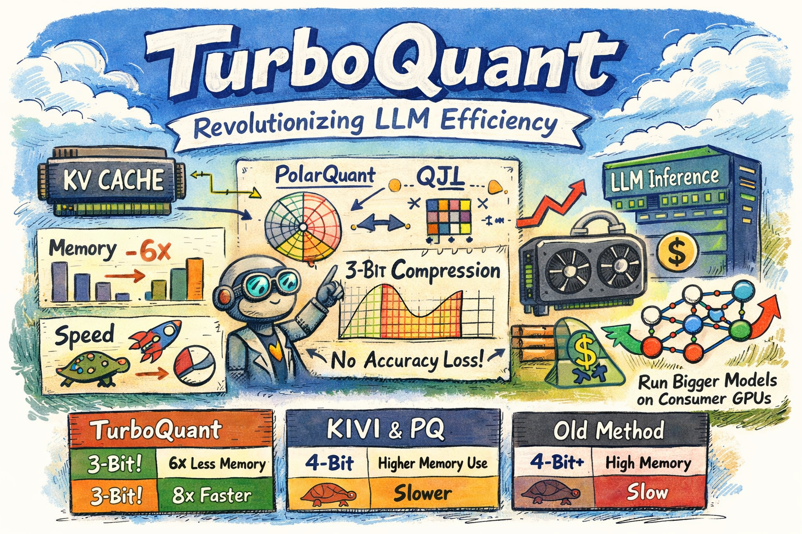

# TurboQuant: Online Vector Quantization with Near-optimal Distortion Rate

> Amir Zandieh, Majid Daliri, Majid Hadian, Vahab Mirrokni

## Abstract

Vector quantization, a problem rooted in Shannon's source coding theory, aims to quantize high-dimensional Euclidean vectors while minimizing distortion in their geometric structure. We propose TurboQuant to address both mean-squared error (MSE) and inner product distortion, overcoming limitations of existing methods that fail to achieve optimal distortion rates. Our data-oblivious algorithms, suitable for online applications, achieve near-optimal distortion rates (within a small constant factor) across all bit-widths and dimensions. TurboQuant achieves this by randomly rotating input vectors, inducing a concentrated Beta distribution on coordinates, and leveraging the near-independence property of distinct coordinates in high dimensions to simply apply optimal scalar quantizers per each coordinate. Recognizing that MSE-optimal quantizers introduce bias in inner product estimation, we propose a two-stage approach: applying an MSE quantizer followed by a 1-bit Quantized JL (QJL) transform on the residual, resulting in an unbiased inner product quantizer. We also provide a formal proof of the information-theoretic lower bounds on best achievable distortion rate by any vector quantizer, demonstrating that TurboQuant closely matches these bounds, differing only by a small constant ($\approx 2.7$) factor. Experimental results validate our theoretical findings, showing that for KV cache quantization, we achieve absolute quality neutrality with 3.5 bits per channel and marginal quality degradation with 2.5 bits per channel. Furthermore, in nearest neighbor search tasks, our method outperforms existing product quantization techniques in recall while reducing indexing time to virtually zero.

---

*以下总结由 MiMo 生成：*

这篇论文针对高维向量量化中现有方法难以达到最优失真率的问题，提出了TurboQuant方法。该方法通过随机旋转输入向量并利用高维坐标的近独立性，结合最优标量量化器实现数据无关的在线量化。TurboQuant在均方误差和内积失真上均达到接近理论最优的失真率（仅相差约2.7倍常数因子），并在KV缓存量化和最近邻搜索任务中展现出显著优势，如实现绝对质量中性量化并大幅减少索引时间。
