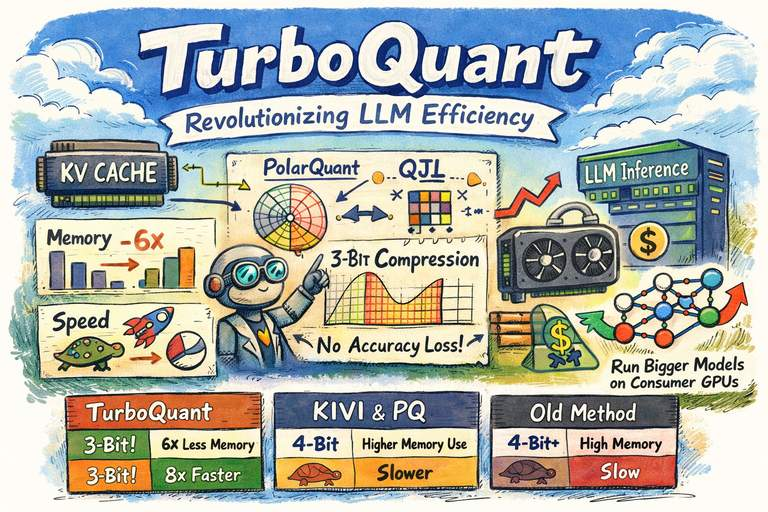

# TurboQuant: Online Vector Quantization with Near-optimal Distortion Rate

> Amir Zandieh, Majid Daliri, Majid Hadian, Vahab Mirrokni

> **生成声明**：本 note 由 AI Agent 自动生成，基于 arXiv 论文 2504.19874v1 全文阅读与分析。

---

## 一句话总结

TurboQuant 通过随机旋转诱导 Beta 分布 + 最优标量量化器的两阶段设计，在数据无关（online）条件下实现了接近信息论下界的最优失真率（仅差约 2.7 倍常数因子），在 KV 缓存量化和近邻搜索任务中表现优异。

---

## 摘要翻译

向量量化（Vector Quantization）是 Shannon 源编码理论的奠基性问题，旨在量化高维欧几里得向量的同时最小化几何结构失真。我们提出 TurboQuant 来解决均方误差（MSE）和内积失真问题，克服了现有方法无法达到最优失真率的局限。我们的数据无关算法适用于在线应用，在所有位宽和维度下均实现接近最优的失真率（仅差一个小常数因子）。TurboQuant 通过随机旋转向量，使坐标服从集中的 Beta 分布，并利用高维中不同坐标的近独立性，简单地对每个坐标应用最优标量量化器。鉴于 MSE 最优量化器在内积估计中引入偏差，我们提出两阶段方法：先应用 MSE 量化器，再对残差应用 1-bit 量化 JL（QJL）变换，从而得到无偏内积量化器。我们还提供了信息论下界的正式证明，表明 TurboQuant 与这些下界仅相差约 2.7 倍常数因子。实验结果验证了理论发现：在 KV 缓存量化中，以 3.5 bits/ch 实现绝对质量中性，以 2.5 bits/ch 实现微小质量退化；在近邻搜索任务中，以接近零的索引时间超越现有乘积量化技术。

---

## 研究动机

### 核心问题

向量量化（VQ）在高维欧氏空间中是压缩高维向量的基础技术，广泛应用于 LLM 推理加速（权重/激活量化）、KV 缓存压缩、以及向量数据库中的近邻搜索（Product Quantization）。核心目标是在将浮点坐标转换为低比特整数时，最小化 MSE 和内积失真。现有方法面临两个关键局限：

1. **缺乏加速器兼容性**：部分方法无法利用 GPU 向量化并行，计算速度慢，不适合实时 AI 应用（如 KV 缓存量化）。
2. **失真率次优**：现有方法在给定位宽下无法达到理论最优失真率，与信息论下界差距较大。

### 现有方法的局限

- **离线（data-dependent）方法**（如 GPTQ、AWQ）：需要大量预处理和校准，不适用于动态数据场景。
- **在线（data-oblivious）方法**：如 KIVI（scalar quantization，无理论最优保证）、QJL（仅 1-bit，内积无偏但 MSE 不够优化）。
- **网格投影方法**（如 RabitQ）：理论界次优（分析可能过于宽松），且计算效率低（无向量化，无法利用 GPU 加速）。
- **乘积量化（PQ）**：依赖 k-means 构建码本，需要大量预处理，不适合在线场景。

### 关键洞察

作者发现通过随机旋转输入向量，每个坐标服从 Beta 分布，在高维下收敛于正态分布，且不同坐标近独立。这使得最优标量量化器（Lloyd-Max）可以独立应用于每个坐标，从而实现近最优的向量量化。

---

## 方法（技术细节）

### 1. 问题定义

设计量化映射 $Q: \mathbb{R}^d \to \{0,1\}^B$，其中 $B = b \cdot d$（$b$ 为每坐标比特数）。目标是最小化 MSE 和内积失真，同时要求内积估计无偏。

MSE 失真定义：
$$D_{\text{mse}} = \mathbb{E}_Q\left[\|x - Q^{-1}(Q(x))\|_2^2\right]$$

内积失真定义：
$$D_{\text{prod}} = \mathbb{E}_Q\left[|\langle y, x\rangle - \langle y, Q^{-1}(Q(x))\rangle|^2\right]$$

### 2. MSE 最优 TurboQuant（TurboQuant_mse）

#### 2.1 随机旋转 + Beta 分布

对输入向量 $x \in S^{d-1}$ 应用随机旋转矩阵 $\Pi$（由随机正交矩阵得到），旋转后向量 $\Pi \cdot x$ 均匀分布在单位球上。关键性质：**每个坐标 $y_j$ 服从 Beta 分布**，概率密度为：
$$f_X(x) = \frac{\Gamma(d/2)}{\sqrt{\pi} \cdot \Gamma((d-1)/2)} (1-x^2)^{(d-3)/2}$$

在高维下，该分布收敛于正态分布 $N(0, 1/d)$。

#### 2.2 近独立性

高维中，不同坐标近独立（超越仅不相关），允许对每个坐标独立应用最优标量量化器。

#### 2.3 Lloyd-Max 标量量化器

将 $[-1, 1]$ 划分为 $2^b$ 个区间（Voronoi 区域），通过求解连续 1-D k-means 问题（Eq. 4）获得最优质心 $c_1, \ldots, c_{2^b}$。对不同位宽预计算并存储最优码本（如 $b=1,2$ 时质心分别为 $\pm\sqrt{2/(\pi d)}$ 和 $\{\pm 0.453/\sqrt{d}, \pm 1.51/\sqrt{d}\}$）。

#### 2.4 算法流程（Algorithm 1）

**Quantmse(x)**：$\Pi \cdot x$ → 对每个坐标找到最近质心 → 输出索引（$b \cdot d$ bits）

**DeQuantmse(idx)**：检索质心 → 乘以 $\Pi^T$ 旋转回原坐标空间

#### 2.5 理论保证（Theorem 1）

对于 $x \in S^{d-1}$，MSE 失真上界：
$$D_{\text{mse}} \leq \frac{\sqrt{3}\pi}{2} \cdot \frac{1}{4^b}$$

具体值（$b=1,2,3,4$）：$D_{\text{mse}} \approx 0.36, 0.117, 0.03, 0.009$。

### 3. 内积最优 TurboQuant（TurboQuant_prod）

#### 3.1 问题

MSE 最优量化器对内积估计有偏。例如 $b=1$ 时，MSE 量化器的内积估计有 $2/\pi$ 的乘性偏差，随着 $b$ 增加偏差逐渐减小。

#### 3.2 两阶段方法（Algorithm 2）

1. **第一阶段**：对 $x$ 应用 TurboQuant_mse（位宽 $b-1$），得到量化表示
2. **残差计算**：$r = x - Q^{-1}_{\text{mse}}(Q_{\text{mse}}(x))$（L2 范数很小）
3. **第二阶段**：对残差 $r$ 应用 QJL（1-bit 量化 JL 变换）

QJL 定义：$Q_{\text{qjl}}(x) = \text{sign}(S \cdot x)$，其中 $S$ 为 i.i.d. 高斯矩阵

反量化：$Q^{-1}_{\text{qjl}}(z) = \sqrt{\pi/2} \cdot S^T \cdot z / d$

最终内积估计：$\langle y, Q^{-1}_{\text{mse}}(Q_{\text{mse}}(x))\rangle + \|r\|_2 \cdot \langle y, Q^{-1}_{\text{qjl}}(Q_{\text{qjl}}(r))\rangle$

#### 3.3 理论保证（Theorem 2）

- **无偏性**：$\mathbb{E}[\langle y, \tilde{x}\rangle] = \langle y, x\rangle$
- **失真上界**：$D_{\text{prod}} \leq \frac{\sqrt{3}\pi^2 \cdot \|y\|_2^2}{2d} \cdot \frac{1}{4^b}$
- 具体值（$b=1,2,3,4$）：$D_{\text{prod}} \approx 1.57/d, 0.56/d, 0.18/d, 0.047/d$

### 4. 信息论下界（Theorem 3）

利用 **Shannon 下界（SLB）** + **Yao 极小极大原理**，证明：

- MSE 下界：$D_{\text{mse}} \geq 1/4^b$
- 内积下界：$D_{\text{prod}} \geq \|y\|_2^2/(d \cdot 4^b)$

TurboQuant 的 MSE 失真仅比信息论下界高约 $\sqrt{3}\pi^2/2 \approx 2.7$ 倍。在低位宽（$b=1$）时差距仅约 1.45 倍。

---

## 实验结果

### 评估基准与设置

- 硬件：单块 NVIDIA A100 GPU
- 数据集：DBpedia（1536/3072 维 OpenAI3 嵌入）、GloVe 嵌入

### 1. 理论验证（Section 4.1）

- 在 DBpedia（1536 维）上验证 MSE 和内积失真与理论上下界的一致性
- TurboQuant_prod 在所有位宽下保持无偏；TurboQuant_mse 有偏但随位宽增加而消除
- 实际失真与理论预测吻合

### 2. Needle-In-A-Haystack（Section 4.2）

- 模型：Llama-3.1-8B-Instruct
- 上下文长度：4K - 104K tokens
- 内存压缩比：0.25（仅用 25% 完整 KV 缓存）
- **TurboQuant 以 4× 压缩实现与全精度模型相同的性能**（Score: 0.997 vs 0.997）
- 优于 PolarQuant（0.995）、KIVI（0.981）、SnapKV（0.858）、PyramidKV（0.895）

### 3. LongBench 端到端生成（Section 4.3）

- 模型：Llama-3.1-8B-Instruct、Ministral-7B-Instruct
- 使用 2.5-bit 和 3.5-bit 量化（通过分离 outlier/non-outlier 通道实现非整数位宽）

| 方法 | KV 大小 | 平均分 |
|------|---------|--------|
| Full Cache (16-bit) | 16 | 50.06 |
| KIVI (3-bit) | 3 | 48.50 |
| PolarQuant (3.9-bit) | 3.9 | 49.78 |
| **TurboQuant (3.5-bit)** | **3.5** | **50.06** |
| TurboQuant (2.5-bit) | 2.5 | 49.44 |

- **3.5-bit TurboQuant 与全精度持平**（50.06 vs 50.06），压缩超过 4.5×
- 2.5-bit TurboQuant 仅有微小退化
- 显著优于 KIVI 和 PolarQuant

### 4. 近邻搜索（Section 4.4）

- 数据集：DBpedia（1536/3072 维）、GloVe（200 维）
- 对比基线：Product Quantization（PQ）、RabitQ
- 指标：Recall@1@k

**量化时间对比（4-bit）**：

| 方法 | d=200 | d=1536 | d=3072 |
|------|-------|--------|--------|
| PQ | 37.04s | 239.75s | 494.42s |
| RabitQ | 597.25s | 2267.59s | 3957.19s |
| **TurboQuant** | **0.0007s** | **0.0013s** | **0.0021s** |

- TurboQuant 在所有数据集和维度上均超越 PQ 和 RabitQ 的召回率
- 索引时间近乎为零（毫秒级 vs 数百至数千秒）

### 消融与额外发现

- 熵编码可进一步压缩码本指针（b=4 时可减少约 5%），但因增益有限未纳入 TurboQuant
- 量化器为数据无关（data-oblivious），无需预处理或校准

---

## 优势

1. **理论最优性**：MSE 失真仅比信息论下界高约 2.7 倍，内积失真同样接近最优，提供了严格的理论保证
2. **数据无关（Online）**：无需预处理或数据依赖的校准，适用于动态数据场景（如 KV 缓存在线量化）
3. **加速器友好**：基于标量量化和矩阵乘法，完全向量化，适合 GPU 并行处理
4. **两阶段无偏内积估计**：MSE 量化器 + QJL 残差修正，同时实现低 MSE 失真和无偏内积估计
5. **广泛的适用性**：适用于 KV 缓存量化、权重/激活量化、近邻搜索（Product Quantization）等多个场景
6. **极快的量化速度**：量化时间近乎为零（毫秒级），远优于 PQ（分钟级）和 RabitQ（小时级）
7. **低压比特下的优异表现**：b=1 时仅比下界高 1.45 倍，低位宽场景尤其适用
8. **简单且高效**：预计算码本 + 标量量化 + 可选 QJL，无复杂超参调优

---

## 局限

1. **随机旋转矩阵开销**：需要生成并存储 $d \times d$ 的随机正交矩阵 $\Pi$，当维度 $d$ 很大时可能产生额外存储和计算开销（尽管可预计算一次）
2. **对非单位范数向量的处理**：论文假设输入向量范数为 1（$S^{d-1}$），对于非单位范数向量需额外存储和恢复 L2 范数
3. **QJL 旋转矩阵的存储**：TurboQuant_prod 的内积版本需要额外存储 $d \times d$ 随机矩阵 $S$，增加内存开销
4. **渐进最优常数因子**：虽然在低位宽时差距很小（约 1.45），但在高位宽时渐近常数因子约为 2.7，仍有理论优化空间
5. **实验规模有限**：主要在 8B 规模模型上验证 KV 缓存量化，更大模型（70B+）和不同架构的效果有待进一步验证
6. **非整数位宽处理**：实际应用中使用 outlier/non-outlier 通道分离来实现非整数位宽（如 2.5-bit），增加了实现复杂度
7. **与更激进压缩方法的对比**：论文主要对比 KIVI、PolarQuant 等量化方法，未与更激进的 KV 缓存压缩方法（如 token 丢弃）进行直接对比
8. **随机矩阵依赖**：算法依赖随机矩阵的高维性质，对于低维数据（$d$ 较小时）可能效果较差

---

## 与 EfficientPaper 相关的研究方向

### 直接相关
- **KV 缓存量化**：TurboQuant 是在线 KV 缓存量化的最新进展，通过理论最优的向量量化方法实现接近无损的 KV 缓存压缩，关键词 `kv_cache_quant`
- **乘积量化（Product Quantization）**：TurboQuant 在近邻搜索任务中超越传统 PQ，无需预处理或码本学习
- **向量量化（Vector Quantization）**：基于 Shannon 源编码理论的现代向量量化方法，提供信息论最优的失真率保证

### Baseline 关联
- **KIVI（2024）**：TurboQuant 的 baseline 方法，KIVI 是一种免调优的非对称 2-bit KV 缓存量化方法，但缺乏理论最优性保证
- **PolarQuant（2025）**：另一种具有理论保证的 KV 缓存量化方法，TurboQuant 在 Needle-In-A-Haystack 任务中略优于它
- **QJL（2024）**：TurboQuant 的核心组件之一，提供无偏内积估计的 1-bit 量化变换
- **SnapKV（2024）、PyramidKV（2024）**：KV 缓存压缩的 token 级方法，TurboQuant 在 Needle-In-A-Haystack 任务中表现更优

### 扩展方向
- **LLM 推理优化**：TurboQuant 可与其他推理优化技术（如 FlashAttention、投机解码）结合，进一步加速 LLM 推理
- **权重/激活量化**：TurboQuant 的 MSE 最优量化器可扩展到模型权重和激活值的量化
- **向量数据库搜索**：TurboQuant 在近邻搜索中以近乎零的索引时间超越传统 PQ，对向量数据库性能提升有重要意义
- **低比特量化理论**：TurboQuant 提供了严格的信息论下界证明，对低比特量化的理论研究有重要参考价值
- **随机化量化方法**：TurboQuant 的随机旋转 + 标量量化范式可推广到其他高维向量压缩场景
- **高效 GPU 计算**：TurboQuant 的完全向量化设计对高效 GPU 计算有参考价值

---

## 参考信息

- **论文链接**：[arXiv:2504.19874v1](http://arxiv.org/abs/2504.19874v1)
- **代码仓库**：[GitHub](https://github.com/TheTom/turboquant_plus)（PyTorch）
- **机构**：Google Research、New York University、Google DeepMind
- **关键词**：quantization、kv_cache_quant
- **Baseline**：KIVI（2024）
- **发表**：ICLR 2026
