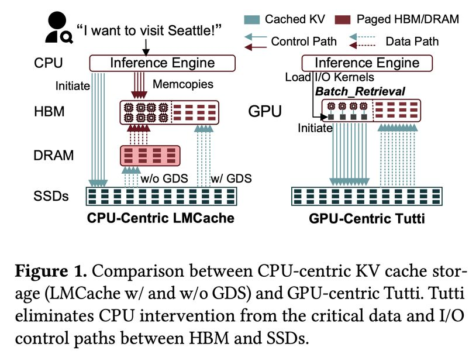

# Tutti: Making SSD-Backed KV Cache Practical for Long-Context LLM Serving

> Shi Qiu, Yifan Hu, Xintao Wang, Wenhao Zhu, Jianqin Yan, Hao Chen, Kaiqiang Xu, Kai Chen, Yiming Zhang

## Abstract

LLM serving relies on prefix caching to improve inference performance. As growing contexts push key-value (KV) cache footprint far beyond GPU HBM and CPU DRAM capacity, KV cache is increasingly offloaded to NVMe SSDs. Unfortunately, restoring KV cache from SSDs suffers from poor I/O performance and incurs significant GPU stalls. This is primarily because the fragmented GPU memory layout results in a massive number of tiny random I/Os, rendering the low-parallelism CPU a severe bottleneck even with GPU Direct Storage (GDS), which still relies on CPU intervention to initiate each I/O and thus remains CPU-centric. This paper presents Tutti, an efficient SSD-backed KV caching solution that eliminates CPU intervention from the critical data and I/O control paths between HBM and SSDs. At the core of Tutti is a GPU-centric KV cache object store, in which the CPU is only responsible for asynchronously loading I/O kernels once per layer to the GPU. Tutti saturates NVMe SSD bandwidth and reduces GPU stalls to near zero through the following designs: (i) we provide a GPU-native object abstraction that enables bulk KV cache transfers and management; (ii) we re-architect the GPU storage stack by introducing GPU io_uring to support asynchronous GPU direct object I/O; and (iii) we propose slack-aware I/O scheduling to avoid GPU resource contention. We have implemented Tutti and integrated it to vLLM. Extensive evaluation shows that compared to the state-of-the-art GDS-enabled, SSD-backed LMCache, Tutti reduces TTFT by 78.3% under strict SLO constraints and improves the achievable request rate by 2x. The serving cost is reduced by 27%. Tutti achieves nearly the same inference performance as DRAM-backed LMCache, while providing almost infinite capacity.

---

*以下总结由 MiMo 生成：*

这篇论文针对长上下文大语言模型服务中KV缓存容量不足的问题，提出了一种基于SSD的高效缓存方案。研究团队设计了Tutti系统，通过GPU中心化的对象存储和异步I/O机制，消除了CPU在关键数据路径上的干预。实验表明，Tutti在严格SLO约束下将首token延迟降低了78.3%，请求吞吐量提升2倍，服务成本降低27%，同时实现了接近DRAM缓存的推理性能。
