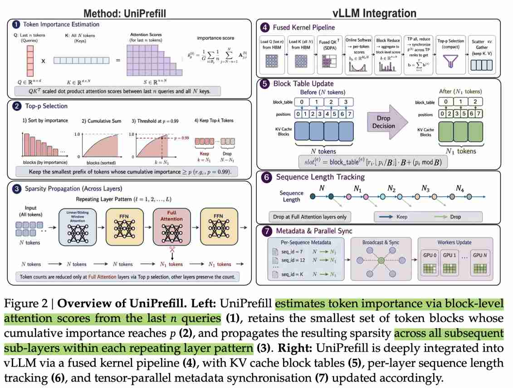

# UniPrefill: Universal Long-Context Prefill Acceleration via Block-wise Dynamic Sparsification

> Qihang Fan, Huaibo Huang, Zhiying Wu, Bingning Wang, Ran He

## Abstract

As large language models (LLMs) continue to advance rapidly, they are becoming increasingly capable while simultaneously demanding ever-longer context lengths. To improve the inference efficiency of long-context processing, several novel low-complexity hybrid architectures have recently been proposed, effectively alleviating the computational burden of long-context inference. However, existing research on long-context prefill acceleration remains predominantly focused on sparse attention mechanisms, which achieve their maximum speedup only on full-attention models. When transferred to emerging architectures--such as linear/full attention hybrids or sliding window/full attention hybrids--these prefill acceleration approaches suffer significant performance degradation. Furthermore, such methods are generally incompatible with continuous batching, making them difficult to integrate into modern inference engines such as vLLM. To this end, we propose UniPrefill, a prefill acceleration framework applicable to virtually any model architecture, which directly accelerates the model's computation at the token level. We further implement UniPrefill as a continuous batching operator and extend vLLM's scheduling strategy to natively support prefill-decode co-processing and tensor parallel for UniPrefill, enabling its seamless integration into vLLM. UniPrefill achieves up to 2.1x speedup in Time-To-First-Token (TTFT), with the acceleration becoming increasingly pronounced as the number of concurrent requests grows.

---

## 一句话总结

UniPrefill 提出了一种**通用的、与模型架构无关的预填充加速框架**，通过块级动态稀疏化（block-wise dynamic sparsification）在全注意力层估算 token 重要性并将稀疏性传播至所有后续层（包括线性注意力、滑动窗口注意力和 FFN 层），同时降低注意力和 GEMM 计算量，实现高达 2.1 倍的首令牌时间（TTFT）加速，并与 vLLM 连续批处理调度器无缝集成。

---

## 摘要翻译

随着大语言模型（LLM）的快速发展，它们的能力不断提升，同时对上下文长度的需求也在不断增长。为了提高长上下文处理的推理效率，近期提出了若干新型低复杂度混合架构，有效缓解了长上下文推理的计算负担。然而，现有长上下文预填充加速研究主要集中在稀疏注意力机制上，这些方法仅在全注意力模型上达到最大加速效果。当迁移到新兴架构（如线性/全注意力混合架构或滑动窗口/全注意力混合架构）时，这些预填充加速方法的性能会显著下降。此外，这些方法通常与连续批处理不兼容，难以集成到 vLLM 等现代推理引擎中。为此，我们提出 UniPrefill，一个适用于几乎所有模型架构的预填充加速框架，它在 token 级别直接加速模型计算。我们进一步将 UniPrefill 实现为连续批处理算子，并扩展 vLLM 的调度策略以原生支持预填充-解码协同处理和张量并行，使其能够无缝集成到 vLLM 中。UniPrefill 在首令牌时间（TTFT）上实现了最高 2.1 倍的加速，且随着并发请求数量的增加，加速效果更加显著。

---

## 研究动机

### 1. LLM 长上下文推理的效率瓶颈

随着 LLM 在文档理解、代码生成、多轮对话等应用中的广泛部署，上下文长度需求从数千 token 增长到数十万甚至百万 token。标准的 Softmax 自注意力机制（Self-Attention）随序列长度呈二次方复杂度增长，导致长上下文推理的计算成本极高。

### 2. 混合架构的兴起与现有加速方法的局限

为应对二次方复杂度瓶颈，新一代混合架构应运而生，主要包括两类：
- **线性/全注意力混合架构**（如 Qwen3-Next-80B-A3B）：将部分注意力层替换为线性递归机制，每层复杂度从 O(N²) 降至 O(N)
- **滑动窗口/全注意力混合架构**（如 Gemma-3-12B）：将大部分注意力层限制在固定局部上下文窗口，仅保留少量全局全注意力层

然而，现有预填充加速方法（如 MInference、FlexPrefill）主要依赖**稀疏注意力机制**，仅在全注意力模型上有效。在混合架构中，全注意力层只占一小部分（如 3:1 或 5:1 的比例），加速全注意力层的收益有限，剩余的计算开销完全未被优化。

### 3. 与连续批处理不兼容

现有稀疏注意力方法（如 FlexPrefill）以单个请求为单位操作，假设静态批处理组合，与 vLLM 等推理引擎的连续批处理调度范式不兼容，难以在生产环境中部署。

---

## 方法（技术细节）

### 核心思想

UniPrefill 的核心洞察是：**token 的重要性可以在全注意力层估算，并传播到所有后续层**。通过在全注意力层进行块级动态稀疏化，丢弃计算冗余的 token，不仅减少注意力 FLOPs，还减少所有后续层（包括 FFN）的 GEMM FLOPs。

### 1. Token 重要性估算（Token Importance Estimation）

对于输入序列 x = [x₁, ..., x_N]，模型由 B 个 block 组成，每个 block b 包含一个全注意力层和 M_b 个子层（线性注意力、滑动窗口注意力、FFN 等）。

- **注意力权重计算**：token i 对最终隐藏状态的贡献由注意力权重 A^(b)_{N,i} = softmax_i(q^(b)_N K^(b)^T / √d_k) 决定
- **聚合 last n 个 query**：为降低估算方差，聚合最后 n 个 query 位置的注意力权重：
  - s^(b)_i = (1/n) Σ_{j=N-n+1}^{N} A^(b)_{j,i}
  - 计算成本为 O(nNd_k)，当 n ≪ N 时可忽略
- **块级评分**：将输入序列划分为大小为 G 的不重叠块，计算每个块的平均重要性得分：
  - s̄^(b)_g = (1/G) Σ_{i∈B_g} (1/n) Σ_{j=N-n+1}^{N} A^(b)_{j,i}
  - 在完整 key 序列上进行 softmax 归一化后再进行块级聚合，确保得分反映真实的注意力分布

### 2. Top-p Token 选择（Top-p Token Selection）

采用 top-p 策略（而非 top-k）选择保留的 token 块：
- 按块级得分降序排列
- 保留最小的块集合 S^(b)，使得累积重要性分数达到阈值 p
- 始终保留前 A 个 token（注意力汇聚/attention sinks）和最后 n 个 token（query 窗口），确保因果一致性和数值稳定性
- **误差界**：|Δh^(b,1)_j| ≤ (1-p) · V^(b)_max，设置 p=0.99 保证最多丢弃 1% 的总注意力质量

**Top-p vs. Top-k**：top-k 固定保留数量，对注意力分布不敏感；top-p 自适应调整保留数量，注意力集中时保留少，分散时保留多，提供与序列长度和内容无关的一致误差界。

### 3. 跨所有层的稀疏性传播（Sparsity Propagation Across All Layers）

这是 UniPrefill 的关键创新：
- 在 block b 的全注意力层选定 token 后，被丢弃的 token 被排除在所有后续子层（全注意力、线性注意力、滑动窗口注意力、FFN）之外
- 仅保留的 token 集合 S^(b) 参与后续计算
- 在下一个 block b+1，丢弃的 token 状态保持不变（不更新），重新计算重要性得分
- **FLOPs 分析**：单次丢弃节省的 FLOPs 为 (1-ρ) · (L-ℓ₁) · O(Nd²)，与剩余层数线性相关
- **与稀疏注意力方法对比**：稀疏注意力仅节省注意力层的 FLOPs，UniPrefill 同时节省注意力和 GEMM FLOPs，在长上下文场景下优势更加明显

### 4. 融合内核与 vLLM 集成（Fused Kernel and vLLM Integration）

- **内核设计**：实现为 4 个融合的 Triton 内核，直接操作可变长度打包 token 表示（cu_seqlens 索引），无需创建 per-request 张量或填充
  - 部分 GEMM：S = Q[N-n:N]K^T
  - 在线 softmax：聚合 softmax(S) 得到 per-token 重要性得分
  - 块级聚合：在块内收缩得到块级得分向量
  - Top-p 选择：在 GPU 上完成排序和阈值化，无需 CPU 回传
- **张量并行**：在 TP 度为 T 时，每个 rank 观察 1/T 的注意力头，通过同步块级得分实现一致的丢弃决策
- **vLLM 调度器集成**：
  - 在丢弃事件时更新下游层的 query_start_loc、seq_lens、num_actual_tokens
  - 重新计算物理 KV cache slot 映射
  - 维护 per-request 丢弃历史，确保 decode 时每层的 KV 序列长度一致
  - 不修改模型权重或 PagedAttention 内存分配器

---

## 实验结果

### 1. RULER 基准测试（准确率与效率对比）

| 方法 | LLaMA-3.1-8B（全注意力） | Qwen3-Next-80B-A3B（线性/全注意力混合） | Gemma-3-12B（滑动窗口/全注意力混合） |
|------|--------------------------|----------------------------------------|-----------------------------------|
| Baseline（RULER Avg） | 90.36 | 94.76 | 79.99 |
| LazyLLM | 68.50 | 69.98 | 67.93 |
| SlimInfer | 68.87 | 68.55 | 68.83 |
| MInference | 90.68 | 94.31 | 79.25 |
| FlexPrefill | 89.62 | 93.97 | 78.64 |
| XAttention | 89.34 | 93.53 | 78.26 |
| ProxyAttn | 90.14 | 93.88 | 78.79 |
| **UniPrefill** | **90.45** | **93.94** | **78.87** |

| 方法 | LLaMA-3.1-8B（128K TTFT） | Qwen3-Next-80B-A3B（128K TTFT） | Gemma-3-12B（128K TTFT） |
|------|--------------------------|----------------------------------------|-----------------------------------|
| MInference | 1.34× | 1.05× | 1.03× |
| FlexPrefill | 1.46× | 1.08× | 1.04× |
| XAttention | 1.38× | 1.05× | 1.02× |
| ProxyAttn | 1.79× | 1.11× | 1.06× |
| **UniPrefill** | **2.26×** | **1.68×** | **1.49×** |

**关键发现**：
- UniPrefill 在所有架构上均实现了最佳的准确率-效率权衡
- LazyLLM 和 SlimInfer 在所有架构上准确率显著下降
- 稀疏注意力方法在混合架构上加速效果有限，128K 下通常低于 1.1×
- UniPrefill 在 128K 上下文长度下实现了 2.26×、1.68×、1.49× 的 TTFT 加速

### 2. vLLM 吞吐量（Prefill Throughput）

| 模型架构 | 批大小 | 最大吞吐量提升 |
|---------|--------|--------------|
| LLaMA-3.1-8B（全注意力） | BS=64 | +109%（128K） |
| Qwen3-Next-80B-A3B（线性/全注意力混合） | BS=64 | +68%（128K） |
| Gemma-3-12B（滑动窗口/全注意力混合） | BS=16 | +42%（128K） |

**关键发现**：
- 随着上下文长度和批大小增加，加速效果更加显著
- 在高并发、长上下文的生产服务场景中尤为有效

### 3. 消融实验

- **块大小（Block Size）**：G=64 为默认值，在选择开销和丢弃率之间取得平衡
  - G=32 在长上下文下提升更大（128K 时 LLaMA-3.1-8B 达 +121%）
  - G=128 在短上下文下提升更大
- **Last n**：n=128 为默认值，n=32 准确率明显下降，n=512 准确率恢复但开销更高
- **随机种子**：不同种子下结果一致，表明 UniPrefill 对随机初始化具有鲁棒性

---

## 优势

1. **架构通用性**：适用于几乎所有模型架构（全注意力、线性/全注意力混合、滑动窗口/全注意力混合），首次实现跨架构的统一预填充加速
2. **同时降低注意力和 GEMM FLOPs**：不同于稀疏注意力方法仅加速注意力层，UniPrefill 通过 token 丢弃传播，同时减少注意力和 FFN 层的计算
3. **与 vLLM 无缝集成**：实现为连续批处理算子，支持预填充-解码协同处理和张量并行，可直接用于生产环境
4. **无需修改模型权重**：作为透明加速层集成到推理引擎中，不改变模型权重或服务基础设施
5. **高并发下的加速效果更显著**：加速效果随并发请求数增加而增强，特别适合高并发生产场景
6. **理论保障**：提供误差界，设置 p=0.99 保证最多丢弃 1% 的注意力质量，有严格的信息论界
7. **实现简洁高效**：融合 Triton 内核，直接操作可变长度打包 token 表示，无需填充或 CPU 回传

---

## 局限

1. **仅加速预填充阶段**：不涉及解码阶段或训练阶段的优化
2. **依赖全注意力层进行重要性估算**：在纯线性注意力或纯滑动窗口注意力模型（无全注意力层）上无法应用
3. **需要调参**：top-p 阈值、块大小 G、last n 等参数需要针对不同模型和任务进行调整
4. **精确度与加速的权衡**：在短上下文长度下（如 4K），加速效果有限（甚至可能轻微下降），主要在长上下文下发挥作用
5. **与 MInference 等稀疏注意力方法相比**，在全注意力模型上的加速倍率略低（MInference 可达 10×）
6. **实验模型规模有限**：主要验证了 8B-80B 规模的模型，未在更大规模模型（如 100B+）上进行验证
7. **生产部署复杂性**：需要集成 vLLM 调度器并实现融合内核，对工程实现有一定要求

---

## 与 EfficientPaper 相关的研究方向

### 1. 长上下文推理加速
- **相关论文**：MInference（2024）、FlexPrefill（2025）、XAttention（2025）、ProxyAttn（2025）、LazyLLM（2024）、SlimInfer（2025）
- **关系**：UniPrefill 是长上下文预填充加速领域的最新进展，与上述方法形成对比
- **方向**：稀疏注意力、动态稀疏化、token 丢弃

### 2. 混合架构设计
- **相关论文**：Qwen3-Next-80B-A3B（2025）、Gemma-3-12B（2025）、Jamba（2025）
- **关系**：UniPrefill 专门针对混合架构设计，解决现有加速方法在混合架构上的局限性
- **方向**：线性注意力、滑动窗口注意力、混合架构

### 3. 推理引擎优化
- **相关论文**：vLLM（2023）、SGLang（2024）
- **关系**：UniPrefill 与 vLLM 深度集成，扩展了 vLLM 的调度策略
- **方向**：连续批处理、张量并行、推理引擎

### 4. KV Cache 优化
- **相关论文**：SnapKV（2024）
- **关系**：UniPrefill 与 SnapKV 在 token 重要性估算上相似，但目标和范围不同（SnapKV 压缩 KV cache，UniPrefill 在预填充阶段减少 FLOPs）
- **方向**：KV cache 压缩、token 选择

### 5. 稀疏注意力机制
- **相关论文**：MInference（2024）、Moba（2025）、Native Sparse Attention（2025）、VSPrefill（2026）、FlashPrefill（2026）
- **关系**：UniPrefill 是稀疏注意力方法的扩展，从仅加速注意力层扩展到加速所有层
- **方向**：动态稀疏模式、块稀疏注意力

### 6. 模型压缩与高效推理
- **相关论文**：MInference（2024）、LazyLLM（2024）
- **关系**：UniPrefill 通过 token 丢弃减少计算量，与模型压缩方向互补
- **方向**：动态 token 丢弃、推理效率

---

## 元数据

- **论文标题**：UniPrefill: Universal Long-Context Prefill Acceleration via Block-wise Dynamic Sparsification
- **作者**：Qihang Fan, Huaibo Huang, Zhiying Wu, Bingning Wang, Ran He
- **机构**：WeChat, Tencent; UCAS
- **发布**：arXiv, 2026
- **代码**：https://github.com/qhfan/UniPrefill
- **关键词**：sparse_pruning, attention_sparsity
- **基线方法**：XAttention（2025）、FlexPrefill（2025）、MInference（2024）
- **PDF URL**：http://arxiv.org/abs/2605.06221v1

---

*以下总结由 AI Agent 自动生成，基于论文全文阅读和分析。生成日期：2026年6月4日。*
