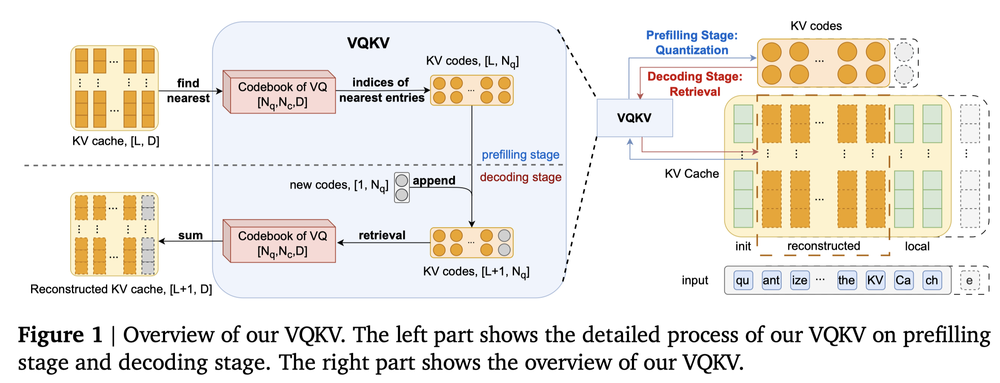

# VQKV: High-Fidelity and High-Ratio Cache Compression via Vector-Quantization

> Yixuan Wang, Qingyu Shi, Jiayu Zhou, Dianbo Liu, Ziwei He, Zhouhan Lin

## Abstract

The growing context length of Large Language Models (LLMs) enlarges the Key-Value (KV) cache, limiting deployment in resource-limited environments. Prior training-free approaches for KV cache compression typically rely on low-rank approximation or scalar quantization, which fail to simultaneously achieve high compression ratios and high reconstruction fidelity. We propose VQKV, a novel, training-free method introducing vector quantization (VQ) to obtain highly compressed KV representations while preserving high model fidelity, allowing for the representation of thousands of floating-point values with just a few integer indices. As a result, VQKV achieves an 82.8\% compression ratio on LLaMA3.1-8B while retaining 98.6\% of the baseline performance on LongBench and enabling 4.3x longer generation length on the same memory footprint.

---

*以下总结由 MiMo 生成：*

这篇论文旨在解决大语言模型KV缓存因上下文长度增长而占用大量内存的问题。作者提出了一种名为VQKV的无训练方法，通过向量量化技术对KV缓存进行高压缩比的表示。该方法能在仅用少量整数索引表示数千个浮点值的同时，保持高保真度，从而在LLaMA3.1-8B模型上实现了82.8%的压缩率，并保留了98.6%的基准性能，使相同内存下的生成长度延长了4.3倍。
